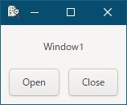
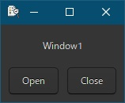
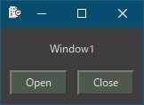
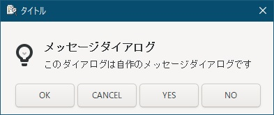
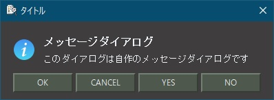

# 3. テーマを使いたい
gtk3は実行ファイルが出来た後でも、テーマを変更することでアプリの外観を変更することが可能です。  

## 3.1 標準テーマ
以下のファイルを作成し、テキストエディタで編集します。  
<pre>
D:\TEST
└─share
    └─gtk-3.0
        └─settings.ini
</pre>

1. 標準テーマ（Adwaita）  
     
   settings.iniを作成しないか、以下の内容を記載します。
   ```
   [Settings]
   ```
1. ダークテーマ（Adwaita）  
     
   以下の内容を記載します。
   ```
   [Settings]
   gtk-application-prefer-dark-theme = true
   ```
   > 「gtk-application-prefer-dark-theme」オプションは、GTKアプリケーションに対して暗いテーマを優先的に使用するかどうかを指示する設定です。このオプションをtrueに設定すると、アプリケーションは暗いテーマが利用可能な場合に、そちらを優先して適用しようとします。

   テーマが不完全な場合や、ダークテーマを意識して作られてない場合、おかしな表示になることがあります。
   （暗いテーマを指定している時に、このオプションを指定すると、真っ白なウィンドウになる等）

## 3.2 カスタムテーマ
1. テーマ  
   Geminiにgtk3テーマを無料で公開しているサイトを聞いてみました。
   > [GNOME Look](https://www.gnome-look.org/): GNOMEデスクトップ環境向けのテーマが豊富に公開されています。GTK3テーマも多数あります。  

   simplewaitaというテーマをダウンロードして以下のディレクトリに配置します。  
   <pre>
   D:\TEST
   └─share
       └─themes
           └─simplewaita
   </pre>
   3.1で使ったsettings.iniに以下の内容を記載します。
   ```
   [Settings]
   gtk-theme-name = simplewaita
   ```
     

> [!NOTE]  
> ダウンロードしたテーマがサイズ別の画像や他の名前の画像をシンボリックリンクを使って代替している場合、Windows環境では解凍時に大量のエラーが出ることがあります。
> また、シンボリックリンクで上書きされた場合、サイズ0の画像ファイルが出来てしまいます。
> そのため、「画像が見つからない」というgtkエラーが出る可能性があります。

2. アイコンテーマ  
   テーマの中にアイコンを含んでるテーマを探す必要があります。（ファイルサイズが大きい物に含まれてる可能性が高いです）  
   テーマをダウンロードし、アイコンテーマを以下のディレクトリに配置します。  
   <pre>
   D:\TEST
   └─share
       └─icons
           └─ダウンロードしたテーマ名のディレクトリ
   </pre>
   3.1で使ったsettings.iniに以下の内容を記載します。
   ```
   [Settings]
   gtk-icon-theme-name = ダウンロードしたテーマ名
   ```
   試してみたら、シンボリックリンクエラーが大量に出て0バイトファイルだらけになったので、  
   (1)0バイトファイルを削除  
   (2)Adwaitaディレクトリを別名でコピー  
   (3)(2)へ(1)で上書き  
   という手順でとりあえずアイコンテーマを作成、表示してみました。  
     
   上が標準テーマで下がダウンロードしたテーマです。  
       
> [!NOTE] 
> settings.iniは、「gtk-application-prefer-dark-theme」「gtk-theme-name」「gtk-icon-theme-name」の全てを別行で記載可能です。  
> また、先頭に「#」を記載するとコメントになります。
