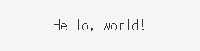
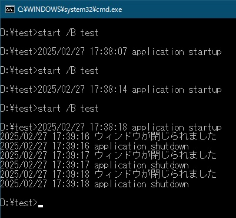

# 半透明の付箋もどき
ウィンドウ右上の「×」ボタンを押した時、タスクトレイに格納するアプリを作ろうと思いました。  
最小化ボタンを無効にして、メインウィンドウはタスクトレイに格納する機能のみに限定したかったため、最小化ボタンを消す方法を聞いてみました。  

> gotk3でウィンドウ右上の最小化ボタンを消すには、WindowオブジェクトのSetDecoratedメソッドを使用します。  
> SetDecorated(false)を使用すると、最小化ボタンだけでなく、最大化ボタンや閉じるボタンも非表示になります。これらのボタンを個別に制御する方法はありません。  
> ウィンドウの装飾を無効化すると、ウィンドウの移動やリサイズもできなくなります。これらの機能を維持したい場合は、別の方法を検討する必要があります。  

ちょっと期待した回答とは違いましたが、やってみました。  

```go
// ウィンドウのヘッダーバーを消す
window1.SetDecorated(false)
```

| ヘッダーバーあり | ヘッダーバーなし |
|---|---|
|  |  |  

これは付箋っぽいアプリが作れそうだなぁと思ったので、ついでにウィンドウを透明にする方法も聞いてみました。  

> - ウィンドウ全体の透明度を設定する方法
>   ```go
>   // ウィンドウの透明度を設定 (0.0: 完全透明, 1.0: 完全不透明)
>   win.SetOpacity(0.5)
>   ```
>   
> - ウィンドウの背景色を透明にする方法
>   ```go
>   // 背景色を透明に設定
>   rgba, err := gdk.RGBAParse("rgba(0,0,0,0)") // 完全透明なRGBA
>   if err != nil {
>       panic(err)
>   }
>   win.OverrideBackgroundColor(gtk.STATE_NORMAL, rgba)
>   ```

残念ながら`SetOpacity()`では透明になりませんでした。（ウィンドウの色を変えるとか追加で何か必要なのかもしれません）  
`OverrideBackgroundColor()`は、`RGBAParse()`が存在しなかったので、調べてみた所`gdk.NewRGBA()`に置き換えることで上手くいきました。  

```
color := gdk.NewRGBA(1.0, 0.97, 0.82, 0.8)
window1.OverrideBackgroundColor(gtk.STATE_FLAG_NORMAL, color)
window1.SetDecorated(false)
```

作成したアプリを３つ起動してみました。  

  
  

[ここ](01_SimpleWindow.go)  

