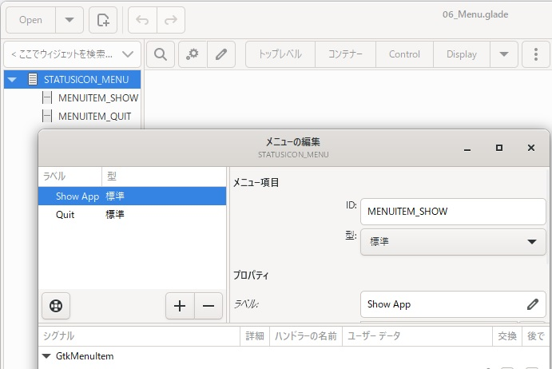
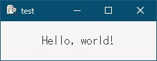
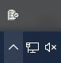
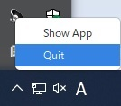
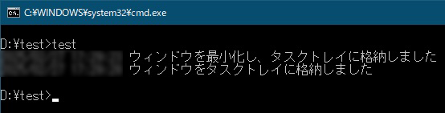

# 6. タスクトレイに格納したい
5章で横道にそれてしまったので、今度こそタスクトレイに格納するアプリを作成しようと思います。  
- 最小化ボタン/閉じるボタンを押した時、タスクトレイに格納し、タスクトレイアイコンを表示する。  
- タスクトレイアイコンをクリックした時、ウィンドウを表示し、タスクトレイアイコンを消す。  
- タスクトレイアイコンを右クリックした時、メニューを表示する。  

## 6.1 右クリックメニューを作成する
gladeにて以下のようにメニューを作成してファイル名「06_Menu.glade」で保存します。  
「Display」からGtkMenuを真ん中のペインに置いた後(GtkMenuの画像は表示されません)、左側のペインで「GtkMenu」-右クリック-「Edit...」を選択し、「メニューの編集」画面を開きます。  
左側の「+」ボタンで型「標準」のMenuItemを追加し、IDとラベルを設定します。  
  
作成したファイルは、
[ここ](glade/06_Menu.glade)
に置いてます。  

## 6.2 タスクトレイアイコンを表示する
タスクトレイにアイコンを表示する方法を聞いてみました。  

> - タスクトレイアイコンの作成
>   ```go
>   icon, err := gtk.StatusIconNewFromFile("path/to/icon.png")
>   ```
> - アイコンの操作（例：ツールチップの設定）
>   ```go
>   icon.SetTooltipText("My Application")
>   ```
> - メニューの作成  
>   ※gladeから読み込むので省略  
> - アイコン右クリック時にメニューを表示
>   ```go
>   icon.Connect("popup-menu", func(icon *gtk.StatusIcon, button uint, activateTime uint32) {
>       menu.Popup(nil, nil, nil, button, activateTime)
>   })
>   ```
> - メニュー選択時の動作を設定
>   ```go
>   menuItem.Connect("activate", gtk.MainQuit)
>   ```
> - タスクトレイアイコンの表示/非表示を切り替えるには、gtk.StatusIconのSetVisible()メソッドを使用します。
>   ```go
>   icon.SetVisible(true)
>   ```

作成したコードは、
[ここ](06_TaskTray.go)
に置いてます。 

## 6.3 実行画面
メインウィンドウ  
  
最小化ボタンか閉じるボタンを押すとタスクトレイに格納(左図)され、アイコンを右クリックをするとメニューが表示(右図)されます。  
　　  

