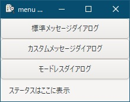
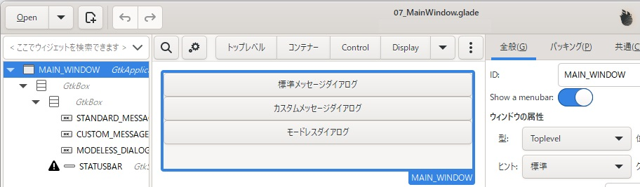
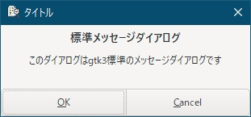
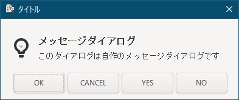
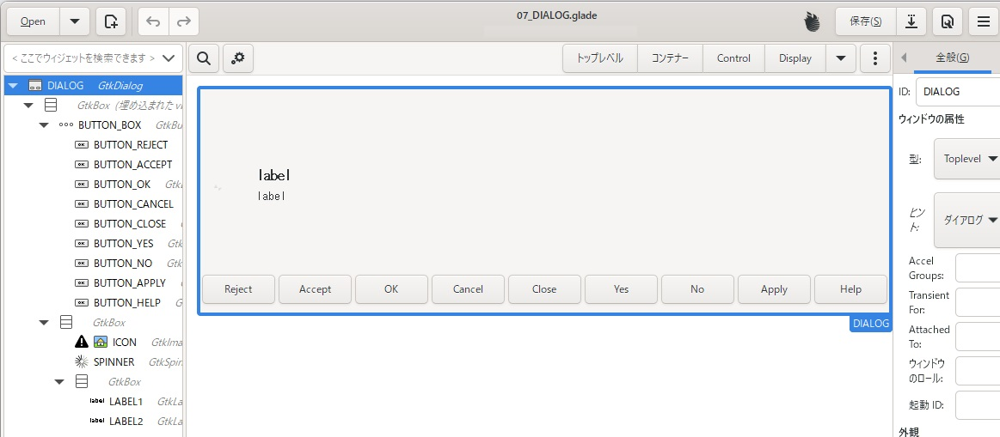
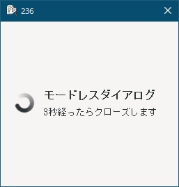

# 7. メッセージダイアログを表示したい
ここまでで、ほぼほぼ「Hello World!」から進化してないので、ダイアログを表示するアプリを作成してみます。  
今回は、以下の３つに分類して進めていきます。  
- gtk標準のメッセージダイアログ（モーダルダイアログ）
- 自作したカスタムメッセージダイアログ（モーダルダイアログ）
- カスタムメッセージダイアログを使ったモードレスダイアログ

  

あと、ステータスバーも追加してます。  

  

作成したファイルは、
[ここ](glade/07_MainWindow.glade)
に置いてます。  

## 7.1 標準メッセージダイアログ
  

特徴についてGeminiに聞いてみました。  

> - 作成時の戻り値でエラーを返さない。  
> - OSやデスクトップ環境によって、ボタンの配置（YES/NOなど）が逆になることや、テキストが英語から日本語になることがある。  
> - Windows環境では、アイコンが表示されない。  
> - カスタムボタンの追加も可能。（`dialog.AddButton("Custom Button", gtk.RESPONSE_YES)`）  
> - 通常はモーダルダイアログとして表示され、親ウィンドウの操作をブロックする。

メッセージダイアログはエラー表示などに使うので、作成が失敗することがない前提なのでしょうか？  

> メッセージダイアログはエラー表示など、ユーザーに何らかの情報を伝えるために使用されるものであり、作成が失敗することは稀であるという前提があります。そのため、GTK3のメッセージダイアログは、作成時の戻り値でエラーを返す仕組みになっていません。

> [!NOTE]
> あくまでもGeminiの回答となります。開発者の考えがどうなのかは分かりません。

アイコンが表示されないことと、OSによってボタン配置やボタンラベルが変わるというのは残念な感じがしました。  
ボタンについては、OS標準の操作性を維持するためということで仕方がないようです。  
作成したコードは以下になります。  

```go
dialog := gtk.MessageDialogNew(window1, gtk.DIALOG_MODAL | gtk.DIALOG_DESTROY_WITH_PARENT, gtk.MESSAGE_INFO, gtk.BUTTONS_OK_CANCEL, "標準メッセージダイアログ")
defer dialog.Destroy()

dialog.SetTitle ("タイトル")
dialog.FormatSecondaryText("このダイアログはgtk3標準のメッセージダイアログです")

ret := dialog.Run()

// 標準メッセージダイアログの応答処理
switch ret {
	case gtk.RESPONSE_OK:
		log.Println("標準メッセージダイアログで、OKが押されました")
	case gtk.RESPONSE_CANCEL:
		log.Println("標準メッセージダイアログで、CANCELが押されました")
	case gtk.RESPONSE_DELETE_EVENT:
		log.Println("標準メッセージダイアログが閉じられました")
}
```

`MessageDialogNew()`の引数に指定している項目の意味は以下になります。  

| 引数の場所 | 引数値 | 説明 |
| --- | --- | --- |
| 2 | DIALOG_MODAL | モーダルダイアログを指定 |
|  | DIALOG_DESTROY_WITH_PARENT | 親と一緒に破棄（モーダルダイアログでは親だけ閉じれないので不要な筈） |
| 3 | MESSAGE_INFO | 電球型アイコン |
|  | MESSAGE_WARNING | 「！」型アイコン |
|  | MESSAGE_QUESTION | 「？」型アイコン |
|  | MESSAGE_ERROR | 通行止め型アイコン |
|  | MESSAGE_OTHER | アイコンなし |
| 4 | BUTTONS_NONE | ボタンなし |
|  | BUTTONS_OK | OKボタン |
|  | BUTTONS_CLOSE | CLOSEボタン |
|  | BUTTONS_CANCEL | CANCELボタン |
|  | BUTTONS_YES_NO | YESとNOのボタン |
|  | BUTTONS_OK_CANCEL | OKとCANCELのボタン |

`dialog.Run()`の戻り値は以下になります。  

| 戻り値 | 説明 |
| --- | --- |
| RESPONSE_NONE | ボタン押下以外で終了した時用 |
| RESPONSE_REJECT | `AddButton()`で追加したボタン押下 |
| RESPONSE_ACCEPT | `AddButton()`で追加したボタン押下 |
| RESPONSE_DELETE_EVENT | 右上の「×」ボタン押下 |
| RESPONSE_OK | OKボタン押下 |
| RESPONSE_CANCEL | CANCELボタン押下 |
| RESPONSE_CLOSE | CLOSEボタン押下 |
| RESPONSE_YES | YESボタン押下 |
| RESPONSE_NO | NOボタン押下 |
| RESPONSE_APPLY | `AddButton()`で追加したボタン押下 |
| RESPONSE_HELP | `AddButton()`で追加したボタン押下 |

## 7.2 カスタムメッセージダイアログ
  

やっぱりアイコンを表示したいので、メッセージダイアログを自作してみました。  

  

レスポンスを返す全てのボタンを並べてます。あと、アイコン表示用のImageと処理中表示用のSpinnerも追加しました。  
作成したファイルは、
[ここ](glade/07_DIALOG.glade)
に置いてます。  

ダイアログ作成の流れは以下のようになります。

- ダイアログを作成  
- 親と紐づけてアイコンを継承
- ボタンラベルが指定されてる物は、ラベルを設定。ボタンラベルが指定されてない物は、非表示
- 指定されたタイプ（MESSAGE_INFOとか）によって、アイコンを表示  
- 起動時にはスピナーを非表示  
- メッセージ1行目/2行目を設定  

ダイアログ作成のコードは、
[ここ](07_library.go)
にあります。  

上記で作成した関数を呼び出す側のコードは、以下のようになります。  

```go
func ShowErrorDialog(parent *gtk.ApplicationWindow, err error) {
	dialog := gtk.MessageDialogNew(parent, gtk.DIALOG_MODAL | gtk.DIALOG_DESTROY_WITH_PARENT, gtk.MESSAGE_ERROR, gtk.BUTTONS_OK, "エラーが発生しました")
	dialog.FormatSecondaryText("%s", err.Error())
	dialog.SetTitle ("error")
	dialog.Run()
	dialog.Destroy()
}

// 以下は、application.Connect("activate", func() {})の中
button2.Connect("clicked", func() {
	// REJECT, ACCEPT, OK, CANCEL, CLOSE, YES, NO, APPLY, HELP
	buttonFlg := [9]string{"", "", "OK", "CANCEL", "", "YES", "NO", "", ""}

	// ダイアログの作成
	dialog1, _, err := CustomMessageDialogNew(window1, "タイトル", gtk.MESSAGE_INFO, buttonFlg, "メッセージダイアログ", "このダイアログは自作のメッセージダイアログです")
	if err != nil {
		log.Println("Could not create dialog: ", err)
		ShowErrorDialog(window1, err)
		return
	}
	defer dialog1.Destroy()

	// ダイアログをモーダルに設定して表示
	dialog1.SetModal(true)
	ret := dialog1.Run()

	// カスタムメッセージダイアログの応答処理
	switch ret {
		case gtk.RESPONSE_REJECT:
			log.Println("カスタムメッセージダイアログで、REJECTが押されました")
		case gtk.RESPONSE_ACCEPT:
			log.Println("カスタムメッセージダイアログで、ACCEPTが押されました")
		case gtk.RESPONSE_OK:
			log.Println("カスタムメッセージダイアログで、OKが押されました")
		case gtk.RESPONSE_CANCEL:
			log.Println("カスタムメッセージダイアログで、CANCELが押されました")
		case gtk.RESPONSE_CLOSE:
			log.Println("カスタムメッセージダイアログで、CLOSEが押されました")
		case gtk.RESPONSE_YES:
			log.Println("カスタムメッセージダイアログで、YESが押されました")
		case gtk.RESPONSE_NO:
			log.Println("カスタムメッセージダイアログで、NOが押されました")
		case gtk.RESPONSE_APPLY:
			log.Println("カスタムメッセージダイアログで、APPLYが押されました")
		case gtk.RESPONSE_HELP:
			log.Println("カスタムメッセージダイアログで、HELPが押されました")
		case gtk.RESPONSE_DELETE_EVENT:
			log.Println("カスタムメッセージダイアログが閉じられました")
		default:
			log.Println("カスタムメッセージダイアログで、想定してないレスポンスを受信しました")
	}
})
```

標準メッセージダイアログと違って、ダイアログ作成時にエラーを返す可能性があるため、エラー表示のために`ShowErrorDialog()`を作成してます。  

## 7.3 モードレスダイアログ
  

ボタンを全て非表示にしたら、なぜか縦幅が大きくなってしまったのですが、モードレスダイアログを作成します。  
3秒間スピナーが回り続けて、タイトルバーでカウントダウンしてます。  

ダイアログ作成関数は、カスタムメッセージダイアログと同じ関数を使ってるので、呼び出し側のコードのみを以下に示します。  

```go
func DoEvents() {
	for i := 0; i < 100; i++ {
		if !gtk.EventsPending() {
			break
		}
	    gtk.MainIteration()
	}
}

// 以下は、application.Connect("activate", func() {})の中
button3.Connect("clicked", func() {
	// REJECT, ACCEPT, OK, CANCEL, CLOSE, YES, NO, APPLY, HELP
	buttonFlg := [9]string{"", "", "", "", "", "", "", "", ""}
	
	// ダイアログの作成
	// 「gtk.MESSAGE_OTHER」を指定して、アイコンを非表示にする（スピナー表示のため）
	dialog1, spinner1, err := CustomMessageDialogNew(window1, "タイトル", gtk.MESSAGE_OTHER, buttonFlg, "モードレスダイアログ", "3秒経ったらクローズします")
	if err != nil {
		log.Println("Could not create dialog: ", err)
		ShowErrorDialog(window1, err)
		return
	}
	
	// ダイアログが表示された時のシグナル処理
	// 3秒待ってクローズ
	dialog1.Connect("show", func(dlg *gtk.Dialog) {
		go func() {
			for i := 0; i <= 300; i++ {
				DoEvents()
				time.Sleep(10 * time.Millisecond)
				
				// goルーチン内のUI操作はglib.IdleAddを使って安全に実行
				glib.IdleAdd(func() {
					dlg.SetTitle(fmt.Sprintf("%d", 300-i))
				})
			}
			
			// goルーチン内のUI操作はglib.IdleAddを使って安全に実行
			glib.IdleAdd(func() {
				dlg.Destroy()
			})
			log.Println("モードレスダイアログが閉じられました")
		}()
	})
	
	// スピナーをShow・Start
	spinner1.Show()
	spinner1.Start()
	
	// ダイアログをモードレスに設定して表示
	dialog1.SetModal(false)
	dialog1.Show()
	
	// モードレスの場合隠れることがあるから、最前面に表示
	dialog1.SetKeepAbove(true)
	dialog1.SetKeepAbove(false)
})
```

`DoEvents()`は、
「[4.6 UIが更新されない場合や、ダイアログが真っ白の時](../04#46-ui%E3%81%8C%E6%9B%B4%E6%96%B0%E3%81%95%E3%82%8C%E3%81%AA%E3%81%84%E5%A0%B4%E5%90%88%E3%82%84%E3%83%80%E3%82%A4%E3%82%A2%E3%83%AD%E3%82%B0%E3%81%8C%E7%9C%9F%E3%81%A3%E7%99%BD%E3%81%AE%E6%99%82
)」に記載しているように、UIのメインループを回す処理になります。（ちなみに、メインループを回さないと、スピナーは停止したままになる可能性があります）  

"show"シグナル処理内では、後から開いたダイアログの方がUIのメインループを優先して使うようなので、複数ダイアログを開いた時でも並列に動かす目的で、goルーチンを使用してます。  
そのため、`glib.IdleAdd()`が必要となりますので気をつけてください。  
画像ビューアのようにマウス操作で使うアプリの場合、goルーチンは不要なのかもしれません。  
