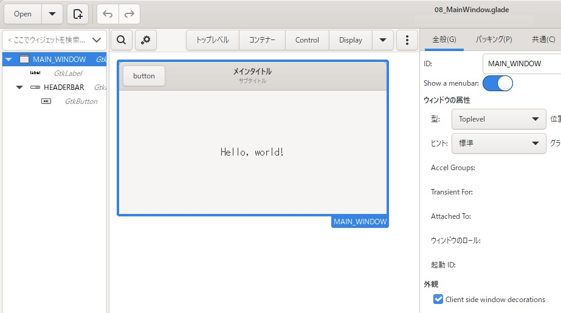
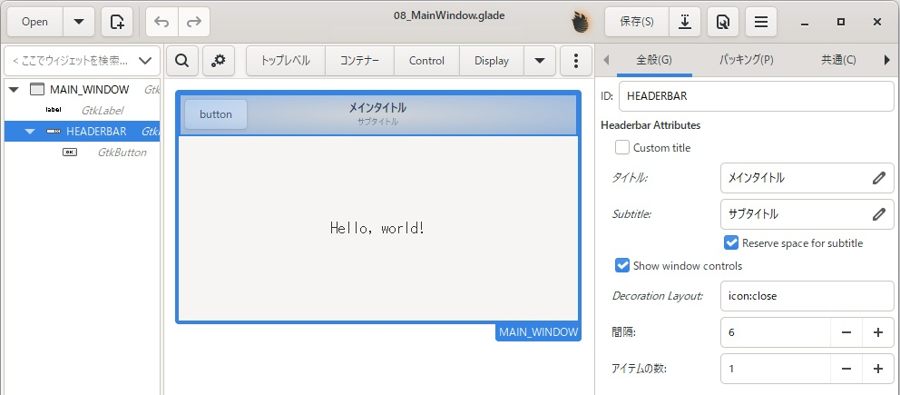
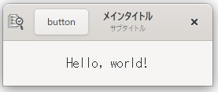

# 8. ヘッダーバーのカスタマイズとラベルの書式設定
「[5.1 ヘッダーバーを消す](../05#51-%E3%83%98%E3%83%83%E3%83%80%E3%83%BC%E3%83%90%E3%83%BC%E3%82%92%E6%B6%88%E3%81%99)」
に記載しているように、標準のヘッダーバーは表示/非表示しか制御できないようですが、ヘッダーバーを作ることでカスタマイズが出来ます。  
また、ラベルに表示する文字列についてもフォントを変えたり色を変えたりすることが出来ます。  
今回は、それらのやり方について確認していきます。  

## 8.1 カスタムヘッダーバーの作成
メインウィンドウについては、以下のように設定します。  
右側のペイン「外観」-「Client side window decorations」にチェックを入れる。  
メインウィンドウの上部に隙間が出来るので、「コンテナ―」から「GtkHeaderBar」をD&Dする。  
「GtkHeaderBar」にボタンなどのコントロールを配置する。  

  

ヘッダーバーの設定については、閉じるボタンのみを残して、最大化/最小化ボタンは表示しないように設定していきます。  
まず、右側のペイン「Show window controls」にチェックを入れて、最大化/最小化/閉じるボタンを表示するように設定します。  
次に、「Decoration Layout」に「icon:close」と入力し、閉じるボタンのみを表示します。  

  

作成したファイルは、
[ここ](glade/08_MainWindow.glade)
に置いてます。  

> [!NOTE]  
> 「Decoration Layout」に「icon:minimize,maximize,close」と入力した状態、もしくは空欄の状態が全てのボタンを表示する状態となります。  

プログラムの方は、「[1. gotk3を使って、Simple windowを作成する](../01/README.md)」のままとなります。  
（今回は実施していませんが、ヘッダーバーのボタンを押した時の処理などの追加が必要となります）  

実行画面は以下のようになります。  

  
