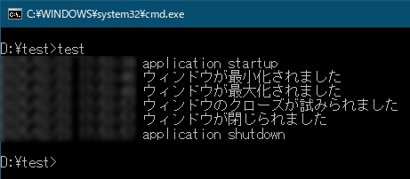

[go言語 & gotk3をちょっとやり直してみたい](../../README.md#go%E8%A8%80%E8%AA%9Egotk3%E3%82%92%E3%81%A1%E3%82%87%E3%81%A3%E3%81%A8%E3%82%84%E3%82%8A%E7%9B%B4%E3%81%97%E3%81%A6%E3%81%BF%E3%81%9F%E3%81%84)  

# 1. gotk3を使って、Simple windowを作成する
「Hello, world!」を表示するアプリを作成します。  
  
  

UI作成は基本的にgladeを使います。  
文章中で確認している相手はGeminiです。  
> このようにテキスト参照になってる部分がGeminiの回答です

## 1.1 環境準備とコンパイルオプション
コンパイル環境は何年も前に作成したため、手順を覚えてません。  
以下の環境をWindows上に構築し、「go build」でコンパイル出来るように準備して下さい。  
- go言語 & gotk3
- MSYS2（gtk3, gladeに必要）
- gtk3
- glade（gtk3のUIをGUIで作成するツール）

コンパイルオプション  
- コンソールに出力しているので、「-H=windowsgui」は使わないで下さい。  
  （今回は使いませんが、アプリ開発時gtkが出力するエラーの確認も必要となるため使わずに開発し、完成後につけると良いです）
- 非推奨になってる機能も使うので、「-tags gtk_deprecated」をつけて下さい。

今回は、以下のコマンドとオプションでコンパイルしてます。  
```bat
go build -gcflags "-N -l" -tags gtk_deprecated -o test.exe
```  

> [!CAUTION]
> gotk3 v0.6.4の場合、「自分のHOME\go\pkg\mod\github.com\gotk3\gotk3@v0.6.4」配下にある以下のファイルに対応が必要となります。（go言語用に環境変数を設定している場合、ディレクトリが異なる場合があります）  
> - gdk/gdk_since_3_22.go：githubからDLして差し替え（v0.6.4.1以降では修正されるそうです）
> - gtk/gtk_deprecated_since_3_10.go：エラーが出るので、コンパイル対象から除外するため、別フォルダへ退避  

## 1.2 gtk.Applicationを使うべきなの？
サンプルコードなどを検索すると、「gtk.Init」を使ってる物と「gtk.Application」を使ってる物があるため、違いを聞いてみました。  
> gtk.Initは古いGTKのバージョンで使用されていましたが、現在ではgtk.Applicationの使用が推奨されています。  
> 
> | 機能 | gtk.Init | gtk.Application |
> | --- | --- | --- | 
> | 初期化 | GTKの基本的な機能を初期化 | アプリケーション全体のライフサイクルを管理 |
> | ウィンドウ管理 | 行わない | ウィンドウの作成、管理を行う |
> | イベント処理 | 行わない | イベントループの実行、イベント処理を行う |
> | その他 | 古いバージョンで使用されていた | 現代的なGTKアプリケーション開発に適している |

「gtk.Application」を使う事にします。

## 1.3 gtk.ApplicationWindowを使うべきなの？
「gtk.Init」のサンプルコードでは、「gtk.Window」を使ってる例が多いように思いましたが、「gtk.Application」では「gtk.ApplicationWindow」を使ってる物があるため、違いを聞いてみました。
> 基本的にはgtk.ApplicationWindowを使用することを推奨します。
> | 機能 | gtk.Window | gtk.ApplicationWindow | 
> | --- | --- | --- | 
> | 基本機能 | ウィンドウの基本的な要素を提供 | gtk.Windowの機能を拡張 | 
> | アプリケーション連携 | 連携機能は限定的 | アプリケーションメニュー、menubar、アクションなどを管理 | 
> | 推奨用途 | 単独のウィンドウ作成・表示 | GTKアプリケーション内でのウィンドウ作成・表示 | 

「gtk.ApplicationWindow」を使う事にします。

## 1.4 Gladeでメインウィンドウを作成
Gladeで「トップレベル」を「GtkApplicationWindow」にし、ラベルを貼り付けたウィンドウを作成後、ファイル名「01_MainWindow.glade」で保存します。  
    
作成したファイルは、
[ここ](glade/01_MainWindow.glade)
に置いてます。  

## 1.5 gladeファイルをリソースに埋め込み、コードから参照する
「.glade」ファイルはテキスト形式であるため、誤って削除したり編集したりするとアプリケーションが起動できなくなる可能性があります。そのため、実行ファイルに埋め込むことにします。  
> go1.16で導入された go:embed ディレクティブを使用すると、gladeファイルをGoのバイナリに埋め込むことができます。
> ```go
> import _"embed"
> 
> //go:embed ui/window.glade
> var windowGlade string
> ```
「ui/window.glade」がソースファイルからの相対パスです。  
「var windowGlade string」がgladeファイルのテキストデータを代入する文字列型変数です。  
文字列型変数から、「gtk.Window」オブジェクトを取得するサンプルコードは以下のようになります。
> ```go
> builder, err := gtk.BuilderNewFromString(windowGlade)
> if err != nil {
> 	log.Fatal("Error creating builder:", err)
> }
> 
> windowObj, err := builder.GetObject("main_window")
> if err != nil {
> 	log.Fatal("Error getting window:", err)
> }
> 
> window, ok := windowObj.(*gtk.Window)
> if !ok {
> 	log.Fatal("Error: object is not a Gtk.Window")
> }
> ```
今回は、メインウィンドウだけをgladeから読み込みますが、buttonやmenuなど何度も同じ処理が必要になります。
共通化するようGeminiにお願いしてみました。  
（「T gtk.Widget」が回答だったのですが、コンパイルエラーになったので一部修正してます）
> ```go
> func createObjectFromGlade[T *gtk.Window](gladeString, objectName string) (T, error) {
> 	builder, err := gtk.BuilderNewFromString(gladeString)
> 	if err != nil {
> 		return nil, err
> 	}
> 
> 	obj, err := builder.GetObject(objectName)
> 	if err != nil {
> 		return nil, err
> 	}
> 
> 	window, ok := obj.(T)
> 	if !ok {
> 		return nil, fmt.Errorf("object is not a %T", *new(T))
> 	}
> 
> 	return window, nil
> }
> ```
呼び出し側は以下の通りです。
> ```go
> window, err := createObjectFromGlade[*gtk.Window](windowGlade, "main_window")
> ```
今回使用した関数は、
[ここ](01_library.go)
に置いてます。  

## 1.6 多重起動防止
Linux環境では、「gtk.Application」作成時に以下のようにすれば、多重起動防止となるようなのですが、Windows上では上手くいきませんでした。  
```go
gtk.ApplicationNew(appID, glib.APPLICATION_FLAGS_NONE)
```
Windows上では、複数起動が可能であったり、他アプリのシグナルを受信したりなどの不具合が発生しました。  
通常のアプリでは多重起動しても問題ないと思うのですが、タスクトレイに格納するようなアプリや、設定ファイルを複数アプリから参照することを考慮してないアプリなどで問題が起こる可能性があります。  
そのため、gtkの機能を使わずに多重起動防止をする必要があります。
> ミューテックスは、排他制御を行うための仕組みです。これを利用することで、同時に複数のプロセスが同じリソースにアクセスするのを防ぎます。
> ```go
> import "golang.org/x/sys/windows"
> 
> mutexName := "MyApplicationMutex" // ミューテックス名
> 
> // ミューテックスを作成
> mutex, err := windows.CreateMutex(nil, false, windows.StringToUTF16Ptr(mutexName))
> if err != nil {
> 	fmt.Println("ミューテックス作成に失敗:", err)
> 	os.Exit(1)
> }
> defer windows.CloseHandle(mutex)
> ```
ミューテックス作成でエラーになった場合は、既にアプリが起動しているため、終了します。

## 1.7 プログラムの流れ
- `CreateMutex`でミューテックスを作成
- `ApplicationNew`でアプリケーションを作成
- `application.Connect("startup", func() {})`でアプリケーション起動時の処理を記述
- `application.Connect("activate", func() {})`でアプリケーションアクティブ時の処理を記述
  - メインウィンドウを作成（gladeから読み込み）
  - メインウィンドウのシグナル処理を記述（今回は最小化、最大化、閉じる、破棄を記述）
  - `window.SetApplication(application)`でアプリケーションとメインウィンドウを紐づける
  - `window1.ShowAll()`でメインウィンドウを表示
- `application.Connect("shutdown", func() {})`でアプリケーション終了時の処理を記述
- `os.Exit(application.Run(os.Args))`でアプリケーションの実行

作成したコードは、
[ここ](01_SimpleWindow.go)
に置いてます。  
フォルダ構成は、ソースが「d:\test」にある場合、以下のようになります。  
<pre>
D:\test
├─glade
│  └─01_MainWindow.glade
├─resources
│  └─icon.ico
├─01_SimpleWindow.go
└─01_library.go
</pre>  
「icon.ico」はフリー素材をImageMagickで「.ico」にした物を使いましたが、再配布可能かどうか分からなかったのでここには置いてません。  
参考までに、画像ファイルをImageMagickで変換するコマンドは以下のようになります。  
> ImageMagick で複数のサイズを含む ICO ファイルを作成するには、-define icon:auto-resize オプションを使用します。
> ```bat
> convert input.png -define icon:auto-resize=16,32,48,64 output.ico
> ```

## 1.8 実行
起動画面  
  
コンソールへの表示結果  
  
「ウィンドウのクローズが試みられました」の部分は、ウィンドウ右上の「×」ボタンを押した時の処理になります。  
ここに「本当に終了しても良いですか？」とかを確認してキャンセルするような処理を追加することが出来ます。

</br>

「[2. 他のパソコンでも実行したい](../02/README.md)」へ
