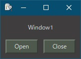
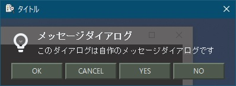

[go言語 & gotk3をちょっとやり直してみたい](../../README.md#go%E8%A8%80%E8%AA%9Egotk3%E3%82%92%E3%81%A1%E3%82%87%E3%81%A3%E3%81%A8%E3%82%84%E3%82%8A%E7%9B%B4%E3%81%97%E3%81%A6%E3%81%BF%E3%81%9F%E3%81%84)  

# 3. テーマを使いたい
gtk3は実行ファイルが出来た後でも、テーマを変更することでアプリの外観を変更することが可能です。  

## 3.1 標準テーマ
以下の場所に「settings.ini」ファイルを作成し、テキストエディタで編集します。  
（「D:\TEST」は、実行ファイルが置いてあるディレクトリです）
<pre>
D:\TEST
└─share
    └─gtk-3.0
        └─settings.ini
</pre>

1. 標準テーマ（Adwaita）  
     
   「settings.ini」を作成しないか、以下の内容を記載します。
   ```
   [Settings]
   ```
1. ダークテーマ（Adwaita）  
     
   以下の内容を記載します。
   ```
   [Settings]
   gtk-application-prefer-dark-theme = true
   ```
   > 「gtk-application-prefer-dark-theme」オプションは、GTKアプリケーションに対して暗いテーマを優先的に使用するかどうかを指示する設定です。このオプションをtrueに設定すると、アプリケーションは暗いテーマが利用可能な場合に、そちらを優先して適用しようとします。

> [!CAUTION]
> テーマが不完全な場合や、ダークテーマを意識して作られてない場合、おかしな表示になることがあります。  
> （暗いテーマを指定している時に、このオプションを指定すると、真っ白なウィンドウになる等）

## 3.2 カスタムテーマ

### 3.2.1 テーマ  
   Geminiにgtk3テーマを無料で公開しているサイトを聞いてみました。
   > [GNOME Look](https://www.gnome-look.org/): GNOMEデスクトップ環境向けのテーマが豊富に公開されています。GTK3テーマも多数あります。  

   simplewaitaというテーマをダウンロードして以下のディレクトリに配置します。  
   <pre>
   D:\TEST
   └─share
       └─themes
           └─simplewaita
   </pre>
   3.1で使った「settings.ini」に以下の内容を記載します。
   ```
   [Settings]
   gtk-theme-name = simplewaita
   ```
     

> [!CAUTION]  
> ダウンロードしたテーマがサイズ別の画像や他の名前の画像をシンボリックリンクを使って代替している場合、Windows環境では解凍時に大量のエラーが出ることがあります。
> また、サイズ0の画像ファイルが出来てしまい、「画像が読み込めない」というようなgtkエラーが出る可能性があります。
 
### 3.2.2 アイコンテーマ  
   公開されてるテーマの中からアイコンを含んでるテーマを探す必要があります。  
   （「icon theme」とついてる物か、ファイルサイズが大きい物に含まれてる可能性があります）  
   テーマをダウンロードし、アイコンテーマを以下のディレクトリに配置します。  

   <pre>
   D:\TEST
   └─share
       └─icons
           └─ダウンロードしたテーマ名のディレクトリ
   </pre>
   
   3.1で使った「settings.ini」に以下の内容を記載します。
   ```
   [Settings]
   gtk-icon-theme-name = アイコンテーマのディレクトリ名
   ```
   「Win11 icon theme」をダウンロード・解凍して出来た「Win11-dark」ディレクトリを配置してみましたが、エラーになりました。  
   AdwaitaディレクトリとWin11-darkディレクトリを比較したところ、Adwaita側には、「scalable」ディレクトリがあり、その配下に以下の4つのディレクトリがありました。
    - devices
    - mimetypes
    - places
    - status
   
   Win11-darkディレクトリ配下に「scalable」ディレクトリを作成し、Win11-darkディレクトリ直下の4つのディレクトリ「devices」「mimes」「places」「status」の中にある「scalable」もしくは「48」など数字が大きいディレクトリを作成した「scalable」ディレクトリへコピーしてAdwaitaのディレクトリ名に合わせて変更しました。
   その結果、エラーが出なくなったので、アイコンテーマで何かエラーが出たらAdwaitaのディレクトリ構成に準拠するように変更すればある程度なんとかなりそうに思います。

   <pre>
   D:\TEST
   └─share
       └─icons
           └─Win11-dark
               └─scalable
                   ├─devices
                   ├─mimetypes
                   ├─places
                   └─status
   </pre>
   
     
   上が標準テーマで下がsimplewaitaテーマ + Win11-darkアイコンテーマです。  
       

> [!NOTE] 
> 「settings.ini」は、「gtk-application-prefer-dark-theme」「gtk-theme-name」「gtk-icon-theme-name」の全てを別行で記載可能です。  
> また、先頭に「#」を記載するとコメントになります。

> [!CAUTION]  
> Win11-darkへのディレクトリ構成変更の対応が正しいかどうかは分かりません。

## 3.3 カスタムテーマの修正  

カスタムテーマを修正して、背景を半透明にしてみます。  

  

> [!NOTE]  
> 「[5. 半透明の付箋もどき](../05/README.md)」や「[15. （まとめ）CSSを使った書式設定](../15/README.md)」のやり方もありますが、今回はカスタムテーマを使ったやり方になります。  

3.2.1でsimplewaitaに設定していることを前提とします。  
以下のファイルをテキストエディタで開きます。

 <pre>
 D:\TEST
 └─share
     └─themes
         └─simplewaita
             └─gtk-3.0
                 └─gtk.css
 </pre>

Windowの背景色を半透明にし、Windowの上に重ねて表示されてる物を透明にします。  
「Base States」の下にある`.background {}`内の  
`background-color: #3f3e3e;`  
の部分を  
`background-color: rgba(63, 62, 62, 0.8);`  
に置き換え、  
`.view, iconview, .view text, iconview text, textview text {}`内の  
`background-color: #323232;`  
の部分を  
`background-color: transparent;`  
に置き換えます。  
「0.8」の部分が透明度です。0が透明で1が不透明になります。  
ButtonやNotebookなどもカスタマイズしたい場合は、各項目の「background-color」をtransparentにしてどこに影響が出るかを確認してみて下さい。  

> [!NOTE]  
> 「e17gtk-revolved」テーマの場合は、設定ファイルの頭で各色が宣言されてるので、「theme_bg_color」と「view_color」を`transparent`に設定して、「Base States」の下にある`.background {}`内の  
> `background-color: @theme_bg_color;`  
> の部分を  
> `background-color: rgba(61, 61, 62, 0.8);`  
> に置き換えることで半透明になりました。  
> 他のテーマでも似たような方法で変更できるのではないかと思います。  

> [!CAUTION]  
> Linuxで同じように設定しても、トップレベルのウィンドウは半透明になりませんでした。

<br>

「[4. これに気をつけないとアプリがクラッシュする](../04/README.md)」へ
