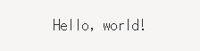
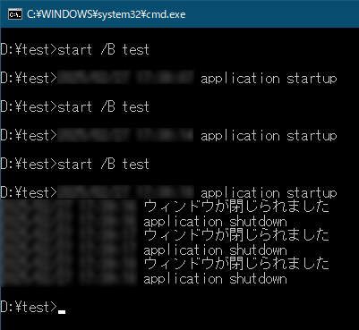

[go言語 & gotk3をちょっとやり直してみたい](../../README.md#go%E8%A8%80%E8%AA%9Egotk3%E3%82%92%E3%81%A1%E3%82%87%E3%81%A3%E3%81%A8%E3%82%84%E3%82%8A%E7%9B%B4%E3%81%97%E3%81%A6%E3%81%BF%E3%81%9F%E3%81%84)  

# 5. 半透明の付箋もどき
## 5.1 ヘッダーバーを消す
ウィンドウ右上の「×」ボタンを押した時、タスクトレイに格納するアプリを作ろうと思いました。  
最小化ボタンを無効にして、メインウィンドウはタスクトレイに格納する機能のみに限定したかったため、最小化ボタンを消す方法を聞いてみました。  

> gotk3でウィンドウ右上の最小化ボタンを消すには、WindowオブジェクトのSetDecoratedメソッドを使用します。  
> SetDecorated(false)を使用すると、最小化ボタンだけでなく、最大化ボタンや閉じるボタンも非表示になります。これらのボタンを個別に制御する方法はありません。  
> ウィンドウの装飾を無効化すると、ウィンドウの移動やリサイズもできなくなります。これらの機能を維持したい場合は、別の方法を検討する必要があります。  

ちょっと期待した回答とは違いましたが、やってみました。  

```go
// ウィンドウのヘッダーバーを消す
window1.SetDecorated(false)
```

| ヘッダーバーあり | ヘッダーバーなし |
|---|---|
|  |  |  

## 5.2 ウィンドウを透明にする

ついでにウィンドウを透明にする方法も聞いてみました。  

> - ウィンドウ全体の透明度を設定する方法
>   ```go
>   // ウィンドウの透明度を設定 (0.0: 完全透明, 1.0: 完全不透明)
>   win.SetOpacity(0.5)
>   ```
>   
> - ウィンドウの背景色を透明にする方法
>   ```go
>   // 背景色を透明に設定
>   rgba, err := gdk.RGBAParse("rgba(0,0,0,0)") // 完全透明なRGBA
>   if err != nil {
>       panic(err)
>   }
>   win.OverrideBackgroundColor(gtk.STATE_NORMAL, rgba)
>   ```

残念ながら`SetOpacity()`では透明になりませんでした。  
`OverrideBackgroundColor()`は、`RGBAParse()`が存在しなかったので、調べてみた所`gdk.NewRGBA()`に置き換えることで上手くいきました。  

```go
color := gdk.NewRGBA(1.0, 0.97, 0.82, 0.8)
window1.OverrideBackgroundColor(gtk.STATE_FLAG_NORMAL, color)
window1.SetDecorated(false)
```

作成したアプリを３つ起動してみました。  

  
  

> [!NOTE]
> `SetOpacity()`はウィンドウでは透明に出来ませんでしたが、ラベルは透明になりました。
> ウィジェットには使えそうです。  


## 5.3 ウィンドウをマウスで動かしたい
ウィンドウをマウスでドラッグして動かす方法を聞いてみました。  
※Geminiの回答コードでは、イベントから座標を取得する部分が動かなかったので`e.MotionVal()`を使うように修正してます。  

> ```go
> var dragging bool
> var offsetX, offsetY int
> 
> //-----------------------------------------------------------
> // マウスボタンを押したときのイベントハンドラ
> //-----------------------------------------------------------
> window1.Connect("button-press-event", func(win *gtk.ApplicationWindow, event *gdk.Event) {
> 	e := gdk.EventButtonNewFromEvent(event)
> 	if e.Button() == gdk.BUTTON_PRIMARY {
> 		dragging = true
> 		x, y := e.MotionVal()
> 		offsetX = int(x)
> 		offsetY = int(y)
> 	}
> })
> 
> //-----------------------------------------------------------
> // マウスを移動したときのイベントハンドラ
> //-----------------------------------------------------------
> window1.Connect("motion-notify-event", func(win *gtk.ApplicationWindow, event *gdk.Event) {
> 	if dragging {
> 		e := gdk.EventMotionNewFromEvent(event)
> 		x, y := e.MotionVal()
> 		dx := int(x) - offsetX
> 		dy := int(y) - offsetY
> 		winX, winY := win.GetPosition()
> 		win.Move(winX+dx, winY+dy)
> 	}
> })
> 
> //-----------------------------------------------------------
> // マウスボタンを離したときのイベントハンドラ
> //-----------------------------------------------------------
> window1.Connect("button-release-event", func(win *gtk.ApplicationWindow, event *gdk.Event) {
> 	e := gdk.EventButtonNewFromEvent(event)
> 	if e.Button() == gdk.BUTTON_PRIMARY {
> 		dragging = false
> 	}
> })
> ```


作成したコードは、
[ここ](05_SimpleWindow_no_header.go)
に置いてます。  

> [!CAUTION]
> なんか動きが変な気がします。`e.MotionVal()`は、ウィドウ座標に対するマウス座標の相対位置だと思うので、常にウィドウとマウスカーソルの相対座標を一定にしようとしているとすると、考え方はあってるんでしょうか？  
> `e.MotionVal()`と`win.GetPosition()`と`win.Move(winX+dx, winY+dy)`のタイムラグが問題なのかもしれません。  
> `e.MotionValRoot()`はスクリーン座標が取得できるので、左マウスクリック時にウィンドウのスクリーン座標とマウスカーソルのスクリーン座標を取得して、移動時はマウスカーソルのスクリーン座標の差分のみでウィンドウ移動をした方が良さそうに思います。
> - 左クリック時（移動開始時）  
>   ```go
>   winX, winY = win.GetPosition()
>   x, y := e.MotionValRoot()
>   offsetX = int(x)
>   offsetY = int(y)
>   ```
> - マウス移動時
>   ```go
>   x, y := e.MotionValRoot()
>   dx := int(x) - offsetX
>   dy := int(y) - offsetY
>   win.Move(winX + dx, winY + dy)
>   ```


## 5.4 おわりに
以上で、ヘッダーバーがないウィンドウを半透明にして、マウスで移動させるアプリが出来ました。  
付箋アプリにするには、  

- モードレスウィンドウにして、複数起動出来るようにする。  
- ダブルクリックしたら、文字列を編集する画面を表示する。  
- 右クリックメニューで「新規」「編集」「はがす」などを選べるようにする。
- 開始/終了時にウィンドウ位置、色、文字列などをファイルからRead/Writeする。  

などの機能を足すことでちゃんとしたアプリになりそうです。  

</br>

「[6. タスクトレイに格納したい](../06/README.md)」へ  
