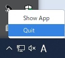

[go言語 & gotk3をちょっとやり直してみたい](../../README.md#go%E8%A8%80%E8%AA%9Egotk3%E3%82%92%E3%81%A1%E3%82%87%E3%81%A3%E3%81%A8%E3%82%84%E3%82%8A%E7%9B%B4%E3%81%97%E3%81%A6%E3%81%BF%E3%81%9F%E3%81%84)  

# 6. タスクトレイに格納したい
5章で横道にそれてしまったので、今度こそタスクトレイに格納するアプリを作成しようと思います。  
- 最小化ボタン/閉じるボタンを押した時、タスクトレイに格納し、タスクトレイアイコンを表示する。  
- タスクトレイアイコンをクリックした時、ウィンドウを表示し、タスクトレイアイコンを消す。  
- タスクトレイアイコンを右クリックした時、メニューを表示する。  

## 6.1 右クリックメニューを作成する
gladeにて以下のようにメニューを作成してファイル名「06_Menu.glade」で保存します。  
「Display」からGtkMenuを真ん中のペインに置いた後(GtkMenuの画像は表示されません)、左側のペインで「GtkMenu」-右クリック-「Edit...」を選択し、「メニューの編集」画面を開きます。  
左側の「+」ボタンで型「標準」のMenuItemを追加し、IDとラベルを設定します。  
  
作成したファイルは、
[ここ](glade/06_Menu.glade)
に置いてます。  

## 6.2 タスクトレイアイコンを表示する
タスクトレイへアイコンを表示する方法をGeminiに聞いてみました。  

> - タスクトレイアイコンの作成
>   ```go
>   icon, err := gtk.StatusIconNewFromFile("path/to/icon.png")
>   ```
> - アイコンの操作（例：ツールチップの設定）
>   ```go
>   icon.SetTooltipText("My Application")
>   ```
> - メニューの作成  
>   ※gladeから読み込む（メインウィンドウとほぼ同じ）なので省略  
> - アイコン右クリック時にメニューを表示
>   ```go
>   icon.Connect("popup-menu", func(icon *gtk.StatusIcon, button uint, activateTime uint32) {
>       menu.PopupAtStatusIcon(statusIcon, button, activateTime)
>   })
>   ```
> - メニュー選択時の動作を設定
>   ```go
>   menuItem.Connect("activate", gtk.MainQuit)
>   ```
> - タスクトレイアイコンの表示/非表示を切り替えるには、gtk.StatusIconのSetVisible()メソッドを使用します。
>   ```go
>   icon.SetVisible(true)
>   ```

作成したコードは、
[ここ](06_TaskTray.go)
に置いてます。 

## 6.3 実行画面
メインウィンドウ  
  
最小化ボタンか閉じるボタンを押すとタスクトレイに格納され、アイコンが表示されます。（タスクトレイアイコンを表示したところ）  
  
アイコンを右クリックをするとメニューが表示されます。（残念ながら、メニューの外をクリックしても閉じないため、必ず何かを選択する必要がありそうです）  
  
アイコンを左クリックするか、メニュー「Show App」を選択すると、アイコンを消し、メインウィンドウを表示します。  
また、メニュー「Quit」を選択すると、アプリを終了します。  
実行時のコンソール画面は以下になります。  


</br>

「[7. メッセージダイアログとステータスバーを表示したい](../07/README.md)」へ  
