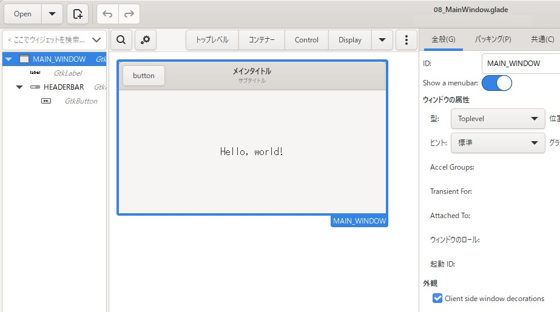
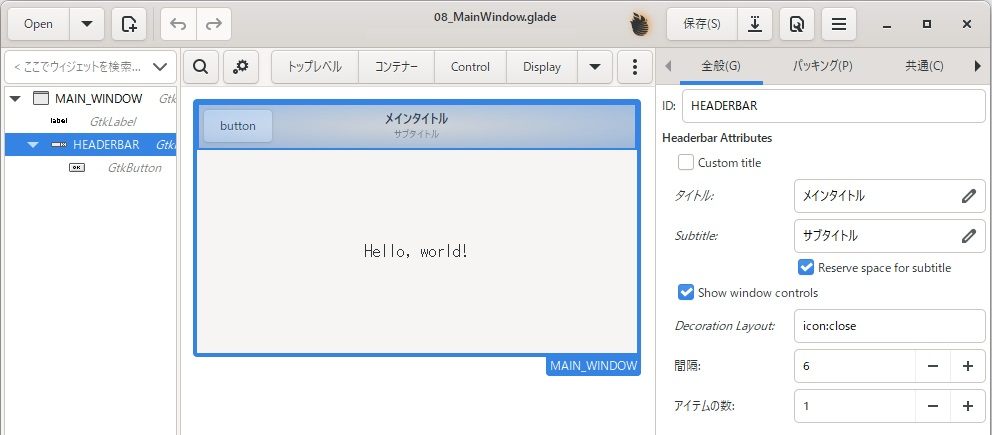

[go言語 & gotk3をちょっとやり直してみたい](../../README.md#go%E8%A8%80%E8%AA%9Egotk3%E3%82%92%E3%81%A1%E3%82%87%E3%81%A3%E3%81%A8%E3%82%84%E3%82%8A%E7%9B%B4%E3%81%97%E3%81%A6%E3%81%BF%E3%81%9F%E3%81%84)  

# 8. ヘッダーバー・ラベル書式・ウィンドウ書式のカスタマイズ
「[5.1 ヘッダーバーを消す](../05#51-%E3%83%98%E3%83%83%E3%83%80%E3%83%BC%E3%83%90%E3%83%BC%E3%82%92%E6%B6%88%E3%81%99)」
に記載しているように、標準のヘッダーバーは表示/非表示しか制御できないようですが、ヘッダーバーを作ることでカスタマイズが出来ます。  
また、ラベルに表示する文字列についてもフォントを変えたり色を変えたりすることが出来ますし、ウィンドウやダイアログ全体のフォントを設定することも出来ます。  
今回は、それらのやり方について確認していきます。  

## 8.1 カスタムヘッダーバーの作成
メインウィンドウについては、以下のように設定します。  
右側のペイン「外観」-「Client side window decorations」にチェックを入れる。  
メインウィンドウの上部に隙間が出来るので、「コンテナ―」から「GtkHeaderBar」をD&Dする。  
「GtkHeaderBar」にボタンなどのコントロールを配置する。  

  

ヘッダーバーの設定については、閉じるボタンのみを残して、最大化/最小化ボタンは表示しないように設定していきます。  
まず、右側のペイン「Show window controls」にチェックを入れて、最大化/最小化/閉じるボタンを表示するように設定します。  
次に、「Decoration Layout」に「icon:close」と入力し、閉じるボタンのみを表示します。  

  

作成したファイルは、
[ここ](glade/08_MainWindow.glade)
に置いてます。  

> [!NOTE]  
> 「Decoration Layout」に「icon:minimize,maximize,close」と入力した状態、もしくは空欄の状態が全てのボタンを表示する状態となります。  

プログラムの方は、「[1. gotk3を使って、Simple windowを作成する](../01/README.md)」のままとなります。  
（今回は作成していませんが、ヘッダーバーのボタンを押した時の処理などの追加が必要となります）  

実行画面は以下のようになります。  

  

## 8.2 ラベルの書式設定
ラベル（ボタンラベルなどを含む）には、「Pango Markup」を使って書式の設定が出来ます。

> Pango Markupは、テキストのスタイルや装飾を制御するための軽量なマークアップ言語です。主にGTK（GIMP Toolkit）などのGUIツールキットで使用され、テキストの表示を柔軟にカスタマイズできます。  
> Pango Markupは、HTMLに似たタグを使用してテキストのスタイルを指定します。これにより、以下のようなことが可能になります。  
> - フォントスタイルの変更:
>   - 太字 (`<b>`)
>   - 斜体 (`<i>`)
>   - 下線 (`<u>`)
>   - 取り消し線 (`<s>`)
> - テキストの色とサイズの変更:
>   - テキストの色 (`<span color="red">`)
>   - テキストのサイズ (`<span size="x-large">`)
> - その他の装飾:
>   - 上付き文字 (`<sup>`)
>   - 下付き文字 (`<sub>`)

やり方は、以下のようになります。  

```go
markup := `<span foreground="black" size="20pt" style="normal" font_family="MS Gothic">MSゴシック 20pt</span>`  + "\n" +
          `<span foreground="blue" size="20pt" style="normal" font_family="Yu Mincho">游明朝 20pt</span>`
dialogLabel1.SetMarkup(markup)
```

実行結果は、以下のようになります。  

  

## 8.3 ウィンドウやダイアログ全体の書式設定
CSSを使って設定します。解説とコードをGeminiに聞いてみました。  

> gotk3のダイアログでスタイルコンテキストを使用した場合、設定した書式は子ウィジェットに継承されます。
> 
> 具体的には、以下のようになります。
> 
> - スタイルコンテキストの継承:
>   - GTK（gotk3はGTKのGoバインディング）では、ウィジェットは階層構造を持っています。
>   - 親ウィジェットに設定されたスタイルコンテキストのプロパティ（フォント、色、余白など）は、特に上書きされない限り、子ウィジェットに継承されます。
>   - ダイアログも通常のウィジェットと同様に、スタイルコンテキストの継承の対象となります。
> 
> - ダイアログにおけるスタイルの適用:
>   - ダイアログ自体にスタイルコンテキストを設定した場合、そのスタイルはダイアログ内のすべてのウィジェット（ボタン、ラベル、入力フィールドなど）に適用されます。
>   - ただし、子ウィジェットが独自のスタイルコンテキストを持っている場合、そのスタイルが優先されます。
>   - スタイルプロバイダがダイアログにアタッチされている場合、そのスタイルプロバイダ内のスタイルも継承されます。
> 
> 
> ```
> 	// ダイアログを作成
> 	dlg, err := gtk.DialogNew()
> 	if err != nil {
> 		log.Fatal("Unable to create dialog:", err)
> 	}
> 	dlg.SetTransientFor(win)
> 	dlg.AddButton("OK", gtk.RESPONSE_OK)
> 
> 	// ダイアログのスタイルコンテキストを取得
> 	context, err := dlg.GetStyleContext()
> 	if err != nil {
> 		log.Fatal("Unable to get dialog style context:", err)
> 	}
> 
> 	// CSSプロバイダを作成
> 	cssProvider, err := gtk.CssProviderNew()
> 	if err != nil {
> 		log.Fatal("Unable to create CSS provider:", err)
> 	}
> 
> 	// CSSを設定（フォントを指定）
> 	css := `
> 		* {
> 			font-family: "MS Gothic";
> 			font-size: 12pt;
> 		}
> 	`
> 	err = cssProvider.LoadFromData(css)
> 	if err != nil {
> 		log.Fatal("Unable to load CSS:", err)
> 	}
> 
> 	// スタイルコンテキストにプロバイダを追加
> 	context.AddProvider(cssProvider, gtk.STYLE_PROVIDER_PRIORITY_APPLICATION)
> ```

実際に試していないため、コードは置いてませんが、WEB検索しても似たようなコードが表示されるため、問題ないのではないかと思います。  
（コンパイルしてエラーが出たら対処して下さい）
