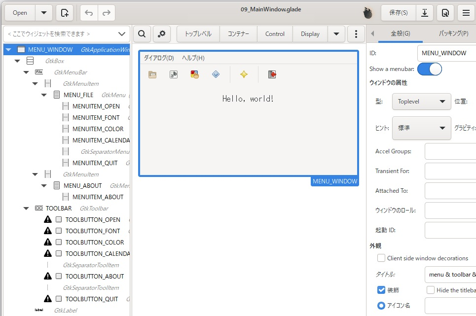
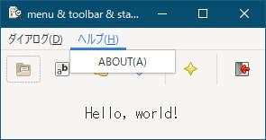
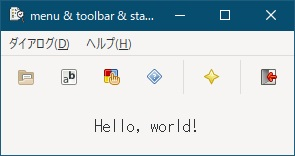

[go言語 & gotk3をちょっとやり直してみたい](../../README.md#go%E8%A8%80%E8%AA%9Egotk3%E3%82%92%E3%81%A1%E3%82%87%E3%81%A3%E3%81%A8%E3%82%84%E3%82%8A%E7%9B%B4%E3%81%97%E3%81%A6%E3%81%BF%E3%81%9F%E3%81%84)  

# 9. メニューバー/ツールバー/標準ダイアログを使いたい(前編)
前編では、メニューバー/ツールバーを対象にし、後編で、標準ダイアログを対象にします。  

> [!NOTE]  
> gtk3のウィジェットは「The Python GTK+ 3 Tutorial」の[5. Widget Gallery](https://python-gtk-3-tutorial.readthedocs.io/en/latest/gallery.html)が画像が多くて参考になりました。  

  

メインウィンドウの一番上に表示されてる部分がメニューバーで、その下でアイコンが並んでる部分がツールバーとなります。  
gladeでApplicationWindow上に、gtkMenuBarとgtkToolBarを配置します。  
gtkMenuItemとgtkToolButtonは、左側のペインで親を右クリックし、「Edit...」-「+」で追加できます。  

作成したファイルは、
[ここ](glade/09_MainWindow.glade)
に置いてます。  

> [!NOTE]
> - MenuBarは、「gtkMenuBar」-「gtkMenuItem」-「gtkMenu」-「gtkMenuItem」のような親子関係になります。
> - MenuItemの「下線を使用する」プロパティは、「ダイアログ(_D)」のようにすると、下線の後ろの文字がニーモニックキーになり、「ALT+D」でメニューが選択出来るようになります。  
>   「ダイアログ(_D)」-「開く(_O)」のようにメニューをプルダウンした後のメニューアイテムを選択する場合、「ALT+D」-「O」になります。  
> - ToolButtonの画像は「画像」-「ストックID」から選択すると標準のアイコンが使用されます。「画像」-「アイコン名」から選択すると、おそらく標準のアイコンテーマから選択されるのだと思います。

## 9.1 メニューバー
   

`application.Connect("activate", func() {})`の中で、メインウィンドウの後にgladeから読み込み、メニューアイテム選択時の処理を記述します。  

```go
menuItemOpen, _, err := GetObjFromGlade[*gtk.MenuItem](builder, "", "MENUITEM_OPEN")
if err != nil {
	return err
}

menuItemOpen.Connect("activate", func(){
	ret, err := menuOpen(parent)
	if err != nil {
		ShowErrorDialog(parent, err)
		return
	}
	if len(ret) != 0 {
		log.Println(ret)
	}
})
```

メニューアイテムの数だけ、上記のようなコードを記述すれば、メニューバーの完成となります。  

> [!NOTE]
> - `ShowErrorDialog()`は、
> [7.2 カスタムメッセージダイアログ](../07#72-%E3%82%AB%E3%82%B9%E3%82%BF%E3%83%A0%E3%83%A1%E3%83%83%E3%82%BB%E3%83%BC%E3%82%B8%E3%83%80%E3%82%A4%E3%82%A2%E3%83%AD%E3%82%B0)
> で作成した関数です。  
> - `menuOpen()`は、後編で説明します。  

## 9.2 ツールバー
  

`application.Connect("activate", func() {})`の中で、メインウィンドウの後にgladeから読み込み、ツールボタン選択時の処理を記述します。  

```go
toolButtonOpen, _, err := GetObjFromGlade[*gtk.ToolButton](builder, "", "TOOLBUTTON_OPEN")
if err != nil {
	return err
}

toolButtonOpen.Connect("clicked", func(){
	ret, err := menuOpen(parent)
	if err != nil {
		ShowErrorDialog(parent, err)
		return
	}
	if len(ret) != 0 {
		log.Println(ret)
	}
})
```

ツールボタンの数だけ、上記のようなコードを記述すれば、ツールバーの完成となります。  
ツールバーには、メニューバーと同じ項目を登録しているので、処理もほとんどメニューアイテムと同じになります。  
ジェネリックスで共通化出来ないかと思ったのですが、Connect()関数をコールする部分を共通化する方法が見つからなかったので、別々のコードになってます。  

> [!NOTE]
> - `ShowErrorDialog()`は、
> [7.2 カスタムメッセージダイアログ](../07#72-%E3%82%AB%E3%82%B9%E3%82%BF%E3%83%A0%E3%83%A1%E3%83%83%E3%82%BB%E3%83%BC%E3%82%B8%E3%83%80%E3%82%A4%E3%82%A2%E3%83%AD%E3%82%B0)
> で作成した関数です。  
> - `menuOpen()`は、後編で説明します。  

## 9.3 おわりに
メニューバー/ツールバーの各項目選択後の処理を
「[10. メニューバー/ツールバー/標準ダイアログを使いたい(後編)](../10/README.md)」
で説明します。
