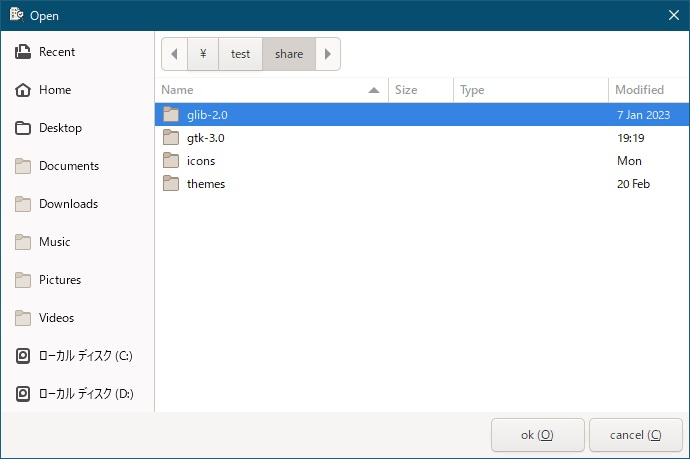

[go言語 & gotk3をちょっとやり直してみたい](../../README.md#go%E8%A8%80%E8%AA%9Egotk3%E3%82%92%E3%81%A1%E3%82%87%E3%81%A3%E3%81%A8%E3%82%84%E3%82%8A%E7%9B%B4%E3%81%97%E3%81%A6%E3%81%BF%E3%81%9F%E3%81%84)  

# 10. メニューバー/ツールバー/標準ダイアログを使いたい(後編)
後編では、標準ダイアログを対象にします。  

## 10.1 ファイル選択ダイアログ
  

コードを以下に示します。  

```go
func menuOpen(parent *gtk.ApplicationWindow) (string, error) {
	log.Println("Openを選択")
	if parent == nil {
		return "", fmt.Errorf("parent is null")
	}
	
	// ファイル選択ダイアログを作成
	fcd, err := gtk.FileChooserDialogNewWith2Buttons("Open", parent, gtk.FILE_CHOOSER_ACTION_OPEN, "ok (_O)", gtk.RESPONSE_OK, "cancel (_C)", gtk.RESPONSE_CANCEL)
	if err != nil {
		return "", err
	}
	defer fcd.Destroy()
	
	// 「OK」で終わった場合は、ファイル名を返却
	if fcd.Run() == gtk.RESPONSE_OK {
		return fcd.GetFilename(), nil
	}
	return "", nil
}
```

`FileChooserDialogNewWith2Buttons()`の第3引数は、以下のようになります。  

| 設定値 |  
| --- |  
| FILE_CHOOSER_ACTION_OPEN |  
| FILE_CHOOSER_ACTION_SAVE |  
| FILE_CHOOSER_ACTION_SELECT_FOLDER |  
| FILE_CHOOSER_ACTION_CREATE_FOLDER |  

第4～第5引数および第6～第7引数は、ボタンラベルの文字列とレスポンスコードになります。  
レスポンスコードは、
[7.1 標準メッセージダイアログ](../07#71-%E6%A8%99%E6%BA%96%E3%83%A1%E3%83%83%E3%82%BB%E3%83%BC%E3%82%B8%E3%83%80%E3%82%A4%E3%82%A2%E3%83%AD%E3%82%B0)
に一覧を表示してます。  

> [!NOTE]
> `FileChooserDialogNewWith2Buttons()`は、表示するファイルのフィルタ設定や、複数選択可否、カレントフォルダの指定などの設定も出来ます。  
> 詳しくは、[gotk3/gtk/FileChooser](https://pkg.go.dev/github.com/gotk3/gotk3/gtk#FileChooser)で確認して下さい。  

## 10.2 フォント選択ダイアログ
  

コードを以下に示します。  

```go
func menuFont(parent *gtk.ApplicationWindow) (string, error) {
	log.Println("Fontを選択")
	if parent == nil {
		return "", fmt.Errorf("parent is null")
	}
	
	// フォント選択ダイアログを作成
	fcd, err := gtk.FontChooserDialogNew("Font", parent)
	if err != nil {
		return "", err
	}
	defer fcd.Destroy()
	
	// 「OK」で終わった場合は、フォント名を返却
	if fcd.Run() == gtk.RESPONSE_OK {
		return fcd.GetFont(), nil
	}
	return "", nil
}
```

`GetFont()`で取得した文字列には色々な物が含まれてるので利用する時は注意してください。  
例えば、以下のような文字列が返ってきます。  
- Sans 10  
- Sans-Serif Oblique Semi-Condensed 10
- Schneidler Blk BT Heavy Italic 10  

> [!NOTE]
> `FontChooserDialogNew()`は、カレントフォントの指定などの設定も出来ます。  
> 詳しくは、[gotk3/gtk/FontChooser](https://pkg.go.dev/github.com/gotk3/gotk3/gtk#FontChooser)で確認して下さい。  


## 10.3 カラー選択ダイアログ
  

```go
func menuColor(parent *gtk.ApplicationWindow) (string, error) {
	log.Println("Colorを選択")
	if parent == nil {
		return "", fmt.Errorf("parent is null")
	}
	
	// 色選択ダイアログを作成
	ccd, err := gtk.ColorChooserDialogNew("Color", parent)
	if err != nil {
		return "", err
	}
	defer ccd.Destroy()
	
	// 「OK」で終わった場合は、RGBAを返却
	if ccd.Run() == gtk.RESPONSE_OK {
		return ccd.GetRGBA().String(), nil
	}
	return "", nil
}
```

## 10.4 日付選択ダイアログ
  

```go
func menuCalendar(parent *gtk.ApplicationWindow) (string, error) {
	log.Println("Calendarを選択")
	if parent == nil {
		return "", fmt.Errorf("parent is null")
	}
	
	// ダイアログを作成 
	dialog, err := gtk.DialogNew()
	if err != nil {
		return "", err
	}
	defer dialog.Destroy()
	
	dialog.SetTransientFor(parent)
	dialog.SetModal(true)

	// カレンダーウィジェットを作成して追加
	calendar, err := gtk.CalendarNew()
	if err != nil {
		return "", err
	}
	gca, err := dialog.GetContentArea()
	if err != nil {
		return "", err
	}
	gca.Add(calendar)

	// 実行日を設定
	year, month, day := time.Now().Date()
	calendar.SelectMonth(uint(month) - 1, uint(year))
	calendar.SelectDay(uint(day))

	dialog.ShowAll()

	// ダブルクリックされた場合、レスポンスコード「OK」を送信
	calendar.Connect("day_selected_double_click", func() {
		dialog.Response(gtk.RESPONSE_OK)
	})

	// 「OK」で終わった場合は、日付を返却
	if dialog.Run() == gtk.RESPONSE_OK {
		year, month, day := calendar.GetDate()
		return fmt.Sprintf("%04d/%02d/%02d", year, int(month) + 1, day), nil
	}

	return "", nil
}
```

## 10.5 ABOUTダイアログ
   

```go
func menuAbout(parent *gtk.ApplicationWindow) error {
	log.Println("Aboutを選択")
	if parent == nil {
		return fmt.Errorf("parent is null")
	}
	
	// ABOUTダイアログを作成
	abd, err := gtk.AboutDialogNew()
	if err != nil {
		return err
	}
	defer abd.Destroy()
	
	abd.SetTransientFor(parent)
	
	// ロゴに親アイコンを設定
	parentIcon, err := parent.GetIcon()
	if err == nil {
		abd.SetLogo(parentIcon)
	}
	
	abd.SetProgramName("プログラムの名前")
	abd.SetVersion("バージョン x.xx")
	abd.SetComments("コメントをここに記載")
	abd.SetWebsiteLabel("ウェブサイト")
	abd.SetWebsite("ウェブサイトのURL")
	
	abd.SetCopyright("Copyright (c) 20xx Firstname Lastname")
	abd.SetLicense("LicenseTypeを指定しない場合、ここにライセンスを記載")
	abd.SetLicenseType(gtk.LICENSE_MIT_X11)
	abd.SetWrapLicense(true)	// ライセンス表示を改行する

	abd.SetAuthors([]string{"開発した人"})
	abd.SetDocumenters([]string{"ドキュメントを作成した人"})
	abd.SetTranslatorCredits("翻訳した人")
	abd.SetArtists([]string{"グラフィックデザイン、UIデザインなどに貢献した人"})
	
	abd.Run()
	return nil
}
```
