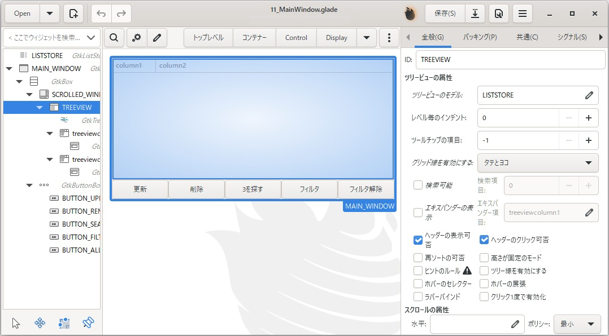
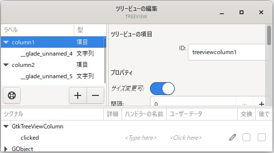
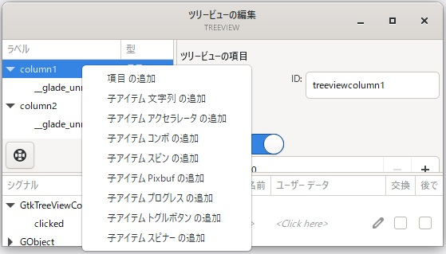
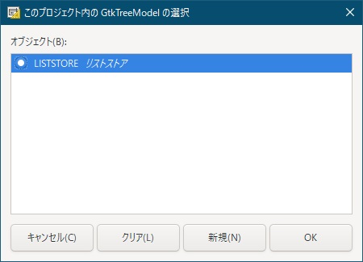
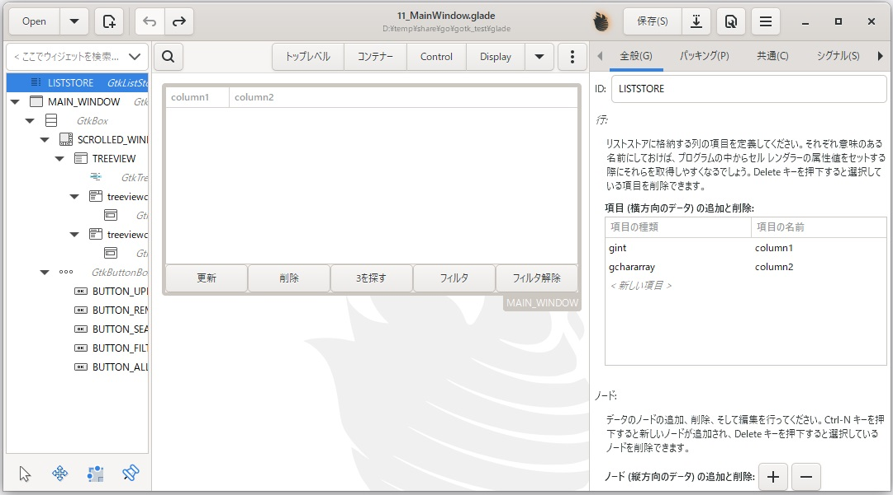
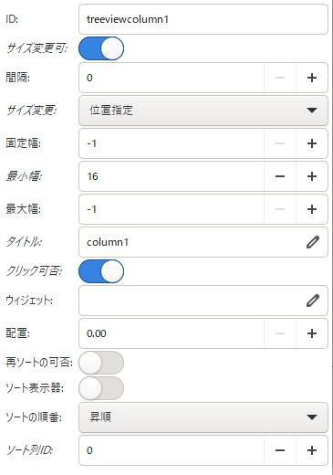
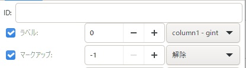

[go言語 & gotk3をちょっとやり直してみたい](../../README.md#go%E8%A8%80%E8%AA%9Egotk3%E3%82%92%E3%81%A1%E3%82%87%E3%81%A3%E3%81%A8%E3%82%84%E3%82%8A%E7%9B%B4%E3%81%97%E3%81%A6%E3%81%BF%E3%81%9F%E3%81%84)  

# 11. 表形式にデータを表示したい


表形式のデータを表示する場合、gtk3では、ListBoxかTreeViewを使うようです。

- ListBox：1行にBoxなどのコンテナを使って複数のオブジェクトを配置可能。列は意識されてなさそう。
- TreeView：（表形式で使う場合）行/列で管理されており、MVC(Model-View-Controller)構造となっている。

列で表示を揃えたりとか考えると、TreeViewを使うのが良さそうなのですが、ちょっと取っ付き難いのです。

- コーディング時に、ビューを1列1列定義していくのが面倒くさい
- モデル(ListStore）が構造体やマップのように手軽にアクセス出来ない
- 「チュートリアルをやってみた」のようなサンプルは見つかるのですが、中々欲しい情報が見つからない

今回は、分かりやすくはならないかもしれませんが、ビュー定義を出来るだけgladeで作成して、モデルをコツコツ作ってみたいと思います。  

## 11.1 Gladeでメインウィンドウを作成

Gladeで「トップレベル」を「GtkApplicationWindow」にし、以下の画像のようにオブジェクトを配置したウィンドウ作成後、ファイル名「11_MainWindow.glade」で保存します。  
ソートを使えるようにしたいので、下図のようにTreeViewのプロパティでは、「ヘッダーの表示可否」「ヘッダーのクリック可否」をチェックしておいて下さい。  

  

ビューへの列追加が分かり難いので気をつけてください。  
メニュー作成時と同じように、左側のペインで「GtkTreeView」-右クリック-「Edit...」を選択し、「ツリービューの編集」画面を開きます。  

  

上図の左側のペインで「+」ボタンを押して項目を追加  
追加された項目を右クリックして、「子アイテム文字列の追加」を選択します。  
※表に表示する項目が数値でも文字列でも「子アイテム文字列の追加」を選択して下さい。  
今回は2列分追加してます。  



メイン画面に戻って、TreeViewのプロパティ（右側のペイン）-「ツリービューのモデル」の右側鉛筆部分をクリックして、「このプロジェクト内のGtkTreeModelの選択」画面を表示します。  

  

「新規(N)」ボタンを押すと左側のペインにGtkListStoreが追加されます。IDを変える場合は、追加されたGtkListStoreのIDを修正するとTreeView側も自動的に変更されます。  

今度はモデルへの列追加となります。  
GtkListStoreのプロパティ（右側のペイン）-「項目（横方向のデータ）の追加と削除」欄に2列分追加します。  
整数は`gint`、文字列は`gchararray`です。項目の名前は後でglade内で使うので分かる名前をつけて下さい。  

  

次に、TreeViewの1列目（TreeView配下のtreeviewcolumn1）のプロパティを設定します。  
「タイトル」はヘッダーの表示文字列、「クリック可否」はチェック、「ソート列ID」は「0」を指定して下さい。  
「ソート列ID」-「0」はモデルの1列目を指してます。その他の項目は任意に設定して下さい。  
TreeViewの2列目のプロパティも1列目と同様ですが、「ソート列ID」は「1」を指定して下さい。  

  

TreeViewの1列目の子GtkCellRendererTextのプロパティを設定します。  
「ラベル」を「0」に設定して下さい。右側にモデルで1列目に設定した名前が表示される筈です。  
この設定を忘れるとモデルにデータを格納しても表示されないので注意して下さい。  
その他の項目は任意に設定して下さい。  
TreeViewの2列目の子GtkCellRendererTextのプロパティも1列目と同様ですが、「ラベル」は「1」を指定して下さい。  

  

> [!NOTE]
> GtkCellRendererTextのプロパティの中で分かり難いと思ったプロパティは「省略記号で置き換える」でした。これは、文字幅が収まらなかった時に、「aaaa...」のように省略記号を表示して短縮表示する設定となります。

以上でgladeファイルの作成は終了となります。  
作成したファイルは、
[ここ](glade/11_MainWindow.glade)
に置いてます。  

## 11.2 フィルタの作成

データの追加・削除・更新などの後に持っていきたかったのですが、フィルタがあることでコードに影響が出るため、先に説明します。  
gladeではフィルタ追加が出来ないようなので、（フィルタが必要な場合は）コードで追加する必要があります。  
以下にコードを示します。  

```go
filterON := false
listFilter, err := listStore.FilterNew(nil)
if err != nil {
	log.Fatal("Failed to create the list filter: ", err)
}

// フィルタ関数（trueなら表示。falseなら非表示）
listFilter.SetVisibleFunc(func(model *gtk.TreeModel, iter *gtk.TreeIter) bool {
	// フィルタがOFFの場合は全行出力
	if !filterON {
		return true
	}
	
	// 値を取得
	col1, err := GetListStoreValue[int] (model, iter, 0)
	if err != nil {
		ShowErrorDialog(window1, fmt.Errorf("Failed to retrieve the tree value: %w", err))
		return false
	}
	
	// 偶数は出力、奇数は出力しない
	if col1 % 2 == 0 {
		return true
	} else {
		return false
	}
})
```

モデルlistStoreにフィルタを追加する形となります。  
フィルタ関数は、コード中のコメントに記載の通り戻り値が`true`なら表示で`false`なら非表示となります。  
フィルタON/OFFを制御するため「filterON」変数を定義してます。  
`ShowErrorDialog`は、[7.2 カスタムメッセージダイアログ](../07#72-%E3%82%AB%E3%82%B9%E3%82%BF%E3%83%A0%E3%83%A1%E3%83%83%E3%82%BB%E3%83%BC%E3%82%B8%E3%83%80%E3%82%A4%E3%82%A2%E3%83%AD%E3%82%B0)で作成した関数となります。  
モデルから値を取得している`GetListStoreValue[int]()`は自作関数となりますが、「11.6」で説明します。  

## 11.3 ソートの作成

gladeでフィルタが作成出来ないので、フィルタを追加したところソートが上手く動かなくなりました。  
そのため、コードで作成して追加します。  

```go
listSort, err := gtk.TreeModelSortNew(listFilter)
if err != nil {
	log.Fatal(err)
}

// TreeViewに追加
treeView.SetModel(listSort)
```

11.2で作成したフィルタを持つソートを作成してTreeViewのモデルに設定し直してます。  
gladeで設定した「ソート列ID」などは維持されているようで、問題なく動作しました。  

> [!TIP]
> ソートもフィルタのように関数を作って独自に判定させることが出来ます。  
> `listSort.SetSortFunc(columnNo, func(model *TreeModel, a, b *TreeIter) int {})`  
> a, bのIterから値を取得して大小比較した結果、負/0/正のいずれかを返す関数を作成することになります。  
> 但し、昇順の場合、降順の場合で正負を逆にする必要があります。  

## 11.4 モデルへのデータ追加

モデルへのデータアクセスにあたり、必須となるIterとpathについてGeminiに聞いてみました。  

> - Iter は、モデル内の特定の行を指し示すイテレータです。TreeView に表示されるデータは モデルに格納されており、Iter を使用することで、モデル内の特定の行にアクセスし、データの取得や変更を行うことができます。  
> - path は、モデル内の特定の行の位置を示すためのデータ構造です。Iter が行自体を指し示すイテレータであるのに対し、path は行の階層的な位置を表します。  

どちらも行を示す物のようですが、pathは階層構造を意識した行ということのようです。  

> [!CAUTION]
> Iterやpathはデータの追加・削除やフィルタ・ソートなどの影響で動的に変わる物なので、ListStoreの行データとIterをグローバル変数のMapなどを使って保持しておいても意味がありません。  

モデルへ行の追加をするコードを以下に示します。  

```go
iter := listStore.Append()
err = listStore.Set(iter, []int{0, 1}, []interface{}{1, "eeeeeeeeeeeeeee"})
if err != nil {
	log.Fatal(err)
}
```

`listStore.Append()`で、データ末尾の次の行位置を取得し、取得した行位置にデータを追加しています。  
`[]int{0, 1}`は、モデルの1列目と2列目を指定してます。  
`[]interface{}{1, "eeeeeeeeeeeeeee"}`は、1列目と2列目に代入するデータを指定しています。  

> [!TIP]
> Iterは他にも、一番前に追加する用の`Prepend()`や挿入用の`Insert()`などで取得できます。  
> 詳しくは、[gotk3/gtk/ListStore](https://pkg.go.dev/github.com/gotk3/gotk3/gtk#ListStore)で確認して下さい。  

## 11.5 ListStoreモデル ⇒ Filterモデル ⇒ Sortモデル ⇒ TreeView

ListStoreにデータを追加したら、FilterされてSortされてTreeViewに表示されます。  
そのため、TreeViewに表示されてる行とListStoreに格納されてるデータの位置には乖離があります。  

例えば、TreeViewカーソル行のモデル（listSort）のIterを取得するのは、以下のコードになります。  

```go
selection, err := treeView.GetSelection()
if err != nil {
	return nil, err
}

_, iter1, ok := selection.GetSelected()
if !ok {
	return nil, fmt.Errorf("Unable to get the selected item.")
}
```

これをListStoreのIterに変換するには、以下のようになります。  

```go
// iter1(listSort) ⇒ iter2(listFilter)
iter2 := listSort.ConvertIterToChildIter(iter1)

// iter2(listFilter) ⇒ iter(listStore)
iter := listFilter.ConvertIterToChildIter(iter2)
```

逆にListStoreから画面に表示されてる行（TreeViewの行）のIterを取得するには、以下のようになります。  

```go
// iter1(listStore) ⇒ iter2(listFilter)
iter2 := listFilter.ConvertChildIterToIter(iter1)

// iter2(listFilter) ⇒ iter(listSort)
iter := listSort.ConvertChildIterToIter(iter2)
```

pathの場合も同様`ConvertChildPathToPath()`や`ConvertPathToChildPath()`を使った対応が必要となります。  
例として、TreeViewの行をダブルクリックした時のシグナル処理を以下に示します。  

```go
treeView.Connect("row-activated", func(tv *gtk.TreeView, path *gtk.TreePath, column *gtk.TreeViewColumn) {})
```

この時、コールバック関数で渡される第2引数がTreeViewのpathになってます。  
ダブルクリックされた行を編集するなどの処理をするためにListStoreのデータを取得するためには、上記のような変換処理が必要となります。  

> [!CAUTION]
> ここで説明した変換処理は、Geminiに聞いても明確な回答がなかったため、モデルの繋がりを考えて設定してみたら動作したという状況です。
> 間違えてたらすみません。  

## 11.6 モデルから値の取得

モデルから値を取得する場合は、Iterとカラム番号から値を取得後、その値をgo言語の形式に変換する必要があります。  
以下にジェネリックスを使って作成した関数を示します。

```go
func GetListStoreValue[T any] (iModel gtk.ITreeModel, iter *gtk.TreeIter, id int) (T, error) {
	model := iModel.ToTreeModel()

	// 値を取得
	colVal, err := model.GetValue(iter, id)
	if err != nil {
		return *new(T), err
	}
	
	// 値をgolang形式に変換
	col, err := colVal.GoValue()
	if err != nil {
		return *new(T), err
	}
	
	// interfaceをT型に変換
	ret, ok := col.(T)
	if !ok {
		return *new(T), fmt.Errorf("type assertion failed")
	}
	return ret, nil
}
```

呼び出し側は、以下のようになります。（エラーハンドリングは省略してます）

```go
col1, err := GetListStoreValue[int] (model, iter, 0)
col2, err := GetListStoreValue[string] (model, iter, 1)
```

## 11.7 モデルのデータ更新

ちょっと見難くなりましたが、Iter行の値を取得して、2列目の項目の末尾に「*」を追加してデータを更新するコードとなります。  

```go
/*
// 1列目の値の取得は、Setで1行分更新する場合に使用
col1, err := GetListStoreValue[int] (listStore, iter, 0)
if err != nil {
	ShowErrorDialog(window1, fmt.Errorf("Failed to retrieve the tree value: %w", err))
	return
}
*/

// 2列目の値を取得
col2, err := GetListStoreValue[string] (listStore, iter, 1)
if err != nil {
	ShowErrorDialog(window1, fmt.Errorf("Failed to retrieve the tree value: %w", err))
	return
}

// 2列目の値を更新して上書き
err = listStore.SetValue(iter, 1, col2 + "*")
if err != nil {
	ShowErrorDialog(window1, fmt.Errorf("Failed to update the value: %w", err))
	return
}

// Setで1行分更新する場合
// err = listStore.Set(iter, []int{0, 1}, []interface{}{col1, col2 + "*"})
```

コメントアウトしてる`Set()`を使う方法は、1行分更新する時に使用するコードです。  
コメントアウトしてない`SetValue()`を使う方法は、1行のうちの1項目のみ更新する時に使用するコードです。  

MVC構造なので、データを更新すれば、画面の表示にも反映されます。  

## 11.8 モデルからのデータ削除

Iter行を削除するコードを以下に示します。  

```go
listStore.Remove(iter)
```

データ更新も同様ですが、「11.5」で記載したようにIterは、ListStoreのIterにする必要があるので注意して下さい。  

## 11.9 モデル内のデータを検索

Geminiにも聞いてみましたが、サーチ関数などはないようなので、ループで1行1行確認する必要があります。  
ListStore内をループで1行1行取りだして、1列目が「3」の行を検索するコードを以下に示します。  

```go
listStore.ForEach(func(model *gtk.TreeModel, path *gtk.TreePath, iter *gtk.TreeIter) bool {
	// 値を取得
	col1, err := GetListStoreValue[int] (model, iter, 0)
	if err != nil {
		ShowErrorDialog(window1, fmt.Errorf("Failed to retrieve the tree value: %w", err))
		return true
	}
	
	if col1 == 3 {
		// listStoreのパスからlistFilterのパスに変換
		path1 := listFilter.ConvertChildPathToPath(path)
		
		// フィルタされておらずTreeviewに表示されてる場合
		if path1 != nil {
			// listFilterのパスからlistSortのパスに変換
			path2 := listSort.ConvertChildPathToPath(path1)
			
			// カーソルを移動
			treeView.SetCursor(path2, nil, false)
		}
		// 検索を終了する
		return true
	}
	
	// 検索を続ける
	return false
})
```

データが見つかった時に、TreeViewのカーソルを移動するために、ListStoreのpathからListSortのpathへ変換してます  
この時、フィルタのために画面に非表示となってるデータの可能性がありますので、pathがNULLかどうかの判定を行っています。  
（ソートで非表示になる事はないので、フィルタ部だけ判定してます）  

見つからなかった時にメッセージを出すなどの処理をしたい場合、ForEachの外側のスコープで宣言した変数に対して、値が見つかった時にForEachの中で値を設定し、値が設定されてなければ見つからなかったと判定する方法となります。  

## 11.10 フィルタ条件の変更

「11.2」で作成したフィルタは、`filterON`変数でフィルタの条件を変更することが出来ます。  
例えば、ボタンを押したタイミングで、`filterON`変数を更新しても、TreeViewの表示は勝手に変わりません。  
そのため、以下のようなコードにする必要があります。  

```go
btnFilter.Connect("clicked", func() {
	filterON = true
	listFilter.Refilter()
})
```

`filterON`変数を変更した後`listFilter.Refilter()`を実行することで再フィルタを行います。  

## 11.11 おわりに

やっぱり取っ付き難いと思います。分り易く説明をしようとしても中々難しいですね。  
作成したコードは、
[ここ](11_ListView.go)
に置いてます。 

</br>

「[12. （まとめ）付箋アプリの作成～はじめに～](../12/README.md)」へ

