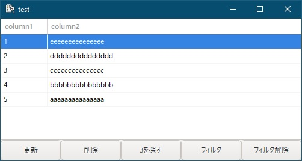

[go言語 & gotk3をちょっとやり直してみたい](../../README.md#go%E8%A8%80%E8%AA%9Egotk3%E3%82%92%E3%81%A1%E3%82%87%E3%81%A3%E3%81%A8%E3%82%84%E3%82%8A%E7%9B%B4%E3%81%97%E3%81%A6%E3%81%BF%E3%81%9F%E3%81%84)  

# 11. 表形式にデータを表示したい



表形式のデータを表示する場合、gtk3では、ListBoxかTreeviewを使うようです。

- ListBox：1行にBoxなどのコンテナを使って複数のオブジェクトを配置可能。列は意識されてなさそう。
- Treeview：（表形式で使う場合）行/列で管理されており、MVC(Model-View-Controller)構造となっている。

列で表示を揃えたりとか考えると、Treeviewを使うのが良さそうなのですが、ちょっと取っ付き難いのです。

- コーディング時に、ビューを1列1列定義していくのが面倒くさい
- モデル(ListStore）が構造体やマップのように手軽にアクセス出来ない
- 「チュートリアルをやってみた」のようなサンプルは見つかるのですが、中々欲しい情報が見つからない

今回は、分かりやすくはならないかもしれませんが、ビュー定義を出来るだけgladeで作成して、モデルをコツコツ作ってみたいと思います。  

## 11.1 Gladeでメインウィンドウを作成

Gladeで「トップレベル」を「GtkApplicationWindow」にし、以下の画像のようにオブジェクトを配置したウィンドウ作成後、ファイル名「11_MainWindow.glade」で保存します。  
ソートを使えるようにしたいので、下図のようにTreeviewのプロパティでは、「ヘッダーの表示可否」「ヘッダーのクリック可否」をチェックしておいて下さい。  

  

ビューへの列追加が分かり難いです。  
メニュー作成時と同じように、左側のペインで「GtkTreeview」-右クリック-「Edit...」を選択し、「ツリービューの編集」画面を開きます。  

  

左図の左側のペインで「+」ボタンを押して項目を追加  


追加された項目を右クリック（右図）して、「子アイテム文字列の追加」を選択します。  
※表に表示する項目が数値でも文字列でも「子アイテム文字列の追加」を選択して下さい。  
今回は2列分追加してます。  

メイン画面に戻って、Treeviewのプロパティ（右側のペイン）-「ツリービューのモデル」の右側鉛筆部分をクリックして、「このプロジェクト内のGtkTreeModelの選択」画面を表示します。  

  

「新規(N)」ボタンを押すと左側のペインにGtkListStoreが追加されます。IDを変える場合は、追加されたGtkListStoreのIDを修正するとTreeview側も自動的に変更されます。  

今度はモデルへの列追加となります。  
GtkListStoreのプロパティ（右側のペイン）-「項目（横方向のデータ）の追加と削除」欄に2列分追加します。  
整数は`gint`、文字列は`gchararray`です。項目の名前は後でglade内で使うので分かる名前をつけて下さい。  

  

次に、Treeviewの1列目（Treeview配下のtreeviewcolumn1）のプロパティを設定します。  
「タイトル」はヘッダーの表示文字列、「クリック可否」はチェック、「ソート列ID」は「0」を指定して下さい。  
「ソート列ID」-「0」はモデルの1列目を指してます。その他の項目は任意に設定して下さい。  
Treeviewの2列目のプロパティも1列目と同様ですが、「ソート列ID」は「1」を指定して下さい。  

  

Treeviewの1列目の子GtkCellRendererTextのプロパティを設定します。  
「ラベル」を「0」に設定して下さい。右側にモデルで1列目に設定した名前が表示される筈です。  
この設定を忘れるとモデルにデータを格納しても表示されないので注意して下さい。  
その他の項目は任意に設定して下さい。  
Treeviewの2列目の子GtkCellRendererTextのプロパティも1列目と同様ですが、「ラベル」は「1」を指定して下さい。  

  

> [!NOTE]
> GtkCellRendererTextのプロパティの中で分かり難いと思ったプロパティは「省略記号で置き換える」でした。これは、文字幅が収まらなかった時に、「aaaa...」のように省略記号を表示して短縮表示する設定となります。

以上でgladeファイルの作成は終了となります。  
作成したファイルは、
[ここ](glade/11_MainWindow.glade)
に置いてます。  

## 11.2 フィルタの作成

データの追加・削除・更新などの後に持っていきたかったのですが、フィルタがあることでコードに影響が出るため、先に説明します。  
gladeではフィルタ追加が出来ないようなので、（必要な場合は）コードで追加する必要があります。  
以下にコードを示します。  

```go
filterON := false
listFilter, err := listStore.FilterNew(nil)
if err != nil {
	log.Fatal("Failed to create the list filter: ", err)
}

// フィルタ関数（trueなら表示。falseなら非表示）
listFilter.SetVisibleFunc(func(model *gtk.TreeModel, iter *gtk.TreeIter) bool {
	// フィルタがOFFの場合は全行出力
	if !filterON {
		return true
	}
	
	// 値を取得
	col1, err := GetListStoreValue[int] (model, iter, 0)
	if err != nil {
		ShowErrorDialog(window1, fmt.Errorf("Failed to retrieve the tree value: %w", err))
		return false
	}
	
	// 偶数は出力、奇数は出力しない
	if col1 % 2 == 0 {
		return true
	} else {
		return false
	}
})
```

モデルlistStoreにフィルタを追加する形となります。  
フィルタ関数は、コード中のコメントに記載の通り戻り値が`true`なら表示で`false`なら非表示となります。  
フィルタON/OFFを制御するため「filterON」変数を定義してます。  
モデルから値を取得している`GetListStoreValue[int]()`は自作関数となりますが、後で説明します。  

## 11.3 ソートの作成

gladeで
