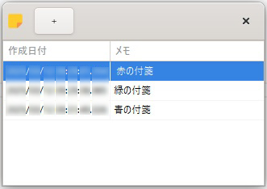
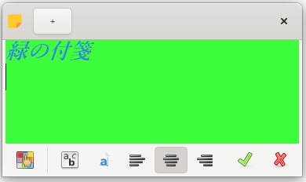

[go言語 & gotk3をちょっとやり直してみたい](../../README.md#go%E8%A8%80%E8%AA%9Egotk3%E3%82%92%E3%81%A1%E3%82%87%E3%81%A3%E3%81%A8%E3%82%84%E3%82%8A%E7%9B%B4%E3%81%97%E3%81%A6%E3%81%BF%E3%81%9F%E3%81%84)  

# 17. （まとめ）付箋アプリの作成  

大体は必要と思われる機能の確認が出来たと思うので、付箋アプリを作成していきます。  
素人プログラムなので、いまいちなコードだと思いますが、関数単位ではGeminiにリファクタリングをして貰ってます。  
（それを組み合わせてるのが素人なので変だったらすみません）  

## 17.1 GladeでUIを作成  

Gladeでメインウィンドウ/編集ウィンドウ/付箋ウィンドウを作成後、ファイル名「17_MainWindow.glade」で保存します。  

    

上図の上から編集ウィンドウ、メインウィンドウ、付箋ウィンドウとなります。他にもListStore、タスクアイコン用のメニュー、付箋用のメニューなども作成しているので左側のペインに表示されてます。  

- 編集ウィンドウ  
  左上のボタン：新規付箋作成  
  真ん中：TextViewを使って付箋に表示する文字列を編集します  
  下側のボタンは左から、  
  - 背景色設定  
  - フォント設定  
  - フォント色設定  
  - 左寄せ  
  - 中央寄せ  
  - 右寄せ  
  - 決定  
  - キャンセル  
  
  となります。  
- メインウィンドウ  
  左上のボタン：新規付箋作成  
  下側：TreeViewを使って付箋の一覧を表示します  
- 付箋ウィンドウ  
  設定された色・書式・文字列・サイズで付箋を表示します。  
- タスクアイコン用のメニュー（STATUSICON_MENU）  
  以下のポップアップメニューを表示します。  
  - ウィンドウを表示
  - 新規付箋  
  - アプリケーションを終了  
- 付箋用のメニュー（STICKY_MENU）  
  以下のポップアップメニューを表示します。  
  - 新規付箋  
  - はがす

作成したファイルは、
[ここ](glade/17_MainWindow.glade)
に置いてます。  

## 17.2 メインウィンドウ  

作成日付をキーにしたマップをグローバル変数として使います。  

```go
var StickyMap		map[string]StickyStr
```

あとは、だいたい以下の章で説明した内容に沿って作成してます。  

- 多重起動防止やアプリケーションの作成、gladeファイルから読み込んでメインウィンドウの作成  
  「[1. gotk3を使って、Simple windowを作成する](../01/README.md)」  
- タスクトレイ格納、右クリックメニュー  
  「[6. タスクトレイに格納したい](../06/README.md)」  
- ダイアログを表示  
  「[7. メッセージダイアログとステータスバーを表示したい](../07/README.md)」  
- ヘッダーバーをカスタマイズ  
  「[8. ヘッダーバー・ラベル書式・ウィンドウ書式のカスタマイズ](../08/README.md)」  
- 表  
  「[11. 表形式にデータを表示したい](../11/README.md)」  
- ファイル入出力  
  「[13. （まとめ）ファイルの存在確認とファイル入出力](../13/README.md)」  
- シグナル  
  「[14. （まとめ）カスタムシグナル](../14/README.md)」  

カスタムシグナルについては、メインウィンドウで表の管理を行うために、以下の操作をメインウィンドウ経由で行えるように作成してます。  

- 編集画面表示  
  付箋の新規作成や編集時に表の追加・更新を行う  
- 付箋表示  
  表の追加・更新に伴い付箋の表示を行う  
- 付箋破棄  
  付箋破棄時に表の更新を行い、付箋ウィンドウを破棄する  

付箋が他のウィンドウの後ろに隠れたときに不便だったので、メインウィンドウがフォーカスされた時に全ての付箋を前面に出すようにしてます。  
また、表にフィルタは不要なので、今回はフィルタを追加してません。  
その他は、前までの章で説明した内容と大きく変わるところはないと思います。  

作成したファイルは、
[ここ](17_MainWindow.go)
に置いてます。  

## 17.3 編集ウィンドウ  

だいたい以下の章で説明した内容に沿って作成してます。 

- ダイアログを表示  
  「[7. メッセージダイアログとステータスバーを表示したい](../07/README.md)」  
- ヘッダーバーをカスタマイズ  
  「[8. ヘッダーバー・ラベル書式・ウィンドウ書式のカスタマイズ](../08/README.md)」  
- ツールバー  
  「[9. メニューバー/ツールバー/標準ダイアログを使いたい(前編)](../09/README.md)」  
- カラー選択ダイアログ、フォント選択ダイアログ  
  「[10. メニューバー/ツールバー/標準ダイアログを使いたい(後編)](../10/README.md)」  
- 書式の反映  
  「[15. （まとめ）CSSを使った書式設定](../15/README.md)」  

gotk3には、RadioToolButtonがなかったので、ToggleToolButtonで代替してます。そのため、左寄せ/中央寄せ/右寄せのボタンが押されるたびに、選択されなかったボタンを非選択に変更する処理を入れてます。  

TextViewから入力されたテキストを取りだす処理と付箋に表示されていたテキストをTextViewへ反映する処理のコードを以下に示します。  

```go
// TextViewから文字列を取得
func GetTextFromTextView(tv *gtk.TextView) (string, error) {
	buffer, err := tv.GetBuffer()
	if err != nil {
		return "", err
	}

	start, end := buffer.GetStartIter(), buffer.GetEndIter()
	text, err := buffer.GetText(start, end, false)
	if err != nil {
		return "", err
	}

	return text, nil
}

// TextViewに文字列を設定
func SetTextToTextView(tv *gtk.TextView, txt string) error {
	buffer, err := tv.GetBuffer()
	if err != nil {
		return err
	}

	buffer.SetText(txt)
	return nil
}
```

TextViewは、Bufferを経由してテキストデータの入出力を行う必要があります。  

作成したファイルは、
[ここ](17_EditWindow.go)
に置いてます。  

## 17.4 付箋ウィンドウ  

だいたい以下の章で説明した内容に沿って作成してます。 

- ヘッダーバーを消す、ウィンドウをマウスで動かす  
  「[5. 半透明の付箋もどき](../05/README.md)」  
- 右クリックメニュー  
  「[6. タスクトレイに格納したい](../06/README.md)」  
- ダイアログを表示  
  「[7. メッセージダイアログとステータスバーを表示したい](../07/README.md)」  
- 書式の反映  
  「[15. （まとめ）CSSを使った書式設定](../15/README.md)」  
- タスクバーにアイコンを表示させない  
  「[16. （まとめ）タスクバーにアイコンを表示させない方法](../16/README.md)」  

作成したファイルは、
[ここ](17_StickyNoteWindow.go)
に置いてます。  

## 17.5 おわりに  

今まで紹介した内容を使って付箋アプリの作成をしてみました。  

- メインウィンドウ  
    
- 編集ウィンドウ  
    
- 付箋ウィンドウ（背景の透明度はそれぞれ50%にしてます）  
    

今回は、文字のみの付箋を作成しましたが、gtkLabelの代わりにgtkImageを使うことで画像の付箋も作成できます。下図は5章で作成した付箋もどきを少し修正して実行した画像となります。ウィンドウは半透明になってるので完全に透明にして、画像のみをデスクトップに表示するようなことも出来そうです。  

  

課題は、「画像をどこに保持しておくか？」と、「図形の拡大/縮小」でしょうか。  
他にも修正出来るところはありそうです。  

以上で、付箋アプリの作成は終わりとします。  
