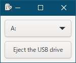

[go言語 & gotk3をちょっとやり直してみたい](../../README.md#go%E8%A8%80%E8%AA%9Egotk3%E3%82%92%E3%81%A1%E3%82%87%E3%81%A3%E3%81%A8%E3%82%84%E3%82%8A%E7%9B%B4%E3%81%97%E3%81%A6%E3%81%BF%E3%81%9F%E3%81%84)  

# 18. クリップボード監視/USBドライブ抜き差し監視/USBドライブイジェクトがしたい  

今回からは、gotk3に特化しない機能も説明していきます。  
- クリップボードの監視  
  クリップボードにデータが書き込まれたかどうかを検知する  

- USBドライブ抜き差し監視  
  USBメモリやUSB HDDなどがUSBに接続された/USBから取り外されたことを検知する  

- USBドライブイジェクト  
  USBメモリやUSB HDDなどをプログラム側から取り外しする  

## 18.1 Windowsのイベント通知

Windowsのイベント通知に関してGeminiに聞いてみました。

> Windowsメッセージ  
> - Windowsメッセージとは、Windowsオペレーティングシステムがアプリケーションやウィンドウに対して送信する通知のことです。  
> - ユーザーの操作（マウスのクリック、キーボードの入力など）、システムの状態変化（ウィンドウのサイズ変更、タイマーの満了など）、他のアプリケーションからの通知など、さまざまなイベントによって生成されます。  
> - メッセージは、メッセージの種類（WM_XXX）、メッセージのパラメータ（wParam、lParam）、メッセージが送信されたウィンドウのハンドルなど、関連する情報を含んでいます。  

> WndProc（ウィンドウプロシージャ）
> - WndProcは、Windowsメッセージを処理するためにアプリケーションが提供するコールバック関数です。  
> - 特定のウィンドウに関連付けられており、そのウィンドウに送信されたメッセージを処理します。  
> - WndProcは、受信したメッセージの種類に応じて適切な処理を行い、必要に応じて応答を返します。  

> GetMessage
> - GetMessageは、アプリケーションのメッセージキューからメッセージを取得する関数です。  
> - メッセージキューは、アプリケーションに送信されたメッセージが一時的に格納される場所です。  
> - GetMessageは、メッセージキューにメッセージが存在するまで待機し、メッセージが到着するとそれを取得してWndProcに渡します。  
> - GetMessageは、アプリケーションのメッセージループ（メッセージを取得して処理する無限ループ）の中で使用されます。  

> Windowsメッセージ、WndProc、およびGetMessageの関係性  
> 1. Windowsオペレーティングシステムは、イベントが発生すると、対応するメッセージをアプリケーションのメッセージキューに送信します。  
> 1. アプリケーションは、メッセージループの中でGetMessageを呼び出して、メッセージキューからメッセージを取得します。  
> 1. GetMessageは、取得したメッセージをアプリケーションに渡し、アプリケーションはDispatchMessage関数を呼び出してメッセージをWndProcに送ります。  
> 1. WndProcは、受信したメッセージの種類に応じて適切な処理を行い、必要に応じて応答を返します。  

## 18.2 クリップボード更新/USBドライブの抜き差し通知の設定  

Windowsメッセージが対象のウィンドウへ通知されるように設定します。  

> [!NOTE]
> win32のシステムコールが多数収録されてる「[zzl/go-win32api/win32](https://pkg.go.dev/github.com/zzl/go-win32api/win32)」パッケージを使用しています。  
> ※登録されてる関数が多いためHPの表示には時間がかかります  

- クリップボード更新通知  
  ```go
  ret, w32err := win32.AddClipboardFormatListener(Hwnd)
  if ret == win32.FALSE || w32err != win32.NO_ERROR {
  	log.Fatal("AddClipboardFormatListenerの失敗")
  }
  ```
  
  win32の`AddClipboardFormatListener()`をコールするだけとなります。  
  `Hwnd`は
  「[16.2 user32.dllを使った方法](../16#162-user32dll%E3%82%92%E4%BD%BF%E3%81%A3%E3%81%9F%E6%96%B9%E6%B3%95)」 
  で作成した`GetWindowHandle()`を使う事により取得できます。  

- USBドライブの抜き差し通知
  ```go
  notificationFilter := win32.DEV_BROADCAST_DEVICEINTERFACE_{
  	Dbcc_size:       uint32(unsafe.Sizeof(win32.DEV_BROADCAST_DEVICEINTERFACE_{})),
  	Dbcc_devicetype: uint32(win32.DBT_DEVTYP_DEVICEINTERFACE),
  	Dbcc_reserved:   0,
  	Dbcc_classguid:  win32.GUID_IO_VOLUME_DEVICE_INTERFACE,
  }
  hDevNotify, w32err = win32.RegisterDeviceNotification(Hwnd, unsafe.Pointer(&notificationFilter), win32.DEVICE_NOTIFY_WINDOW_HANDLE)
  if hDevNotify == nil || w32err != win32.NO_ERROR {
  	log.Fatal("RegisterDeviceNotificationの失敗")
  }
  ```

  こちらもwin32の`RegisterDeviceNotification()`をコールするだけですが、引数に渡す`DEV_BROADCAST_DEVICEINTERFACE_`構造体の作成が必要となります。  
  
> [!NOTE]  
> `DEV_BROADCAST_DEVICEINTERFACE_`の末尾の「_」はパッケージ側の誤記だと思いますが、定義されてる通りに指定しないと認識しないので、そのまま使用してます。  

## 18.3 クリップボード更新/USBドライブの抜き差し通知の解除  

以下のコマンドを使います。  

- クリップボード更新通知  

  ```go
  ret, w32err := win32.RemoveClipboardFormatListener(Hwnd)
  if ret == win32.FALSE || w32err != win32.NO_ERROR {
  	log.Fatal("RemoveClipboardFormatListenerの失敗")
  }
  ```

- USBドライブの抜き差し通知
  ```go
  ret, w32err := win32.UnregisterDeviceNotification(hDevNotify)
  if ret == win32.FALSE || w32err != win32.NO_ERROR {
  	log.Fatal("UnregisterDeviceNotificationの失敗")
  }
  ```

## 18.4 メッセージの受信（メッセージフック）  

gotk3で作成されてるウィンドウ宛のメッセージをフックして、通知を検知する方法です。  
クリップボード更新通知とUSBドライブの抜き差し通知で別々のフックが必要となるため両方とも設定します。  

- クリップボード更新通知  
  ```go
  HookHandleM, w32err = win32.SetWindowsHookEx(win32.WH_GETMESSAGE, uintptr(syscall.NewCallback(hookProcM)), 0, win32.GetCurrentThreadId())
  if HookHandleM == 0 || w32err != win32.NO_ERROR {
  	log.Fatal("SetWindowsHookExの失敗")
  }
  ```
 
- USBドライブの抜き差し通知  
  ```go
  HookHandleW, w32err = win32.SetWindowsHookEx(win32.WH_CALLWNDPROC, uintptr(syscall.NewCallback(hookProcW)), 0, win32.GetCurrentThreadId())
  if HookHandleW == 0 || w32err != win32.NO_ERROR {
  	log.Fatal("SetWindowsHookExの失敗")
  }
  ```

第一引数でフックするメッセージの種類を指定しています。ここが異なるため、別々のフックを行う必要があります。  
コールバック関数`hookProcM()` `hookProcW()`をそれぞれ引数で渡してメッセージ受信時にコールされるようにしています。  
コールバック関数は以下のようになります。  

- クリップボード更新通知  
  ```go
  func hookProcM(nCode int, wParam, lParam uintptr) uintptr {
      if nCode >= 0 {
          cwp := (*win32.MSG)(unsafe.Pointer(lParam))
          // 自ウィンドウの時だけ処理
          if Hwnd == cwp.Hwnd {
              switch (cwp.Message) {
                  case win32.WM_CLIPBOARDUPDATE:
                      // シグナルを送信
                      glib.IdleAdd(func() {
                          window1.Emit("clipboard_update", glib.TYPE_POINTER)
                      })
              }
          }
      }
      return uintptr(win32.CallNextHookEx(HookHandleM, int32(nCode), wParam, lParam))
  }
  ```

  WM_CLIPBOARDUPDATEがクリップボード更新通知のWindowsメッセージとなります。  
  `nCode < 0`は処理不要だということなので処理対象外にしてます。  
  ウィンドウハンドルをグローバル変数として保持し、自分宛のメッセージのみを対象としています。

- USBドライブの抜き差し通知  
  ```go
  func hookProcW(nCode int, wParam, lParam uintptr) uintptr {
      if nCode >= 0 || wParam == 0 {
          cwp := (*win32.CWPSTRUCT)(unsafe.Pointer(lParam))
          // 自ウィンドウの時だけ処理
          if Hwnd == cwp.Hwnd {
              switch (cwp.Message) {
                  case win32.WM_DEVICECHANGE:
                      hdr := (*win32.DEV_BROADCAST_HDR)(unsafe.Pointer(cwp.LParam))
                      if hdr == nil {
                          break
                      }
                      if hdr.Dbch_devicetype == win32.DBT_DEVTYP_VOLUME {
                          // ドライブレターの取得
                          vol := (*win32.DEV_BROADCAST_VOLUME)(unsafe.Pointer(cwp.LParam))
                          drvLetter := ""
                          for i := 0; i < 26; i++ {
                              if (vol.Dbcv_unitmask >> i) & 1 == 1 {
                                  drvLetter = string('A' + i) + ":"
                                  break
                              }
                          }
                          
                          // シグナルを送信
                          switch uint32(cwp.WParam) {
                              case win32.DBT_DEVICEARRIVAL:            // ドライブが追加された場合
                                  glib.IdleAdd(func() {
                                      window1.Emit("device_add", glib.TYPE_POINTER, drvLetter)
                                  })
                              case win32.DBT_DEVICEREMOVECOMPLETE:    // ドライブが取り外された場合
                                  glib.IdleAdd(func() {
                                      window1.Emit("device_remove", glib.TYPE_POINTER, drvLetter)
                                  })
                          }
                      }
              }
          }
      }
      return uintptr(win32.CallNextHookEx(HookHandleW, int32(nCode), wParam, lParam))
  }
  ```

  WM_DEVICECHANGEがデバイス変更通知のWindowsメッセージとなります。  
  その中でメッセージタイプがDBT_DEVTYP_VOLUMEの物が対象となります。  
  `nCode < 0`及び`wParam != 0`は処理不要だということなので処理対象外にしてます。  
  また、ウィンドウハンドルをグローバル変数として保持し、自分宛のメッセージのみを対象としています。  
  あとは、変化があったドライブレターの取得と、追加か取り外しかを判定してシグナル送信を行っています。  

作成したファイルは、
[ここ](18-1_SimpleWindow_clip_usb.go)
に置いてます。  

> [!TIP]  
> `HookHandleM` `HookHandleW`は`CallNextHookEx`で使いますが、コールバック関数内で取得する方法がないためグローバル変数として定義する必要があります。  
> `glib.IdleAdd()`は不要かもしれないので、コメントアウトして動作確認を行った後、フリーズやクラッシュなどが起こらないようなら削除して下さい。  
> WM_CLIPBOARDUPDATEもWM_DEVICECHANGEもコールバック関数の中ではどちらも1種類のメッセージのみを対象に処理してますが、対象メッセージが増えた時の追加がやりやすいように`switch`を使ってます。  

## 18.5 メッセージの受信（メッセージ用ウィンドウ）  

gotk3で作成されてるウィンドウとは別にメッセージ用ウィンドウを作成し、メッセージ用ウィンドウ宛のメッセージを検知する方法です。  
「18.4」では、gotk3宛のメッセージを2回フックして、更にgotk3でも処理するため、種類を分けてフックしているとはいえ、メッセージによっては3回処理されてます。  
gotk3とは別のウィンドウを作成するのは、あまり良くないのかもしれないですが、非表示のメッセージ用ウィンドウを作成することで余計な負荷が減らせるのではないかと思います。  

- メッセージ用ウィンドウの作成  
  ```go
  // ウィンドウクラスの登録
  className := windows.StringToUTF16Ptr("window class")
  wndClass := win32.WNDCLASSEX{
      CbSize    : uint32(unsafe.Sizeof(win32.WNDCLASSEX{})),
      LpfnWndProc   : syscall.NewCallback(WndProc),
      LpszClassName : className,
  }
  _, w32err = win32.RegisterClassEx(&wndClass)
  if w32err != win32.NO_ERROR {
      log.Fatal("RegisterClassExの失敗")
  }
  
  // モジュールハンドルを取得
  hInstance, w32err := win32.GetModuleHandleW(nil)
  
  // メッセージ受信用ウィンドウの作成
  hwnd, w32err := win32.CreateWindowEx(win32.WS_EX_APPWINDOW, className, nil, win32.WS_OVERLAPPEDWINDOW, 0, 0, 0, 0, 0, 0, hInstance, nil)
  if hwnd == 0 || w32err != win32.NO_ERROR {
      log.Fatal("CreateWindowExの失敗")
  }
  ```
  
  「ウィンドウクラスの登録」時に、`WndProc`をコールバック関数に指定してます。  

> [!TIP]  
> `hInstance`は「0」でも動作するので`GetModuleHandleW()`部分は削除できるのですが、dll化する場合などは削除すると動かなくなる可能性があるため、念のために残してます。  
> また、メッセージ用ウィンドウの場合、以下のようにするのが一般的なようですが、
> ```go
> hwnd, w32err := win32.CreateWindowEx(0, className, nil, 0, 0, 0, 0, 0, win32.HWND_MESSAGE, 0, 0, nil)
> ```
> WM_DEVICECHANGEメッセージでDBT_DEVTYP_VOLUMEのメッセージが通知されるのはトップレベルウィンドウだけなので、普通のウィンドウを作成しています。  
> ※`Show`してないので画面には表示されません。  

- メッセージ用ウィンドウの破棄  
  ```go
  win32.DestroyWindow(hwnd)
  ```

- メッセージの受信  

  「18.1」のGeminiの説明では、以下のように記載されてます。  
  
  > GetMessageは、取得したメッセージをアプリケーションに渡し、アプリケーションはDispatchMessage関数を呼び出してメッセージをWndProcに送ります。  
  
  ここで、問題が発生します。  

  `GetMessage`は処理を停止してメッセージを待つので、gotk3のウィンドウがフリーズしてしまいます。では、goルーチンを使って`GetMessage`を実行した場合はどうなるのかというと、`GetMessage`は同一スレッドで作成したウィンドウのメッセージしか受信できないため、goルーチン内では作成したウィンドウへのメッセージは受信出来ません。  
  また、goルーチン内でウィンドウ作成もやってしまえば良いかと思ったのですが、gotk3ウィンドウ終了時に上手く解放できなかったので、この方法も難しそうでした。  

  Geminiの回答では`GetMessage`→`DispatchMessage`がないと`WndProc`がコールされないように読めるのですが、実際には「ウィンドウクラスの登録」時にコールバック関数を登録しているので`GetMessage`→`DispatchMessage`の処理をしなくても`WndProc`はコールされているようです。  

  以上の結果より、`GetMessage`→`DispatchMessage`を使わずにコールされた`WndProc`で処理することにしました。Geminiに聞いたら、「そんなコードは見たことない」「`WndProc`にメッセージが送られなくなる」「やめた方が良い」など否定的な回答しかなかったので、この方法が問題だと思う人は使わない方が良いです。  

- コールバック関数  
  コールバック関数の内容は、「18.4」とあまり変わりません。  
  メッセージ用ウィンドウのみにメッセージが送信されるため、2つのコールバック関数が1つに統合されてます。  
  ```go
  func WndProc(hwnd win32.HWND, msg uint32, wParam, lParam uintptr) uintptr {
      switch (msg) {
          case win32.WM_CLIPBOARDUPDATE:
              // シグナルを送信
              glib.IdleAdd(func() {
                  window1.Emit("clipboard_update", glib.TYPE_POINTER)
              })
          case win32.WM_DEVICECHANGE:
              hdr := (*win32.DEV_BROADCAST_HDR)(unsafe.Pointer(lParam))
              if hdr == nil {
                  break
              }
  
              if hdr.Dbch_devicetype == win32.DBT_DEVTYP_VOLUME {
                  // ドライブレターの取得
                  vol := (*win32.DEV_BROADCAST_VOLUME)(unsafe.Pointer(lParam))
                  drvLetter := ""
                  for i := 0; i < 26; i++ {
                      if (vol.Dbcv_unitmask >> i) & 1 == 1 {
                          drvLetter = string('A' + i) + ":"
                          break
                      }
                  }
                  
                  // シグナルを送信
                  switch uint32(wParam) {
                      case win32.DBT_DEVICEARRIVAL:            // ドライブが追加された場合
                          glib.IdleAdd(func() {
                              window1.Emit("device_add", glib.TYPE_POINTER, drvLetter)
                          })
                      case win32.DBT_DEVICEREMOVECOMPLETE:    // ドライブが取り外された場合
                          glib.IdleAdd(func() {
                              window1.Emit("device_remove", glib.TYPE_POINTER, drvLetter)
                          })
                  }
              }
          case win32.WM_DESTROY:
              win32.PostQuitMessage(0)
      }
      return win32.DefWindowProc(hwnd, msg, wParam, lParam)
  }
  ```

  作成したファイルは、
  [ここ](18-2_SimpleWindow_clip_usb.go)
  に置いてます。  

> [!NOTE]  
> WM_DESTROYメッセージの処理を記載してます。`DestroyWindow()`を実行した時に、`GetMessage`に終了を通知するために必要とGeminiに言われたのですが、`GetMessage`を使わなくなったので不要かもしれません。  

## 18.6 USBドライブイジェクト  

これは説明できることが少ないです。[USB Ejector](https://github.com/dmitrii-eremin/USB-Ejecter)のc言語ソースをGeminiにマルチバイト文字対応／リファクタリング／CGO化して貰っただけとなります。  

  

上記画面でコンボボックスからドライブレターを選択し、ボタンを押すとUSBドライブの取り外しを行います。  
ボタン押下時の処理は以下のようになります。

```go
button.Connect("clicked", func() {
	str := comboBoxText.GetActiveText()
	if C.EjectDriveByLetter(C.wchar_t(str[0])) {
		log.Printf("USBドライブ[%s]が取り外しを行いました。\n", str)
	} else {
		log.Printf("USBドライブ[%s]の取り外しに失敗しました。\n", str)
	}
})
```

go言語に移植しようとしたのですが、go言語のパッケージで`SetupDiEnumDeviceInterfaces()`が実装されてる物がなかったので自分でdllをコールするコードを作成してみました。その結果`SetupDiEnumDeviceInterfaces()`がどうやってもエラーになりました。何かしらの理由があってパッケージに実装出来ないのだと理解したので、移植を諦めてCGOにしました。  

> [!CAUTION]
> [USB Ejector](https://github.com/dmitrii-eremin/USB-Ejecter)ですが、他の同様なソースと見比べて似たような事をしていたことと、取り外し自体は`CM_Request_Device_EjectW()`をコールしており独自実装ではないことなどにより、DISKへ損傷を与えるような取り外しはしていないと判断しています。  
> もしDISKに損傷を与えるようなことがあっても保証/補償などは出来ませんので、ご理解の上ご利用ください。
