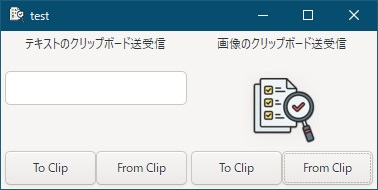

[go言語 & gotk3をちょっとやり直してみたい](../../README.md#go%E8%A8%80%E8%AA%9Egotk3%E3%82%92%E3%81%A1%E3%82%87%E3%81%A3%E3%81%A8%E3%82%84%E3%82%8A%E7%9B%B4%E3%81%97%E3%81%A6%E3%81%BF%E3%81%9F%E3%81%84)  

# 20. クリップボードを使いたい  

gotk3で使えるgtkのクリップボードを紹介していきます。  

## 20.1 gotk3で使用できる関数  

- クリップボードを取得する  
  ```go
  clipboard, err := gtk.ClipboardGet(gdk.SELECTION_CLIPBOARD)
  if err != nil {
  	log.Fatal(err)
  }
  ```
- クリップボードに取得したいデータがあるかどうかを確認する  
  上記で取得した`clipboard`変数を使って記載しています。結果は`bool`型です。  

  - clipboard.WaitIsTextAvailable()  
  - clipboard.WaitIsImageAvailable()  
  - clipboard.WaitIsRichTextAvailable(buf *TextBuffer)  
  - clipboard.WaitIsTargetAvailable(target gdk.Atom)  
  - clipboard.WaitIsUrisAvailable()  

  取得関数の都合でWindows環境ではTextとImage以外は使うことが難しいと思います。  

- クリップボードに取得したいデータが到着するのを待って、データが到着したら取得する  

  - clipboard.WaitForText() (string, error)
  - clipboard.WaitForImage() (*gdk.Pixbuf, error)
  - clipboard.WaitForContents(target gdk.Atom) (*SelectionData, error)

  取得関数は3種類です。TextとImage以外は`WaitForContents()`で取得することを想定していると思うのですが、WEB検索したコードやGeminiが提示したコードではデータが取れませんでした。  

  実際に試したコードは以下のコードとなります。MIMEタイプ「text/html」のデータを取得するとのことなのですが、Windows環境で実行したところ、データ長は「0」、byte配列も文字列も空データとなりました。  
  ※クリップボードに該当のMIMEタイプのデータが存在することは確認してます。  

  ```go
  atom := gdk.GdkAtomIntern("text/html", false)
  if clipboard.WaitIsTargetAvailable(atom) {
  	selectionData, err := clipboard.WaitForContents(atom)
  	length := selectionData.GetLength()
  	data := selectionData.GetData()
  	text := selectionData.GetText()
  }
  ```

  上記の結果より、Windows環境でgotk3のクリップボード関数を使ってデータが取得出来るのはTextとImageのみだと思っています。  
  （私の知識不足が原因の可能性がありますので注意して下さい）  

- クリップボードへデータを格納する  

  - clipboard.SetText(text string)
  - clipboard.SetImage(pixbuf *gdk.Pixbuf)

  データを格納する関数は上記の2つとなります。
  こちらは、TextとImage以外の関数は定義されてませんでした。  

> [!NOTE]  
> move/cutをコードから使う関数や引数などは見当たりませんでした。  
> gtk.Entry上などでは機能が提供されてるので作りこみは不要だと思いますが、仮に作りこむ場合は、「ctrl + x」が押されたら、選択文字列や図形をクリップボードへ格納した後、削除するようなコードを作成する必要があります。  

## 20.2 テキストをクリップボードへ格納/取得する  

テキストをクリップボードへ格納するコードは以下のようになります。  
Entryに入力されてるテキストをクリップボードへ格納しています。  

```go
//-----------------------------------------------------------
// テキストをクリップボードへ送る
//-----------------------------------------------------------
btnTxtTo.Connect("clicked", func() {
	text, err := entryText.GetText()
	if err != nil {
		ShowErrorDialog(window1, err)
		return
	}
	clipboard.SetText(text)
})
```

テキストをクリップボードから取得するコードは以下のようになります。  
`WaitForText()`はクリップボードにデータがないと長時間他の処理をブロックしてしまうので、`WaitIsTextAvailable()`でデータがあるかを確認して、データを取得するようにしています。  

```go
//-----------------------------------------------------------
// テキストをクリップボードから取得する
//-----------------------------------------------------------
btnTxtFrom.Connect("clicked", func() {
	if clipboard.WaitIsTextAvailable() {
		text, err := clipboard.WaitForText()
		if err != nil {
			ShowErrorDialog(window1, err)
			return
		}
		entryText.SetText(text)
	}
})
```

## 20.3 画像をクリップボードへ格納/取得する  

画像をクリップボードへ格納するコードは以下のようになります。  
gtk.Imageから画像をpixbuf型で取得し、クリップボードに格納しています。  

```go
//-----------------------------------------------------------
// 画像をクリップボードへ送る
//-----------------------------------------------------------
btnImgTo.Connect("clicked", func() {
	pixbuf := image1.GetPixbuf()
	if pixbuf == nil {
		ShowErrorDialog(window1, fmt.Errorf("画像が空か、取得に失敗"))
		return
	}
	clipboard.SetImage(pixbuf)
})
```

画像をクリップボードから取得するコードは以下のようになります。  
取得方法はtextと同様で、取得した画像をgtk.Imageへ設定しています。  

```go
//-----------------------------------------------------------
// 画像をクリップボードから取得する
//-----------------------------------------------------------
btnImgFrom.Connect("clicked", func() {
	if clipboard.WaitIsImageAvailable() {
		pixbuf, err := clipboard.WaitForImage()
		if err != nil {
			ShowErrorDialog(window1, err)
			return
		}
		image1.SetFromPixbuf(pixbuf)
	}
})
```

## 20.4 おわりに  

実行画面は以下のようになります。  

  

「To Clip」ボタンでクリップボードへ格納、「From Clip」ボタンでクリップボードから取得します。  

作成したファイルは、
[ここ](20_gotk3_Clipboard.go)
に置いてます。  
