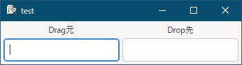

[go言語 & gotk3をちょっとやり直してみたい](../../README.md#go%E8%A8%80%E8%AA%9Egotk3%E3%82%92%E3%81%A1%E3%82%87%E3%81%A3%E3%81%A8%E3%82%84%E3%82%8A%E7%9B%B4%E3%81%97%E3%81%A6%E3%81%BF%E3%81%9F%E3%81%84)  

# 22. Drag and Dropが使い難い  

Drag and Drop（以降DnD）の紹介をしていきますが、Windows環境のgotk3では使う対象が限られてるので使い難いと思います。  
Windows環境のgotk3では、基本的に同一アプリ内でのDnDを想定しているようで、他アプリとのDnDは上手くやる方法が分からなかったです。（gotk3を使った他アプリ含む）  
そのため、同一アプリ内のDnDと、唯一他アプリを想定しているように思えるファイルのDnDについて紹介します。  

> [!CAUTION]  
> Entryを対象としてサンプルコードを作成したのですが、Entryはデフォルト動作としてDnDをサポートしていました。そのため、Entryではコードで設定したデータがDnD出来ず、デフォルト動作が優先されたり、デフォルトのDropとコードによるDropでDropが2重になったりします。コードの説明はしていきますが、コード通りの挙動にはならないので気をつけてください。  

## 22.1 DnDに関連するシグナル  

1. Drag側のシグナル  
   最低でも「drag-data-get」の対応は必要となります。  
   - drag-begin  
     dragが開始された時、アイコンを変えるためなどに使う  
   - drag-data-delete  
     GDK_ACTION_MOVEが正常に完了した時、移動済みデータを削除するために使う  
   - drag-data-get  
     データを要求された時、SelectionDataにデータを格納するために使う  
   - drag-end  
     ドラッグが終了した時、drag-beginで変更したアイコンなどを元に戻すために使う  
   - drag-failed  
     ドラッグが失敗した時、必要な処理を行うために使う  
1. Drop側のシグナル  
   「DEST_DEFAULT_ALL」のオプションを使えば「drag-data-received」の対応だけで良いです。「drag-data-received」以外については説明を省きます。  
   - drag-motion（DEST_DEFAULT_ALLに含む）  
     カーソルがウィジェット上を移動した時、ドロップ可能な領域にカーソルがあるかどうかを判定し、視覚的に分かるような効果を与えるために使う  
   - drag-leave（DEST_DEFAULT_ALLに含む）  
     カーソルがウィジェットから離れた時、drag-motionで変更した視覚効果などを元に戻すために使う  
     （drag-dropの直前など、drag-motionが終わったタイミングでもシグナルが発行されるらしい）  
   - drag-drop（DEST_DEFAULT_ALLに含む）  
     ドロップが開始される直前に、ドロップ受付有無を返すために使う  
   - drag-data-received  
     ドラッグされたデータが受信された時、データを取得するために使う  

## 22.2 ターゲットの設定  

対象とするMIMEタイプを登録します。登録されてないMIMEタイプはDragもDropも出来ないため、Windowsのクリップボード形式「CF_TEXT」などはDnD出来ません。そのため、Windows環境で一般の外部アプリとやりとり出来る形式は少ないです。  

```go
targetEntryText, err := gtk.TargetEntryNew("text/plain", gtk.TARGET_SAME_APP, 0)
if err != nil {
	log.Fatal(err)
}

targetEntryURI, err := gtk.TargetEntryNew("text/uri-list", gtk.TARGET_OTHER_APP, 1)
if err != nil {
	log.Fatal(err)
}
targetEntriesText := []gtk.TargetEntry{*targetEntryText, *targetEntryURI}
```

上記のコードは、`[]gtk.TargetEntry`の作成コードになります。`TargetEntryNew()`の引数は以下の通りになります。  

- 第1引数：MIMEタイプを指定  
- 第2引数：gtk.TARGET_SAME_APP（自アプリ）かgtk.TARGET_OTHER_APP（他アプリ）を指定。  
  本来なら「gtk.TARGET_SAME_APP | gtk.TARGET_OTHER_APP」の指定も可能なようですが、単体で指定しないと上手く動作しませんでした。  
- 第3引数：info値  
  データの授受時（drag-data-getやdrag-data-receivedシグナルハンドラ）に、info引数として渡される値です。この値により、どのMIMEタイプのデータを授受すれば良いかを判断します。  

## 22.3 Drag側の設定  

Drag側のコードは以下のようになります。  
「22.2」で設定したターゲット`targetEntriesText`を「Dragソースの設定」で使います。  

```go
// Dragソースの設定
entryText1.DragSourceSet(gdk.BUTTON1_MASK, targetEntriesText, gdk.ACTION_COPY | gdk.ACTION_MOVE)


// DnD開始時のシグナルハンドラ
entryText1.Connect("drag-begin", func(entry *gtk.Entry, context *gdk.DragContext) {
	fmt.Println("begin")

	// Dragされたターゲットリストを表示
	targetList := context.ListTargets()
	n := targetList.Length()
	for i := uint(0); i < n; i++ {
		switch uintptr(targetList.NthData(i).(unsafe.Pointer)) {
			case uintptr(gdk.GdkAtomIntern("text/plain", false)):
				fmt.Println("start target: text/plain")
			case uintptr(gdk.GdkAtomIntern("text/uri-list", false)):
				fmt.Println("start target: text/uri-list")
		}
	}
})

// MOVE発生時のシグナルハンドラ
entryText1.Connect("drag-data-delete", func(entry *gtk.Entry, context *gdk.DragContext) {
	fmt.Println("delete")
})

// DnD失敗時のシグナルハンドラ
entryText1.Connect("drag-failed", func(entry *gtk.Entry, context *gdk.DragContext, result int) bool {
	fmt.Println("failed", result)
	
	// 失敗が処理済みならtrue
	return true
})

// DnD終了時のシグナルハンドラ
entryText1.Connect("drag-end", func(entry *gtk.Entry, context *gdk.DragContext) {
	fmt.Println("end")
})

// データ受信要求への応答
entryText1.Connect("drag-data-get", func(entry *gtk.Entry, context *gdk.DragContext, data *gtk.SelectionData, info, time uint) {
/*
	// 要求されたデータをSelectionData引数へ格納
	switch info {
		case 0:
			text, err := entryText1.GetText()
			if err != nil {
				ShowErrorDialog(window1, err)
				return
			}
			ok := data.SetText(text)
			if !ok {
				ShowErrorDialog(window1, fmt.Errorf("DnDテキストデータ送信に失敗"))
				return
			}
	}
*/
})
```

「データ受信要求への応答」では、本来ならコメントアウトしているコードのように、引数で渡されたSelectionData型の変数にデータを設定するコードを記載します。  
Entryの場合、デフォルト動作で、選択されているテキストが自動的に設定され、コード側で変更が出来ないようなので、何もしてません。  
コメントアウトしてますが、引数で受け取ったinfo変数により、どのMIMEタイプのデータが要求されたのかを判断してます。  

## 22.4 Drop側の設定  

Drop側のコードは以下のようになります。  
「22.2」で設定したターゲット`targetEntriesText`を「Drop先の設定」で使います。  
DragのターゲットとDropのターゲットは同じものを使ってますが、「text/uri-list」はDrop側にしか使わないので、別の物を定義した方が良いです。  

> [!NOTE]  
> Windows環境でのファイルのDnD形式は「CF_HDROP」形式のため、「text/uri-list」をDragで渡してもファイルエクスプローラーなどでは受け取ってもらえません。ただ、「CF_HDROP」形式を「text/uri-list」としてgotk3アプリへDropされることは可能なようです。  

```go
// Drop先の設定
entryText2.DragDestSet(gtk.DEST_DEFAULT_ALL, targetEntriesText, gdk.ACTION_COPY | gdk.ACTION_MOVE)

// データ受信
entryText2.Connect("drag-data-received", func(entry *gtk.Entry, context *gdk.DragContext, x, y int, data *gtk.SelectionData, info, time uint) {
	// 受信したデータを表示
	switch info {
		case 0:
			// 受信したデータをEntryに設定
//			entryText2.SetText(data.GetText())
			fmt.Printf("text/plain:\n  %s\n", data.GetText())
		case 1:
			entryText2.SetText(strings.ReplaceAll(string(data.GetData()), "\r\n",", "))
			fmt.Printf("text/uri-list:\n  %s\n", strings.ReplaceAll(string(data.GetData()), "\r\n",", "))
	}
})
```

`DragDestSet()`の第1引数で「DEST_DEFAULT_ALL」を設定しているため、対応するシグナルは、「drag-data-received」だけで良いです。  
Drop側は、自アプリの別のEntryから「text/plain」のDropを受け付けます。これは、デフォルト動作でデータの反映まで行われるので、コメントアウトしてます。但し、`DragDestSet()`を設定した時点でデフォルト動作とDrop操作と2つのデータを受信してしまうらしく、Dropされるデータが2重になってしまいます。  
また、外部アプリからも「text/uri-list」を受信します。こちらは、Entryに自動設定されないため、コードで設定しています。  

> [!NOTE]  
> `switch`内のinfoに入る値は、「22.2」で説明している第3引数です。

## 22.5 おわりに  

実行画面は以下のようになります。  

  

左のEntryに入力したテキストを右のEntryにDnDするとテキストが表示されます。（コードの結果ではなくデフォルト動作となります。また、コードの影響で2重にDropされます）  
ファイルエクスプローラーから右のEntryにDnDするとファイル名が表示されます。

作成したファイルは、
[ここ](22_gotk3_DnD.go)
に置いてます。  

gotk3のDnDは、MIMEタイプを指定したデータ以外は受け付けず、Windowsの一般アプリはあまりクリップボード形式にMIMEタイプのデータを格納していないため、外部アプリとの連携には限界があります。  
また、gotk3を使って作成した外部アプリからのDnDでMIMEタイプをあわせていれば連携可能かというと、こちらも上手く連携することが出来ませんでした。  
なぜか「text/uri-list」のみは外部アプリと連携できるようですが「CF_HDROP」形式のDragが出来ないためWindows環境ではDrop専用となります。  
そのため、ほぼ自アプリ内のみの使用となるかと思います。  

Entryではデフォルト動作が邪魔をするので、TreeViewか何かをサンプルにした方が良かったです。Entry以外にもデフォルト動作があるウィジェットはあると思うので、プログラム作成時は、デフォルト動作を確認しながら実施する必要があります。  
