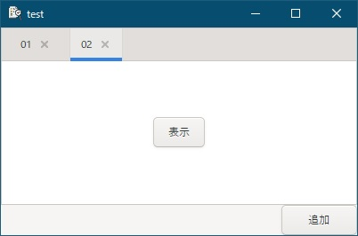
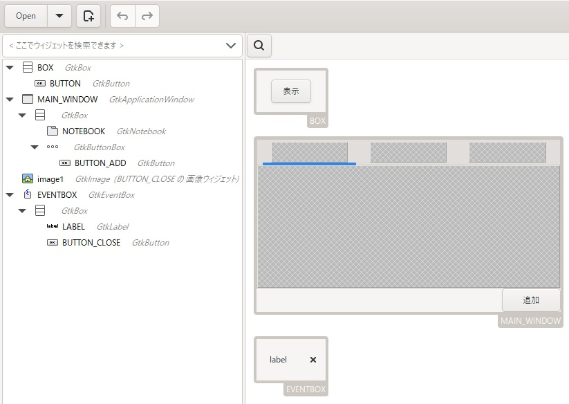

[go言語 & gotk3をちょっとやり直してみたい](../../README.md#go%E8%A8%80%E8%AA%9Egotk3%E3%82%92%E3%81%A1%E3%82%87%E3%81%A3%E3%81%A8%E3%82%84%E3%82%8A%E7%9B%B4%E3%81%97%E3%81%A6%E3%81%BF%E3%81%9F%E3%81%84)  

# 29. （まとめ2）動的に追加するTabControl（Notebook）  

  

右下の追加ボタンを押した時、ページを追加するアプリを作成します。各ページには「表示」ボタンがあり、ボタンを押した時、現在表示されているページのページ番号を表示します。  

## 29.1 GladeでUIを作成  

Gladeで以下のように、  

- ページ（Boxの中に「表示」ボタン）  
- メインウィンドウ  
- タブ（EventBoxの中に、LabelとButton）  

を作成します。  

  

ページはメインウィンドウとは別にコンテナ（BoxやScrolledWindowなど）の中に配置します。  
gtk3のTabControlはNotebookになるので、メインウィンドウにNotebookを配置します。  
Tabに表示する文字列にはLabelを使いますが、動的に追加された時に対応するためと、「閉じる」ボタンを表示するため、コンテナに入れてメインウィンドウとは別に設定しています。  

## 29.2 ページを追加する処理  

ページを追加する処理は以下のようなコードになります。  

```go
btnAdd.Connect("clicked", func() {
	// gladeからBoxを取得
	box1, builder, err := GetObjFromGlade[*gtk.Box](nil, window1Glade, "BOX")
	if err != nil {
		ShowErrorDialog(window1, err)
	}
	
	// gladeからBox内の表示ボタンを取得
	btnShow, _, err := GetObjFromGlade[*gtk.Button](builder, "", "BUTTON")
	if err != nil {
		ShowErrorDialog(window1, err)
	}
	
	// gladeからEventBoxを取得
	eventBox1, _, err := GetObjFromGlade[*gtk.EventBox](builder, "", "EVENTBOX")
	if err != nil {
		ShowErrorDialog(window1, err)
	}
	
	// gladeからLabelを取得
	label1, _, err := GetObjFromGlade[*gtk.Label](builder, "", "LABEL")
	if err != nil {
		ShowErrorDialog(window1, err)
	}
	
	// gladeからページCloseボタンを取得
	btnClose, _, err := GetObjFromGlade[*gtk.Button](builder, "", "BUTTON_CLOSE")
	if err != nil {
		ShowErrorDialog(window1, err)
	}
	
	// タブのラベル文字列を設定
	id := count
	count++
	label1.SetText(fmt.Sprintf("%02d", id))
	
	// タブの右端に、box1の内容のページとlabel1・btnCloseのタブを持ったページを追加
	// ※label1・btnCloseはeventBox1の中
	note.AppendPage(box1, eventBox1)
	
	// タブをマウスで並べ替え可
	note.SetTabReorderable(box1, true)
	
	//-----------------------------------------------------------
	// 表示ボタン押下時の処理
	//-----------------------------------------------------------
	btnShow.Connect("clicked", func() {
		log.Printf("このページのIDは「%d」です。\n", id)
	})
	
	//-----------------------------------------------------------
	// ページCloseボタン押下時の処理
	//-----------------------------------------------------------
	btnClose.Connect("clicked", func() {
		// ページを削除
		note.RemovePage(note.PageNum(box1))
	})
	
	//-----------------------------------------------------------
	// label1のシグナルハンドラはEventBoxが代替して処理
	// ※右クリックで閉じたい時とかに使う
	//-----------------------------------------------------------
	eventBox1.Connect("button-press-event", func(eventBox *gtk.EventBox, ev *gdk.Event) bool {
		log.Println("EventBoxがクリックされました。")
		
		// イベントを伝播
		return false
	})
})
```

gladeで定義したUIをページ毎に別の変数に割り当てる必要があるため、ページに設定したコンテナの内容とタブに設定したコンテナの内容をページの追加時にgladeから読み込んで変数に割り当てます。  
次に、タブの文字列を設定し、ページとタブをNotebookに追加しています。  

最後に各ページのシグナルハンドラーを設定しています。  

- ページ内の「表示」ボタン押下時  
  ページ番号を表示します。（タブの並び順ではありません）  
- タブの「X」ボタン押下時  
  ページを削除します。削除時に指定するページ番号は、その時点でのタブの並び順になります。  
- タブの右クリック時  
  Labelではシグナルを受信できないため、コンテナ（EventBox）でシグナルハンドラを行います。Labelでシグナルハンドラが不要な場合は、タブのコンテナにEventBoxではなくBoxを使っても良いです。  

## 29.3 ページ切替時の処理  

ページ切替時の処理は、以下のようなコードになります。

```go
note.Connect("switch-page", func(notebook *gtk.Notebook, page *gtk.Widget, page_num int) {
	log.Printf("%d番目のページに切り替わりました。\n", page_num + 1)
})
```

引数で渡される`page_num`（タブの並び順）を表示しています。  

## 29.4 おわりに  

gladeでUIを設定して、タブを動的に追加するNotebookについて説明しました。  

作成したファイルは、
[ここ](29_Notebook.go)
に置いてます。  


<br>

「[（まとめ2）文字コード判定](../30/README.md)」へ
