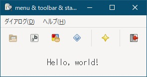

[go言語 & gotk3をちょっとやり直してみたい](../../README.md#go%E8%A8%80%E8%AA%9Egotk3%E3%82%92%E3%81%A1%E3%82%87%E3%81%A3%E3%81%A8%E3%82%84%E3%82%8A%E7%9B%B4%E3%81%97%E3%81%A6%E3%81%BF%E3%81%9F%E3%81%84)  

# 30. （まとめ2）文字コード判定  

  

「[9. メニューバー/ツールバー/標準ダイアログを使いたい(前編)](../09/README.md)」で作成したアプリを流用して、開いたファイルの文字コードを判定するアプリを作成します。  

文字コード判定は、「saintfish/chardet」パッケージを利用します。  

## 30.1 日本語文字コード判定  

文字コード判定処理は以下のようなコードになります。  
判定可能なコードは、ISO-2022-JP, UTF-8, UTF-16BE, UTF-16LE, Shift_JIS, EUC-JPのみとしています。  

```go
func DetectJpCharacterSet(data []byte) string {
	charSets := " ISO-2022-JP, UTF-8, UTF-16BE, UTF-16LE, Shift_JIS, EUC-JP,"

	// 文字コードを判定する（先頭の8KBで判定してるっぽい）
	det := chardet.NewTextDetector()
	res, err := det.DetectBest(data)
	if err != nil {
		return "UnKnown"
	}
	
	// 日本語文字コードに該当するか判定
	if strings.Index(charSets, " " + res.Charset + ",") >= 0 {
		return res.Charset
	}
	
	// "ISO-8859"で始まる文字コードの場合、半角英数字と判定
	if strings.HasPrefix(res.Charset, "ISO-8859") {
		return "ISO-8859-1"
	}
	
	// 上記コード以外で、utf8.ValidがtrueならバイナリではないのでISO-8859-1とみなす
	// ※先頭の8KBで判定
	dataLen := len(data)
	if dataLen > 8192 {
		dataLen = 8192
	}
	if utf8.Valid(data[0:dataLen]) {
		return "ISO-8859-1"
	}
	
	return "UnKnown"
}
```

読み込みファイルが、半角英数字か、判定可能な日本語文字コードか、どちらかの文字コードであるという前提で処理してます。それ以外の文字コードで保存されてるファイルについては正常に判定出来ません。

1. パッケージで日本語文字コードを判定  
   日本語文字コードと判定された場合、終了します。  
1. 「ISO-8859-?」で判定された場合、半角英数字と判定  
   半角英数字と判定された場合、終了します。  
1. 日本語文字コードと判定されず、半角英数字とも判定されなかった場合  
   utf8は半角英数字を内包してるので、utf8に含まれても問題ないコードか確認し、問題ない場合は、半角英数字と判定します。  
   ※utf8とコード上互換がある文字コードであっても、ここまでで判定出来なかった物は全て半角英数字としています。  
1. 最後まで判定されず、utf8に含まれるべきではない文字コードが含まれてる場合  
   バイナリファイルの確率が高いと思いますので、「UnKnown」を返却します。  

## 30.2 おわりに  

パッケージを使った日本語文字コード判定を説明しました。  
入力ファイルが小さい場合など、判定に失敗することがあります。また、ある程度決め打ちしているため、誤判定もありますので気をつけてください。  

作成したファイルは、
[ここ](30_Detect_CharacterSet.go)
に置いてます。  

</br>

「[31. （まとめ2）拡大/縮小](../31/README.md)」へ
