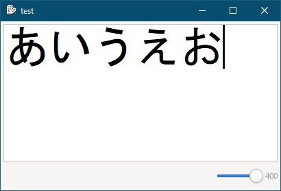

[go言語 & gotk3をちょっとやり直してみたい](../../README.md#go%E8%A8%80%E8%AA%9Egotk3%E3%82%92%E3%81%A1%E3%82%87%E3%81%A3%E3%81%A8%E3%82%84%E3%82%8A%E7%9B%B4%E3%81%97%E3%81%A6%E3%81%BF%E3%81%9F%E3%81%84)  

# 31. （まとめ2）拡大/縮小  

  

TextViewに表示された文字列をスライダーで拡大/縮小するアプリを作成します。  

## 31.1 GladeでUIを作成  

  

gladeでScaleを水平方向に配置し、アジャストメントを追加します。  

  

Scaleの初期値/最小値/最大値などは、Adjustmentで設定します。  

  

> [!CAUTION]  
> 「～単位の増分値」は、スライダーにFocusして、キーボードを使って増減させた時の変動量となります。マウス操作などは対象外となりますので注意して下さい。  


## 31.2 書式の設定  

「[15. （まとめ）CSSを使った書式設定](../15/README.md)」で説明した書式設定を使って拡大/縮小を行います。  

```go
var FontSize = 12.0 * 1024.0

func ApplyStyle(widget gtk.IWidget, scale float64) error {
	// プロバイダーを作成
	cssProvider, err := gtk.CssProviderNew()
	if err != nil {
		return err
	}
	
	// コンテキストを取得
	var context *gtk.StyleContext
	context, err = widget.(*gtk.TextView).GetStyleContext()
	if err != nil {
		return err
	}
	
	// CSS文字列を作成
	cssStr := "text, .view {\n"
	cssStr+= "  font-family: MS Gothic;\n"
	cssStr+= "  font-size: " + strconv.Itoa(int(FontSize * scale / 100.0 / 1024.0)) + "pt;\n"
	cssStr+= "}"
	
	// CSSをロード
	err = cssProvider.LoadFromData(cssStr)
	if err != nil {
		return err
	}
	
	// 書式を反映
	context.AddProvider(cssProvider, gtk.STYLE_PROVIDER_PRIORITY_APPLICATION)
	
	return nil
}
```

フォントサイズ=12ptをデフォルトサイズとして、設定したスケールをフォントサイズにかけて拡大/縮小を行っています。  

## 31.3 スケール変更時の処理  

スケール変更時の処理は以下のようなコードになります。  

```go
adjustment1.Connect("value_changed", func() {
	// 変動量を5刻みにする
	scale := float64(int(adjustment1.GetValue() / 5.0)) * 5.0
	adjustment1.SetValue(scale)
	
	// 書式を設定
	err := ApplyStyle(textView1, scale)
	if err != nil {
		ShowErrorDialog(window1, err)
	}
})
```

変動量を5刻みにする必要がなければ、書式設定をコールするだけで良いです。  

## 31.4 マウスホイール回転時の処理

マウスホイール回転時の拡大/縮小処理は以下のようなコードになります。  

```go
textView1.Connect("scroll_event", func(self *gtk.TextView, e *gdk.Event) bool {
	event := gdk.EventScrollNewFromEvent(e)
	
	// ctrlキー + 垂直方向の場合
	if event.State() == gdk.CONTROL_MASK && event.DeltaY() != 0 {
		// マウスホイールの変動量を10刻みにする
		scale := adjustment1.GetValue() - float64(event.DeltaY()) * 10.0
		
		// スライダーを移動
		adjustment1.SetValue(scale)
		
		// シグナルを伝播しない
		return true
	}
	
	return false
})
```

マウスホイール回転時の変動量は1刻みなので、10倍してます。  
変動量をスライダーに反映しているため、「31.3」で設定したシグナルハンドラがコールされ、書式設定が行われます。  
シグナルの伝播を止めたのは、拡大/縮小時に、TextViewが上下にスクロールすることを防ぐためです。  

## 31.5 おわりに  

TextViewの拡大/縮小を説明しました。  
作成したファイルは、
[ここ](31_Scale.go)
に置いてます。  

<br>

「[32. （まとめ2）UNDO/REDO](../32/README.md)」へ
