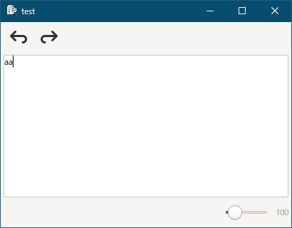
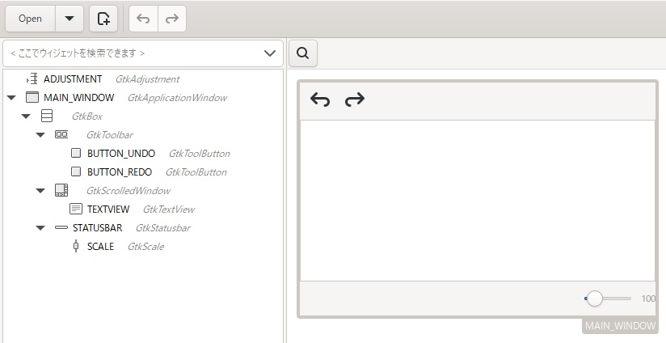

[go言語 & gotk3をちょっとやり直してみたい](../../README.md#go%E8%A8%80%E8%AA%9Egotk3%E3%82%92%E3%81%A1%E3%82%87%E3%81%A3%E3%81%A8%E3%82%84%E3%82%8A%E7%9B%B4%E3%81%97%E3%81%A6%E3%81%BF%E3%81%9F%E3%81%84)  

# 32. （まとめ2）UNDO/REDO  

  

UNDO/REDOを作成していきます。  
UNDO/REDOは
[stackoverflow](https://stackoverflow.com/questions/76096/undo-with-gtk-textview)のbest answerを参考にしてます。  

"container/ring"標準パッケージのリングバッファを使ってundo履歴/redo履歴を保存します。sliceでLIFO（Last-In-First-Out）バッファを作成することも検討したのですが、実装の仕方によっては、sliceのコピーが発生したり位置情報の管理が発生したりするので、ポインタ操作だけで管理はパッケージがやってくれるリングバッファの方が楽で軽いのではないかと思いました。  

> [!NOTE]  
> [Wikipedia](https://ja.wikipedia.org/wiki/%E3%83%AA%E3%83%B3%E3%82%B0%E3%83%90%E3%83%83%E3%83%95%E3%82%A1)にリングバッファの説明があります。  

## 32.1 GladeでUIを作成  

  

「31章」のgladeファイルにundoボタン、redoボタンを追加してます。  

## 32.2 初期化  

初期化処理は以下のようなコードになります。  

```go
// undo/redo用構造体
type UndoRedoStr struct {
	isAvailable		bool    // 有効なデータかどうか
	isInsert		bool    // 挿入か削除か
	offset			int     // テキスト編集位置へのoffset
	text			string  // 編集したテキスト
}

// undo/redoリングバッファの初期化
ubuf := ring.New(10)
rbuf := ring.New(10)
for i := 0; i < 10; i++ {
	ubuf.Value = UndoRedoStr {isAvailable: false}
	ubuf = ubuf.Move(i)
	rbuf.Value = UndoRedoStr {isAvailable: false}
	rbuf = rbuf.Move(i)
}
doingUndoRedo := false
editCount := 0

// undo/redoボタンの初期状態はdisable
btnUndo.SetSensitive(false)
btnRedo.SetSensitive(false)
```

undo/redo用にそれぞれリングバッファを作成してます。バッファのサイズは「10」にしてるので、11個目を格納すると初めに格納したデータが上書きされます。  
リングバッファにはデータ削除がなく、`null`で上書きしない方が良さそうなので、isAvailableメンバ変数で、有効なデータが入っているかどうかを管理します。  

`doingUndoRedo`はundo/redoによる編集時かどうかの判定に使います。  
`editCount`は編集回数です。undoで編集回数が0になった場合、未編集ファイルとなります。  

未編集時のundoボタン、redoボタンは非活性状態となります。  

## 32.3 テキスト挿入時の処理  

テキスト挿入時の処理は以下のようなコードになります。  

```go
textBuffer1.Connect("insert_text", func(textBuffer *gtk.TextBuffer, pos *gtk.TextIter, text string) {
	// undo/redoによる編集時は何もしない
	if doingUndoRedo {
		doingUndoRedo = false
		return
	}
	
	// ユーザによる手入力時、redoバッファをクリアし、disable
	// ※undo後しかredoは実行させない
	for i := 0; i < 10; i++ {
		rbuf.Value = UndoRedoStr {isAvailable: false}
		rbuf = rbuf.Move(i)
	}
	btnRedo.SetSensitive(false)
	
	// 次のundoバッファに編集内容を保存し、enable
	ubuf = ubuf.Next()
	ubuf.Value = UndoRedoStr {
		isAvailable:	true,
		isInsert:		true,
		offset:			pos.GetOffset(),
		text:			text,
	}
	btnUndo.SetSensitive(true)
	
	// editCountが「0」→「1」で編集されたデータ
	editCount++
	if editCount == 1 {
		log.Println("変更発生")
	}
})
```

TextBufferの"insert_text"シグナルハンドラでテキスト挿入時のシグナル処理を行います。  
連続してundoした場合でも正常に動作するよう、undo/redoによる編集時はリングバッファに追加しないようにしています。（こうしないと、最後にundoした物が繰り返しundoされてしまいます）  
undoを実行すると、その内容をredoバッファに貯めてundoを取り消すことが出来るようにしますが、途中で文字入力などをはさむと、文字入力前のundo内容がredoバッファに残っており、文字入力後にredoを実行すると直前で入力した文字と全く関係ない場所がredoされてしまいます。そのため、キー入力時はredoバッファをクリアしています。  
次に、undoバッファの位置を一つ進めて、編集内容をバッファに保存します。  
最後に、`editCount`をインクリメントして、「0」→「1」に変更になった時に、編集済みテキストと判定しています。  

## 32.4 テキスト削除時の処理  

テキスト削除時の処理は以下のようなコードになります。  

```go
textBuffer1.Connect("delete_range", func(textBuffer *gtk.TextBuffer, start *gtk.TextIter, end *gtk.TextIter) {
	// undo/redoによる編集時は何もしない
	if doingUndoRedo {
		doingUndoRedo = false
		return
	}
	
	// ユーザによる手入力時、redoバッファをクリアし、disable
	// ※undo後しかredoは実行させない
	for i := 0; i < 10; i++ {
		rbuf.Value = UndoRedoStr {isAvailable: false}
		rbuf = rbuf.Move(i)
	}
	btnRedo.SetSensitive(false)
	
	// 次のundoバッファに編集内容を保存し、enable
	ubuf = ubuf.Next()
	ubuf.Value = UndoRedoStr {
		isAvailable:	true,
		isInsert:		false,
		offset:			start.GetOffset(),
		text:			start.GetText(end),
	}
	btnUndo.SetSensitive(true)
	
	// editCountが「0」→「1」で編集されたデータ
	editCount++
	if editCount == 1 {
		log.Println("変更発生")
	}
})
```

TextBufferの"delete_range"シグナルハンドラでテキスト削除時のシグナル処理を行います。  
処理内容は挿入時とほぼ同じですが、渡されてくる引数が異なるため、undoバッファへの代入処理が少し異なってます。  

## 32.5 undoボタン押下時の処理  

undoボタン押下時の処理は以下のようなコードになります。  

```go
btnUndo.Connect("clicked", func() {
	// undoバッファから最新の値を取得
	value := ubuf.Value.(UndoRedoStr)
	if !value.isAvailable {
		return
	}
	
	// undo/redoによる編集を開始
	doingUndoRedo = true
	
	// 挿入データの場合は、削除
	// 削除データの場合は、挿入
	iterStart := textBuffer1.GetIterAtOffset(value.offset)
	if value.isInsert {
		iterEnd := textBuffer1.GetIterAtOffset(value.offset + len(value.text))
		textBuffer1.Delete(iterStart, iterEnd)
	} else {
		textBuffer1.Insert(iterStart, value.text)
	}
	
	// 次のredoバッファに保存し、enable
	rbuf = rbuf.Next()
	rbuf.Value = value
	btnRedo.SetSensitive(true)
	
	// 取りだし済みのデータを利用不可にし、1つ前のバッファへ
	ubuf.Value = UndoRedoStr {isAvailable: false}
	ubuf = ubuf.Prev()
	
	// 利用不可データになった場合、disable
	if !ubuf.Value.(UndoRedoStr).isAvailable {
		btnUndo.SetSensitive(false)
	}
	
	// editCountが「1」→「0」で編集前まで戻されたデータ
	editCount--
	if editCount == 0 {
		log.Println("変更前に戻りました")
	}
})
```

undoバッファの現在値（最新データ）を取得し、`doingUndoRedo`フラグをonにします。最後の処理内容が、挿入の場合undoは削除処理に、削除の場合undoは挿入処理になります。  
undo後、最後の処理内容をredoバッファに格納し、取りだしたundoバッファを使用済みにした後、現在値を1つ前の編集データへ戻します。  
最後に、`editCount`をデクリメントして、「1」→「0」に変更になった時に、未編集テキストと判定しています。  

## 32.6 redoボタン押下時の処理  

redoボタン押下時の処理は以下のようなコードになります。  

```go
btnRedo.Connect("clicked", func() {
	// redoバッファから最新の値を取得
	value := rbuf.Value.(UndoRedoStr)
	if !value.isAvailable {
		return
	}
	
	// undo/redoによる編集を開始
	doingUndoRedo = true
	
	// 挿入データの場合は、挿入
	// 削除データの場合は、削除
	iterStart := textBuffer1.GetIterAtOffset(value.offset)
	if value.isInsert {
		textBuffer1.Insert(iterStart, value.text)
	} else {
		iterEnd := textBuffer1.GetIterAtOffset(value.offset + len(value.text))
		textBuffer1.Delete(iterStart, iterEnd)
	}
	
	// 次のundoバッファに保存し、enable
	ubuf = ubuf.Next()
	ubuf.Value = value
	btnUndo.SetSensitive(true)
	
	// 取りだし済みのデータを利用不可にし、1つ前のバッファへ
	rbuf.Value = UndoRedoStr {isAvailable: false}
	rbuf = rbuf.Prev()
	
	// 利用不可データになった場合、disable
	if !rbuf.Value.(UndoRedoStr).isAvailable {
		btnRedo.SetSensitive(false)
	}
	
	// editCountが「0」→「1」で編集されたデータ
	editCount++
	if editCount == 1 {
		log.Println("変更発生")
	}
})
```

undo処理とほぼ同じですが、redoはundoの逆になるので、最後の処理内容が、挿入の場合redoは挿入処理に、削除の場合redoは削除処理になります。  

## 32.7 ショートカットキーのシグナルハンドラ

ショートカットキーのシグナルハンドラは以下のようなコードになります。  

```go
textView1.Connect("key-press-event", func(textView *gtk.TextView, event *gdk.Event) bool {
	keyEvent := gdk.EventKeyNewFromEvent(event)
	keyVal := keyEvent.KeyVal()
	keyState := gdk.ModifierType(keyEvent.State() & 0x0F)
	
	switch keyState {
		case gdk.CONTROL_MASK:	  // CTRLキー
			switch keyVal {
				case gdk.KEY_y, gdk.KEY_Y:
					_, err := btnRedo.Emit("clicked", glib.TYPE_POINTER)
					if err != nil {
						ShowErrorDialog(window1, err)
					}
				case gdk.KEY_z, gdk.KEY_Z:
					_, err := btnUndo.Emit("clicked", glib.TYPE_POINTER)
					if err != nil {
						ShowErrorDialog(window1, err)
					}
			}
	}
	
	// イベントを伝播
	return false
})
```

`Emit`でボタンクリックシグナルを発行してます。（ボタンクリックのシグナルハンドラを関数化しておき、ここでコールした方が効率は良いと思います）  
キー入力検知は、「[21. キー入力の検知、IMEのON/OFF制御をしたい](../21/README.md)」で説明しています。  

## 32.8 おわりに  

undo/redo処理を説明しました。  
作成したファイルは、
[ここ](32_UndoRedo.go)
に置いてます。  

</br>

「[33. （まとめ2）タブ切り替え型の簡易メモ帳](../33/README.md)」へ
