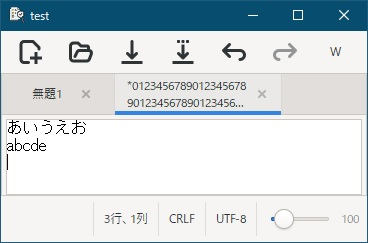
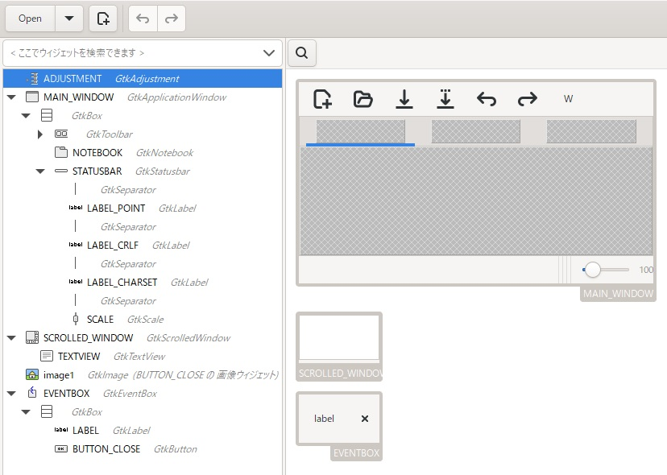

[go言語 & gotk3をちょっとやり直してみたい](../../README.md#go%E8%A8%80%E8%AA%9Egotk3%E3%82%92%E3%81%A1%E3%82%87%E3%81%A3%E3%81%A8%E3%82%84%E3%82%8A%E7%9B%B4%E3%81%97%E3%81%A6%E3%81%BF%E3%81%9F%E3%81%84)  

# 33. （まとめ2）タブ切り替え型の簡易メモ帳  

  

タブ切り替え型の簡易メモ帳を作成していきます。  
上部ボタンは左から、「新規」「ファイルを開く」「上書き保存」「名前を付けて保存」「undo」「redo」「Wrap（折り返し）」となります。  
ステータスバーには、「カーソル位置」「改行コード」「文字コード」「スケール（拡大/縮小）」を表示します。  
タブは編集済みになると先頭に「*」を表示し、横幅は最大20文字、縦幅は最大2行にしています。  

## 33.1 GladeでUIを作成  

  

メインウィンドウにはToolbar、Notebook、Statusbarを縦に並べています。  
ScrolledWindowコンテナは、Notebookのページになり、TextViewを配置しています。  
EventBoxは、Notebookのタブになり、LabelとButtonを配置しています。  

## 33.2 メインウィンドウ  

メインウィンドウには、「ボタン押下時の処理」「ページ変更時の処理」「スライダー変更時の処理」など、ページ内部の処理以外の処理を設定していきます。  

1. 新規ボタン押下時の処理  
   ```go
   func AddPage(parent *gtk.ApplicationWindow, btnUndo, btnRedo *gtk.ToolButton, note *gtk.Notebook, adjustment1 *gtk.Adjustment, labelPoint *gtk.Label, args ...any) error {
       // gladeからScrolledWindowを取得
       scrolledWindow1, builder, err := GetObjFromGlade[*gtk.ScrolledWindow](nil, window1Glade, "SCROLLED_WINDOW")
       if err != nil {
           return err
       }
       
       // gladeからtextviewを取得
       textView1, _, err := GetObjFromGlade[*gtk.TextView](builder, "", "TEXTVIEW")
       if err != nil {
           return err
       }
       
       // textBufferを取得
       textBuffer1, err := textView1.GetBuffer()
       
       // gladeからEventBoxを取得
       eventBox1, _, err := GetObjFromGlade[*gtk.EventBox](builder, "", "EVENTBOX")
       if err != nil {
           ShowErrorDialog(parent, err)
       }
       
       // gladeからLabelを取得
       label1, _, err := GetObjFromGlade[*gtk.Label](builder, "", "LABEL")
       if err != nil {
           return err
       }
       
       // gladeからページCloseボタンを取得
       btnClose, _, err := GetObjFromGlade[*gtk.Button](builder, "", "BUTTON_CLOSE")
       if err != nil {
           return err
       }
       
       // textViewの書式設定
       err = ApplyStyle(textView1, 100.0)
       if err != nil {
           return err
       }
       
       // ファイル用構造体の初期化
       fs := FileStr {
           textView:        textView1,
           textBuffer:        textBuffer1,
           label:            label1,
           directory:        WorkDir,
           fileName:        "無題" + strconv.Itoa(NewFileCount),
           charset:        "UTF-8",
           isCrLf:            true,
           isWrap:            false,
           isEdit:            false,
           isNew:            true,
           isUndoEnable:    false,
           isRedoEnable:    false,
           doingUndoRedo:    false,
           editCount:        0,
           scale:            100.0,
           ubuf:            ring.New(10),
           rbuf:            ring.New(10),
       }
       
       // 新規ではない（可変引数がある）場合
       if len(args) > 0 {
           fs.directory, fs.fileName = filepath.Split(args[0].(string))
           fs.charset = args[1].(string)
           if fs.charset == "ISO-2022-JP" {
               fs.charset = "JIS"
           }
           fs.isCrLf = args[2].(bool)
           fs.isNew = false
           textBuffer1.SetText(string(args[3].([]byte)))
       }
       
       // undo/redoリングバッファの初期化
       for i := 0; i < 10; i++ {
           fs.ubuf.Value = UndoRedoStr {isAvailable: false}
           fs.ubuf = fs.ubuf.Move(i)
           fs.rbuf.Value = UndoRedoStr {isAvailable: false}
           fs.rbuf = fs.rbuf.Move(i)
       }
       
       // FileMapのキーにscrolledWindow1のnameを設定
       id := strconv.Itoa(FileId)
       scrolledWindow1.SetName(id)
       FileMap[id] = fs
       
       FileId++
       NewFileCount++
       
       // ラベルのプロパティを設定
       SetLabelProperty(fs)
       
       // タブの右端に、ページを追加
       pageNum := note.AppendPage(scrolledWindow1, eventBox1)
       
       // 追加したページを表示
       note.SetCurrentPage(pageNum)
       textView1.GrabFocus()
       
       // タブをマウスで並べ替え可
       note.SetTabReorderable(scrolledWindow1, true)
       
   
       //-----------------------------------------------------------
       // カーソル位置の表示
       //-----------------------------------------------------------
       textBuffer1.Connect("mark-set", func(buffer *gtk.TextBuffer, iter *gtk.TextIter, mark *gtk.TextMark) {
           if mark.GetName() == "" {
               line := iter.GetLine() + 1
               offset := iter.GetLineOffset() + 1
               labelPoint.SetText(fmt.Sprintf("%d行、%d列", line, offset))
           }
       })
   
       //-----------------------------------------------------------
       // ページCloseボタン押下時の処理
       //-----------------------------------------------------------
       btnClose.Connect("clicked", func() {
           var err error
           
           // idからFileStrを取得
           fs, ok := FileMap[id]
           if !ok {
               ShowErrorDialog(parent, fmt.Errorf("選択中のページの取得に失敗しました。"))
               return
           }
           
           // 編集済みの場合
           if fs.isEdit {
               // 保存するかどうか確認
               dialog := gtk.MessageDialogNew(parent, gtk.DIALOG_MODAL | gtk.DIALOG_DESTROY_WITH_PARENT, gtk.MESSAGE_QUESTION, gtk.BUTTONS_YES_NO, fs.fileName + "\nへの変更内容を保存しますか？")
               dialog.AddButton("キャンセル(_C)", gtk.RESPONSE_CANCEL)
               defer dialog.Destroy()
               
               ret := dialog.Run()
               switch ret {
                   case gtk.RESPONSE_YES:    // 保存する
                       if fs.isNew {
                           // 新規の場合、名前を付けて保存
                           err = SaveAsFile(parent, note)
                       } else {
                           // 既存の場合、上書き保存
                           err = SaveFile(note)
                       }
                       if err != nil {
                           if err.Error() == "cancel" {
                               return
                           }
                           ShowErrorDialog(parent, err)
                           return
                       }
                   case gtk.RESPONSE_NO:    // 保存しない
                       break
                   default:                // キャンセル
                       return
               }
           }
           
           // ページを削除
           note.RemovePage(note.PageNum(scrolledWindow1))
           delete(FileMap, id)
       })
       
       //-----------------------------------------------------------
       // テキスト挿入時の処理
       //-----------------------------------------------------------
       textBuffer1.Connect("insert_text", func(textBuffer *gtk.TextBuffer, pos *gtk.TextIter, text string, length int) {
           // idからFileStrを取得
           fs, ok := FileMap[id]
           if !ok {
               ShowErrorDialog(parent, fmt.Errorf("選択中のページの取得に失敗しました。"))
               return
           }
           
           // undo/redoによる編集時は何もしない
           if fs.doingUndoRedo {
               return
           }
           
           // ユーザによる手入力時、redoバッファをクリアし、disable
           // ※undo後しかredoは実行させない
           for i := 0; i < 10; i++ {
               fs.rbuf.Value = UndoRedoStr {isAvailable: false}
               fs.rbuf = fs.rbuf.Move(i)
           }
           fs.isRedoEnable = false
           
           // 次のundoバッファに編集内容を保存し、enable
           fs.ubuf = fs.ubuf.Next()
           fs.ubuf.Value = UndoRedoStr {
               isAvailable:    true,
               isInsert:        true,
               offset:            pos.GetOffset(),
               text:            text,
           }
           fs.isUndoEnable = true
           
           // editCountが「0」→「1」で編集されたデータ
           fs.editCount++
           if fs.editCount == 1 {
               fs.isEdit = true
               fs.label.SetText("*" + fs.fileName)
           }
           
           btnRedo.SetSensitive(fs.isRedoEnable)
           btnUndo.SetSensitive(fs.isUndoEnable)
           FileMap[id] = fs
       })
       
       //-----------------------------------------------------------
       // テキスト削除時の処理
       //-----------------------------------------------------------
       textBuffer1.Connect("delete_range", func(textBuffer *gtk.TextBuffer, start *gtk.TextIter, end *gtk.TextIter) {
           // idからFileStrを取得
           fs, ok := FileMap[id]
           if !ok {
               ShowErrorDialog(parent, fmt.Errorf("選択中のページの取得に失敗しました。"))
               return
           }
           
           // undo/redoによる編集時は何もしない
           if fs.doingUndoRedo {
               return
           }
           
           // ユーザによる手入力時、redoバッファをクリアし、disable
           // ※undo後しかredoは実行させない
           for i := 0; i < 10; i++ {
               fs.rbuf.Value = UndoRedoStr {isAvailable: false}
               fs.rbuf = fs.rbuf.Move(i)
           }
           fs.isRedoEnable = false
           
           // 次のundoバッファに編集内容を保存し、enable
           fs.ubuf = fs.ubuf.Next()
           fs.ubuf.Value = UndoRedoStr {
               isAvailable:    true,
               isInsert:        false,
               offset:            start.GetOffset(),
               text:            start.GetText(end),
           }
           fs.isUndoEnable = true
           
           // editCountが「0」→「1」で編集されたデータ
           fs.editCount++
           if fs.editCount == 1 {
               fs.isEdit = true
               fs.label.SetText("*" + fs.fileName)
           }
           
           btnRedo.SetSensitive(fs.isRedoEnable)
           btnUndo.SetSensitive(fs.isUndoEnable)
           FileMap[id] = fs
       })
       
       //-----------------------------------------------------------
       // ctrl + z, ctrl + y押下時の処理
       //-----------------------------------------------------------
       textView1.Connect("key-press-event", func(textView *gtk.TextView, event *gdk.Event) bool {
           keyEvent := gdk.EventKeyNewFromEvent(event)
           keyVal := keyEvent.KeyVal()
           keyState := gdk.ModifierType(keyEvent.State() & 0x0F)
           
           switch keyState {
               case gdk.CONTROL_MASK:      // CTRLキー
                   switch keyVal {
                       case gdk.KEY_y, gdk.KEY_Y:
                           _, err := btnRedo.Emit("clicked", glib.TYPE_POINTER)
                           if err != nil {
                               ShowErrorDialog(parent, err)
                           }
                       case gdk.KEY_z, gdk.KEY_Z:
                           _, err := btnUndo.Emit("clicked", glib.TYPE_POINTER)
                           if err != nil {
                               ShowErrorDialog(parent, err)
                           }
                   }
           }
           
           // イベントを伝播
           return false
       })
       
       
       //-----------------------------------------------------------
       // マウスホイール（垂直）が回転した時、拡大/縮小
       //-----------------------------------------------------------
       textView1.Connect("scroll_event", func(self *gtk.TextView, e *gdk.Event) bool {
           // idからFileStrを取得
           fs, ok := FileMap[id]
           if !ok {
               ShowErrorDialog(parent, fmt.Errorf("選択中のページの取得に失敗しました。"))
               return false
           }
           
           event := gdk.EventScrollNewFromEvent(e)
           
           // ctrlキー + 垂直方向の場合
           if event.State() == gdk.CONTROL_MASK && event.DeltaY() != 0 {
               // マウスホイールの変動量を10刻みにする
               fs.scale -= float64(event.DeltaY()) * 10.0
               FileMap[id] = fs
               
               // スライダーを移動
               // ※書式設定は"value_changed"シグナル内で実行
               adjustment1.SetValue(fs.scale)
               
               // シグナルを伝播しない
               return true
           }
           
           return false
       })
       
       return nil
   }
   ```

   新規ボタン押下時は、ページの追加を行います。  
   「28章～32章」では外部スコープで定義した変数に代入していた物も、今回はページ毎に管理する必要があるため、`FileStr`構造体へ値を代入しています。  
   「開く」でも上記関数をコール出来るように、可変引数が指定された場合に、引数で渡されたデータを`FileStr`構造体へ代入しています。  
   `scrolledWindow1.SetName(id)`により、ScrolledWindowに名前を設定することで、ScrolledWindowがシグナルハンドラの引数で渡された時に、ページの判別が出来るように設定しています。  
   
   ラベルのプロパティ設定は以下のようなコードになります。  

   ```go
   func SetLabelProperty(fs FileStr) {
       min_len := 5 + len(strconv.Itoa(NewFileCount))
       if !fs.isNew {
           min_len = 1
       }
       max_len := 20
       if max_len > len(fs.fileName) + 1 {
           max_len = len(fs.fileName) + 1
       }
       if max_len < min_len {
           max_len = min_len
       }
       fs.label.SetText(fs.fileName)
       fs.label.SetProperty("lines", 2)                        // 最大2行
       fs.label.SetProperty("width-chars", max_len)            // 最大文字数
       fs.label.SetProperty("ellipsize", pango.ELLIPSIZE_END)    // 表示領域からあふれた時末尾に「...」を表示
       fs.label.SetProperty("wrap", true)                        // 折り返し可
       fs.label.SetProperty("wrap-mode", pango.WRAP_CHAR)        // 折り返しモードは文字単位
   }
   ```

   「最大文字数」をファイル名から計算しています。他の設定はコード内のコメントを読めば分かると思います。  

   「カーソル位置の表示」シグナルハンドラは、ステータスバーのLabelにカーソル位置を表示しています。  

   「ページCloseボタン押下時の処理」シグナルハンドラは、編集済みの場合に、ファイルを保存するかどうか確認し、保存する場合は「上書き保存」/「名前を付けて保存」をコールしてます。各保存関数については、「上書き保存」/「名前を付けて保存」ボタン押下時の処理の説明を参照してください。  

   その他の処理は、「28章～32章」とあまり変わらないので、説明は端折ります。  

1. 開くボタン押下時の処理  

   開くボタン押下時の処理は以下のようなコードになります。  
   ファイル選択ダイアログについては、
   「[10. メニューバー/ツールバー/標準ダイアログを使いたい(後編)](../10/README.md)」
   を参照してください。  

   ```go
   func OpenFile(parent *gtk.ApplicationWindow, btnUndo, btnRedo *gtk.ToolButton, note *gtk.Notebook, adjustment1 *gtk.Adjustment, labelPoint *gtk.Label) error {
       if parent == nil {
           return fmt.Errorf("parent is null")
       }
   
       // OSのファイル選択ダイアログを作成
       fcd, err := gtk.FileChooserNativeDialogNew("開く", parent, gtk.FILE_CHOOSER_ACTION_OPEN, "開く(_O)", "キャンセル(_C)")
       if err != nil {
           return err
       }
       defer fcd.Destroy()
   
       // 追加のオプション選択項目を設定
       fcd.AddChoice("cs", "文字コード", []string{"AUTO", "ISO-8859-1", "Shift_JIS", "ISO-2022-JP", "EUC-JP", "UTF-8", "UTF-16LE", "UTF-16BE"}, []string{"自動検出", "半角英数字", "SJIS", "JIS", "EUC-JP", "UTF-8", "UTF-16LE", "UTF-16BE"})
   
       // オプション選択項目の初期値を設定
       fcd.SetChoice("cs", "AUTO")
   
       // すべての拡張子のフィルタを追加
       fileFilterPng, err := gtk.FileFilterNew()
       if err != nil {
           return err
       }
       fileFilterPng.AddPattern("*.*")
       fileFilterPng.SetName("すべてのファイル")
       fcd.AddFilter(fileFilterPng)
   
       // txt拡張子のフィルタを追加
       fileFilterTxt, err := gtk.FileFilterNew()
       if err != nil {
           return err
       }
       fileFilterTxt.AddPattern("*.txt")
       fileFilterTxt.SetName("テキスト文書")
       fcd.AddFilter(fileFilterTxt)
   
       // ダイアログを起動
       if fcd.Run() == int(gtk.RESPONSE_ACCEPT) {
           // 選択した文字コード
           charSet := fcd.GetChoice("cs")
           
           // 選択したファイルを読み込む
           data, err := os.ReadFile(fcd.GetFilename())
           if err != nil {
               return err
           }
           
           // "自動検出"の場合、文字コード判定
           if charSet == "AUTO" {
               charSet = DetectJpCharacterSet(data)
               if charSet == "UnKnown" {
                   return fmt.Errorf("文字コードの検出に失敗しました。\n文字コードを指定して開きなおしてください。")
               }
           }
           
           // utf8へ変換
           utf8Bytes, err := DecodeToUtf8(data, charSet)
           if err != nil {
               return err
           }
           
           // 「\r」が含まれてた場合、改行コードはCRLF
           isCrLf := false
           if bytes.IndexByte(utf8Bytes, '\r') >= 0 {
               isCrLf = true
           }
           
           // ページを追加
           err = AddPage(parent, btnUndo, btnRedo, note, adjustment1, labelPoint, fcd.GetFilename(), charSet, isCrLf, utf8Bytes)
           if err != nil {
               return err
           }
       }
       
       return nil
   }
   ```

   「30章」で説明した文字コード判定を行っています。  
   改行コードは、「CRLF」「LF」のみを想定しており「CR」は想定してません。  

   読み込んだファイルは、UTF8へ文字コード変換を行います。utf8への文字コード変換処理は以下のようなコードになります。  

   ```go
   func DecodeToUtf8(data []byte, charSet string) ([]byte, error) {
       var trans transform.Transformer
   
       switch charSet {
           case "ISO-8859-1" :
               trans = charmap.ISO8859_1.NewDecoder()
   
           case "Shift_JIS" :
               trans = japanese.ShiftJIS.NewDecoder()
   
           case "JIS", "ISO-2022-JP" :
               trans = japanese.ISO2022JP.NewDecoder()
   
           case "EUC-JP" :
               trans = japanese.EUCJP.NewDecoder()
   
           case "UTF-16LE" :
               trans = unicode.UTF16(unicode.LittleEndian, unicode.IgnoreBOM).NewDecoder()
   
           case "UTF-16BE" :
               trans = unicode.UTF16(unicode.BigEndian, unicode.IgnoreBOM).NewDecoder()
   
           default :
               if !utf8.Valid(data) {
                   return nil, fmt.Errorf("failed decode")
               }
               return data, nil
       }
       
       reader := transform.NewReader(bytes.NewReader(data), trans)
       utf8Bytes, err := io.ReadAll(reader)
       if err != nil {
           return nil, err
       }
   
       // utf8で問題ないかチェック
       if !utf8.Valid(utf8Bytes) {
           return nil, fmt.Errorf("failed decode")
       }
   
       return utf8Bytes, nil
   }
   ```

   文字コード変換処理が終わったら、最後に、「ページを追加」の関数をコールしています。  


1. 上書き保存ボタン押下時の処理  
   
   上書き保存ボタン押下時の処理は以下のようなコードになります。  

   ```go
   func SaveFile(note *gtk.Notebook) error {
       // 選択中のページのFileStrを取得
       fs, id, err := GetFileStrFromPageNum(note)
       if err != nil {
           return err
       }
       
       // 未編集の場合、何もしない
       if !fs.isEdit {
           return nil
       }
       
       // textBufferからテキストデータを取得
       start, end := fs.textBuffer.GetStartIter(), fs.textBuffer.GetEndIter()
       utf8Text, err := fs.textBuffer.GetText(start, end, false)
       if err != nil {
           return err
       }
       
       // 改行コードの置換
       retCode := "\n"
       if fs.isCrLf {
           retCode = "\r\n"
       }
       utf8Text = strings.NewReplacer("\r\n", retCode, "\r", retCode, "\n", retCode).Replace(utf8Text)
       
       // 文字コード変換
       data, err := EncodeFromUtf8(utf8Text, fs.charset)
       if err != nil {
           return err
       }
       
       // ファイルの保存
       err = os.WriteFile(filepath.Join(fs.directory, fs.fileName), data, 0666)
       if err != nil {
           return err
       }
       
       // 編集済みの状態をリセット
       fs.isEdit = false
       fs.editCount = 0
       fs.label.SetText(fs.fileName)
       
       // undo/redoリングバッファの初期化
       for i := 0; i < 10; i++ {
           fs.ubuf.Value = UndoRedoStr {isAvailable: false}
           fs.ubuf = fs.ubuf.Move(i)
           fs.rbuf.Value = UndoRedoStr {isAvailable: false}
           fs.rbuf = fs.rbuf.Move(i)
       }
       
       FileMap[id] = fs
       return nil
   }
   ```

   改行コードをページの改行コードに統一した後、文字コード変換を行い、ファイルに保存します。保存した後は、未編集状態に各変数を設定しています。  
   文字コード変換処理は以下のようなコードになります。  

   ```go
   func EncodeFromUtf8(text, charSet string) ([]byte, error) {
       var trans transform.Transformer
   
       switch charSet {
           case "ISO-8859-1" :
               trans = charmap.ISO8859_1.NewEncoder()
   
           case "Shift_JIS" :
               trans = japanese.ShiftJIS.NewEncoder()
   
           case "JIS", "ISO-2022-JP" :
               trans = japanese.ISO2022JP.NewEncoder()
   
           case "EUC-JP" :
               trans = japanese.EUCJP.NewEncoder()
   
           case "UTF-16LE" :
               trans = unicode.UTF16(unicode.LittleEndian, unicode.IgnoreBOM).NewEncoder()
   
           case "UTF-16BE" :
               trans = unicode.UTF16(unicode.BigEndian, unicode.IgnoreBOM).NewEncoder()
   
           default :
               return []byte(text), nil
       }
       
       reader := transform.NewReader(strings.NewReader(text), trans)
       strBytes, err := io.ReadAll(reader)
       if err != nil {
           return nil, err
       }
       
       return strBytes, nil
   }
   ```

   utf8へ変換した時と逆にEncode処理となります。  
   
1. 名前を付けて保存ボタン押下時の処理  
   
   名前を付けて保存ボタン押下時の処理は以下のようなコードになります。  
   ファイル選択ダイアログについては、
   「[10. メニューバー/ツールバー/標準ダイアログを使いたい(後編)](../10/README.md)」
   を参照してください。  

   ```go
   func SaveAsFile(parent *gtk.ApplicationWindow, note *gtk.Notebook) error {
       if parent == nil {
           return fmt.Errorf("parent is null")
       }
   
       // 選択中のページのFileStrを取得
       fs, id, err := GetFileStrFromPageNum(note)
       if err != nil {
           return err
       }
       
       // OSのファイル選択ダイアログを作成
       fcd, err := gtk.FileChooserNativeDialogNew("名前を付けて保存", parent, gtk.FILE_CHOOSER_ACTION_SAVE, "保存(_S)", "キャンセル(_C)")
       if err != nil {
           return err
       }
       defer fcd.Destroy()
       
       // 指定したファイルが存在した場合、上書き確認を行う
       fcd.SetDoOverwriteConfirmation(true)
   
       // 追加のオプション選択項目を設定
       fcd.AddChoice("cs", "文字コード", []string{"ISO-8859-1", "Shift_JIS", "ISO-2022-JP", "EUC-JP", "UTF-8", "UTF-16LE", "UTF-16BE"}, []string{"半角英数字", "SJIS", "JIS", "EUC-JP", "UTF-8", "UTF-16LE", "UTF-16BE"})
       fcd.AddChoice("ret", "改行コード", []string{"CRLF", "LF"}, []string{"CRLF", "LF"})
   
       // オプション選択項目の初期値を設定
       fcd.SetChoice("cs", fs.charset)
       if fs.isCrLf {
           fcd.SetChoice("ret", "CRLF")
       } else {
           fcd.SetChoice("ret", "LF")
       }
   
       // すべての拡張子のフィルタを追加
       fileFilterPng, err := gtk.FileFilterNew()
       if err != nil {
           return err
       }
       fileFilterPng.AddPattern("*.*")
       fileFilterPng.SetName("すべてのファイル")
       fcd.AddFilter(fileFilterPng)
   
       // txt拡張子のフィルタを追加
       fileFilterTxt, err := gtk.FileFilterNew()
       if err != nil {
           return err
       }
       fileFilterTxt.AddPattern("*.txt")
       fileFilterTxt.SetName("テキスト文書")
       fcd.AddFilter(fileFilterTxt)
   
       // ダイアログを起動
       if fcd.Run() == int(gtk.RESPONSE_ACCEPT) {
           // 選択した文字コードを取得
           fs.charset = fcd.GetChoice("cs")
           
           // 選択した改行コードを取得
           retCode := fcd.GetChoice("ret")
           if retCode == "CRLF" {
               fs.isCrLf = true
           } else {
               fs.isCrLf = false
           }
           
           // 設定したファイルパスを取得
           fs.directory, fs.fileName = filepath.Split(fcd.GetFilename())
           
           // ラベルのプロパティを設定
           SetLabelProperty(fs)
           
           // 別名保存が可能なように、編集済みに変更
           fs.isEdit = true
           
           // 保存するので、新規ではない
           fs.isNew = false
           
           FileMap[id] = fs
           
           // ファイルへ保存
           err = SaveFile(note)
           if err != nil {
               return err
           }
           return nil
       }
       
       return fmt.Errorf("cancel")
   }
   ```
   
   ファイルの保存は「上書き保存ボタン押下時の処理」で作成した関数で実施しているため、ファイル選択ダイアログの処理のみとなります。  
   「名前を付けて保存」の場合、別名保存が可能なように、未編集でも保存出来るようにしています。

1. undoボタン押下時の処理  

   「32章」で説明したのとあまり変わらないので省略します。  

1. redoボタン押下時の処理  

   「32章」で説明したのとあまり変わらないので省略します。  
   
1. wrapボタン押下時の処理  

   wrapボタン押下時の処理は以下のようなコードになります。  

   ```go
   btnWrap.Connect("toggled", func() {
       // ページ切替時は、フラグをoffにして終了
       if nextWrap {
           nextWrap = false
           return
       }
       
       // 選択中のページのFileStrを取得
       fs, id, err := GetFileStrFromPageNum(note)
       if err != nil {
           ShowErrorDialog(window1, err)
           return
       }
       
       fs.isWrap = !fs.isWrap
       FileMap[id] = fs
       
       if fs.isWrap {
           fs.textView.SetWrapMode(gtk.WRAP_CHAR)
       } else {
           fs.textView.SetWrapMode(gtk.WRAP_NONE)
       }
   })
   ```

   「選択ページ変更時の処理」で、wrapボタンの状態を変更しているため、「選択ページ変更時の処理」でシグナルが飛んできた場合はフラグをoffにして終了しています。  
   wrapのモード変更は`textView.SetWrapMode()`をコールしています。  

1. スケールの値が変更された時の処理  

   「31章」で説明したのとあまり変わらないので省略します。  

1. 選択ページ変更時の処理  
   
   選択ページ変更時の処理は以下のようなコードになります。  

   ```go
   note.Connect("switch-page", func(self *gtk.Notebook, page *gtk.Widget, page_num int) {
       // 選択後のページのFileStrを取得
       fs, _, err := GetFileStrFromPageNum(note, page_num)
       if err != nil {
           ShowErrorDialog(window1, err)
           return
       }
       
       // 各ボタンの活性状態を設定
       btnSave.SetSensitive(!fs.isNew)
       btnRedo.SetSensitive(fs.isRedoEnable)
       btnUndo.SetSensitive(fs.isUndoEnable)
       
       // ステータスバーにカーソル位置を表示
       iter := fs.textBuffer.GetIterAtMark(fs.textBuffer.GetInsert())
       line := iter.GetLine() + 1
       offset := iter.GetLineOffset() + 1
       labelPoint.SetText(fmt.Sprintf("%d行、%d列", line, offset))
       
       // ステータスバーに改行コードを表示
       if fs.isCrLf {
           labelCrLf.SetText("CRLF")
       } else {
           labelCrLf.SetText("LF")
       }
       
       // ステータスバーに文字コードを表示
       labelCharSet.SetText(fs.charset)
       
       // 移動後ページのWrapボタンを設定
       if btnWrap.GetActive() != fs.isWrap {
           nextWrap = true
           btnWrap.SetActive(fs.isWrap)
       }
       
       // 移動後ページのscaleを設定
       nextPageScale = fs.scale
       adjustment1.SetValue(fs.scale)
   })
   ```

   "switch-page"シグナルはページ変更の直前に発行されます。そのため、現在選択されてるページに対して変更処理を行うと、ページ変更前のページへ反映されてしまうので、ページ変更後のページに反映したい場合は、引数で受け取った変数を使う必要があります。  

   処理内容は、ページ毎の差異を反映しているだけなので、コードを見れば分かると思います。  

## 33.3 おわりに  

タブ切り替え型の簡易メモ帳を作成しました。  
「28章」で記載したように、「検索/置換」や「半角スペース/全角スペース/タブの視覚化」などを追加すれば、普通のエディタのように使えるようになるかと思います。  
また、改行時に改行前の行の先頭空白やタブをコピーして、改行後の先頭に貼り付けるようにするなど、細かい制御を入れると便利になるかもしれません。  

作成したファイルは、
[ここ](33_editor.go)と[ここ](33_page.go)
に置いてます。  

</br>

「[34. （まとめ3）画像ビューア](../34/README.md)」へ
