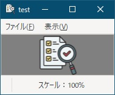
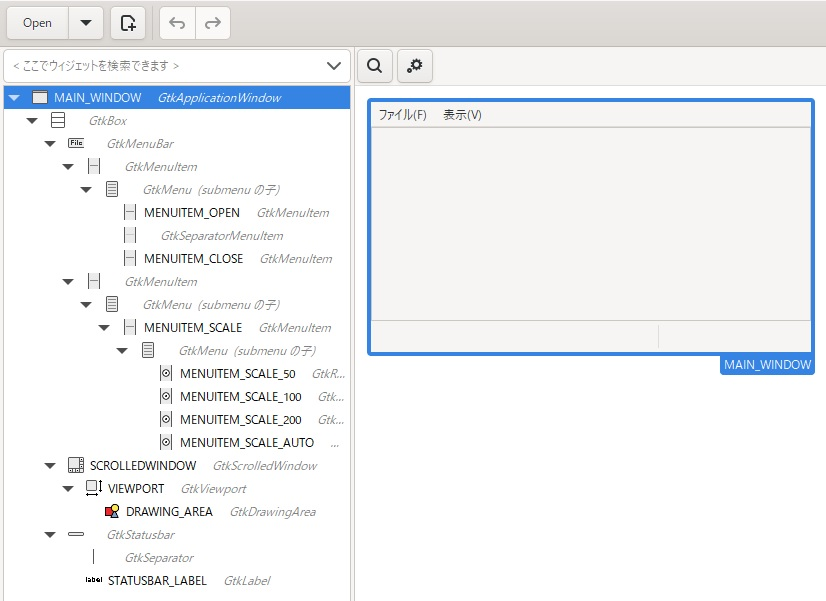

[go言語 & gotk3をちょっとやり直してみたい](../../README.md#go%E8%A8%80%E8%AA%9Egotk3%E3%82%92%E3%81%A1%E3%82%87%E3%81%A3%E3%81%A8%E3%82%84%E3%82%8A%E7%9B%B4%E3%81%97%E3%81%A6%E3%81%BF%E3%81%9F%E3%81%84)  

# 34. （まとめ3）画像ビューア  

  

画像ビューアを作成してみたいと思います。  
今回は、事前確認とかなしで、いきなり作成していくので、少し長くなるかもしれません。  

## 34.1 GladeでUIを作成  

  

以下のような内容になっています。  

- ファイルメニュー：画像ファイルのオープンと、アプリの終了  
- 表示メニュー：画像の拡大率指定（50%, 100%, 200%, 自動）  
- 画像表示：gtk.DrawingAreaへ表示し、ウィンドウサイズより画像が大きい場合はスクロールバーを表示
- ステータスバー：表示中画像の拡大率を表示  

## 34.2 描画処理  

描画処理は、以下のようなコードになります。  

```go
drawingArea.SetEvents(int(gdk.POINTER_MOTION_MASK | gdk.BUTTON_PRESS_MASK | gdk.BUTTON_RELEASE_MASK))

drawingArea.Connect("draw", func(da *gtk.DrawingArea, cr *cairo.Context) {
	if SrcPixbuf == nil {
		return
	}
	
	// 画像を拡大/縮小
	scaledW := int(float64(Width) * Scale)
	scaledH := int(float64(Height) * Scale)
	scaledPixbuf, err := SrcPixbuf.ScaleSimple(scaledW, scaledH, gdk.INTERP_BILINEAR)
	if err != nil {
		ShowErrorDialog(window1, err)
		return
	}
	
	// Pixbuf を描画
	surface, err := gdk.CairoSurfaceCreateFromPixbuf(scaledPixbuf, 1, nil)
	if err != nil {
		ShowErrorDialog(window1, err)
		return
	}
	defer surface.Close()
	
	// Cairo Surface を描画ソースとして設定
	daW := scrolledWindow.GetAllocatedWidth()
	daH := scrolledWindow.GetAllocatedHeight()
	imgX = math.Max(0.0, float64(daW - scaledW) / 2.0)
	imgY = math.Max(0.0, float64(daH - scaledH) / 2.0)
	cr.SetSourceSurface(surface, imgX, imgY)
	cr.Paint()
	
	// 選択範囲を描画
	cr.SetSourceRGBA(0, 0, 1, 0.5) // 青色の半透明
	cr.Rectangle(selection.startX, selection.startY, selection.endX - selection.startX, selection.endY - selection.startY)
	cr.Fill()
	
	text := fmt.Sprintf("スケール：%d%%", ScaleMode)
	if ScaleMode == 0 {
		text = fmt.Sprintf("スケール：自動(%d%%)", int(100.0 * Scale))
	}
	stLabel.SetText(text)
	return
})
```

以下のような処理をしています。  

- `SetEvents`で、「マウスカーソルの移動」 「マウスボタンを押した時/離した時」のシグナルを発行するよう設定しています。
- `Scale(拡大率)`にあわせて、画像を拡大/縮小  
- `scrolledWindow`の中央に画像を表示  
- 選択領域を青色の半透明で描画  
- ステータスバーに拡大率を表示  

選択領域とは、マウスで選択した領域のこととなります。後述しますが`Ctrl + C`で選択領域をクリップボードへコピーすることが出来ます。  

## 34.3 マウスボタンを押した時のシグナルハンドラ  

マウスボタンを押した時のシグナルハンドラは、以下のようなコードになります。  

```go
drawingArea.Connect("button-press-event", func(da *gtk.DrawingArea, ev *gdk.Event) bool {
	if SrcPixbuf == nil {
		return false		// イベントを伝播
	}
	
	mouseEvent := gdk.EventButtonNewFromEvent(ev)
	
	// マウスカーソルの座標を取得
	selection.startX, selection.startY = mouseEvent.MotionVal()
	
	// 画像の範囲内を開始/終了位置に設定
	selection.startX, selection.startY = GetPointWithinImageArea(imgX, imgY, selection.startX, selection.startY)
	selection.endX, selection.endY = selection.startX, selection.startY
	
	selection.active = true
	drawingArea.QueueDraw() // 再描画を要求
	
	return true
})
```

選択領域の始点を設定しています。画像より外の領域をクリックした場合、画像内の領域に変換した後、`selection.active = true`にて、領域選択中のフラグを立ててます。  
`drawingArea.QueueDraw()`で、「34.2」で設定した描画処理がコールされます。  

## 34.4 マウスカーソルが移動した時のシグナルハンドラ  

マウスカーソルが移動した時のシグナルハンドラは、以下のようなコードになります。  

```go
drawingArea.Connect("motion-notify-event", func(da *gtk.DrawingArea, ev *gdk.Event) bool {
	if SrcPixbuf == nil {
		return false		// イベントを伝播
	}
	
	if selection.active {
		mouseEvent := gdk.EventMotionNewFromEvent(ev)
		
		// マウスカーソルの座標を取得
		selection.endX, selection.endY = mouseEvent.MotionVal()
		
		// 画像の範囲内を終了位置に設定
		selection.endX, selection.endY = GetPointWithinImageArea(imgX, imgY, selection.endX, selection.endY)
		
		drawingArea.QueueDraw() // 再描画を要求
	}
	
	return true
})
```

領域選択中のフラグが立ってる時に、現在のマウスカーソル位置を選択領域の終点(仮)に設定し、「34.2」で設定した描画処理をコールしています。  

## 34.5 マウスボタンを離した時のシグナルハンドラ  

マウスボタンを離した時のシグナルハンドラは、以下のようなコードになります。  

```go
drawingArea.Connect("button-release-event", func(da *gtk.DrawingArea, ev *gdk.Event) bool {
	if SrcPixbuf == nil {
		return false		// イベントを伝播
	}
	
	if selection.active {
		mouseEvent := gdk.EventButtonNewFromEvent(ev)
		
		// マウスカーソルの座標を取得
		selection.endX, selection.endY = mouseEvent.MotionVal()
		
		// 画像の範囲内を終了位置に設定
		selection.endX, selection.endY = GetPointWithinImageArea(imgX, imgY, selection.endX, selection.endY)
		
		selection.active = false
		drawingArea.QueueDraw() // 最終的な選択範囲を描画
	}
	
	return true
})
```

領域選択中のフラグが立ってる時に、現在のマウスカーソル位置を選択領域の終点に設定し、「34.2」で設定した描画処理をコールしています。  
`selection.active = false`にて領域選択中のフラグを解除してます。  

## 34.6 ウィンドウサイズが変更された時のシグナルハンドラ  

ウィンドウサイズが変更された時のシグナルハンドラは、以下のようなコードになります。  

```go
oldW, oldH := 0, 0
window1.Connect("configure-event", func(win *gtk.ApplicationWindow, event *gdk.Event) {
	if SrcPixbuf == nil {
		return
	}
	
	// サイズを取得
	e := gdk.EventConfigureNewFromEvent(event)
	w, h := e.Width(), e.Height()
	
	// サイズが変わってない場合、何もしない
	if w == oldW && h == oldH {
		return
	}
	oldW, oldH = w, h
	
	// 選択範囲をクリア
	selection.startX, selection.startY = 0, 0
	selection.endX, selection.endY = 0, 0
	selection.active = false
	
	if ScaleMode != 0 {
		return
	}
	
	// 拡大率を設定
	wScale := float64(w - OtherWidth) / float64(Width)
	hScale := float64(h + HeaderHeight - OtherHeight) / float64(Height)
	Scale = math.Min(wScale, hScale)
	
	// drawingAreaのサイズを変更
	drawingArea.SetSizeRequest(int(float64(Width) * Scale), int(float64(Height) * Scale))
	
	drawingArea.QueueDraw()
})
```

`configure-event`は、ウィンドウサイズや位置などが変更された時に発行されますので、サイズが変わってない場合は、何もせずに終了しています。  
選択領域のリサイズはせずに、クリアするようにしてます。  
`ScaleMode`が自動の場合以外は、ウィンドウサイズに合わせて画像の拡大/縮小を実施しないため、何もせずに終了しています。  
拡大率は、アスペクト比を維持するために、幅の拡大率と高さの拡大率を比較して、小さい方の拡大率を幅と高さ両方に適用するようにしています。  
`drawingArea`のサイズは、拡大/縮小後の画像サイズを設定しています。  
最後に、「34.2」で設定した描画処理をコールしています。  

## 34.7 キーが押された時のシグナルハンドラ  

キーが押された時のシグナルハンドラは、以下のようなコードになります。  

```go
window1.Connect("key-press-event", func(win *gtk.ApplicationWindow, event *gdk.Event) bool {
	if SrcPixbuf == nil {
		return false		// イベントを伝播
	}
	
	keyEvent := gdk.EventKeyNewFromEvent(event)
	keyVal := keyEvent.KeyVal()
	keyState := gdk.ModifierType(keyEvent.State() & 0x0F)
	
	switch keyState {
		case gdk.CONTROL_MASK:	// CTRLキー
			switch keyVal {
				case gdk.KEY_a, gdk.KEY_A:		// 全て選択
					selection.startX = imgX
					selection.startY = imgY
					selection.endX = imgX + float64(Width) * Scale
					selection.endY = imgY + float64(Height) * Scale
					selection.active = false
					drawingArea.QueueDraw()
					
				case gdk.KEY_c, gdk.KEY_C:		// 選択範囲をクリップボードへコピー
					// 選択領域を元画像の選択領域へ変換
					stX := (math.Min(selection.startX, selection.endX) - imgX) / Scale
					stY := (math.Min(selection.startY, selection.endY) - imgY) / Scale
					endX := (math.Max(selection.startX, selection.endX) - imgX) / Scale
					endY := (math.Max(selection.startY, selection.endY) - imgY) / Scale
					destWidth := int(endX - stX)
					destHeight := int(endY - stY)
					
					// 選択領域を切り出したPixbufを取得
					// ※cropが見当たらないから、Scaleで切り出し
					newPixbuf, err := gdk.PixbufNew(SrcPixbuf.GetColorspace(), SrcPixbuf.GetHasAlpha(), SrcPixbuf.GetBitsPerSample(), destWidth, destHeight)
					if err != nil {
						ShowErrorDialog(window1, err)
						return false
					}
					SrcPixbuf.Scale(newPixbuf, 0, 0, destWidth, destHeight, -stX, -stY, 1.0, 1.0, gdk.INTERP_BILINEAR)
					clipboard.SetImage(newPixbuf)
					
				case gdk.KEY_v, gdk.KEY_V:		// クリップボードからペースト
					if clipboard.WaitIsImageAvailable() {
						// 画像を初期化
						SrcPixbuf = nil
						window1.Resize(1, 1)
						DoEvents()
						
						// クリップボードから画像を取得
						SrcPixbuf, err = clipboard.WaitForImage()
						if err != nil {
							ShowErrorDialog(window1, err)
							return false
						}
						
						// 画像サイズを取得
						Width = SrcPixbuf.GetWidth()
						Height = SrcPixbuf.GetHeight()
						
						// 画像を拡大/縮小して表示
						err = ShowScaledImage(window1, drawingArea)
						if err != nil {
							ShowErrorDialog(window1, err)
							return false
						}
					}
			}
	}
	
	// イベントを伝播
	return false
})
```

キー入力により、以下の処理を行います。  

- `CTRL + A`で画像を全て選択  
- `CTRL + C`で選択範囲の画像をクリップボードへコピー  
  画面に表示されてる拡大率でコピーするのではなく、元画像のサイズでコピーしてます。  
- `CTRL + V`でクリップボードの画像をペースト  

## 34.8 メニュー選択時のシグナルハンドラ  

メニュー選択時のシグナルハンドラは、以下のようなコードになります。  

```go
func buildMenuItem(parent *gtk.ApplicationWindow, builder *gtk.Builder, drawingArea *gtk.DrawingArea) error {
	// gladeからmenuItemOpenを取得
	menuItemOpen, _, err := GetObjFromGlade[*gtk.MenuItem](builder, "", "MENUITEM_OPEN")
	if err != nil {
		return err
	}
	// gladeからmenuItemCloseを取得
	menuItemClose, _, err := GetObjFromGlade[*gtk.MenuItem](builder, "", "MENUITEM_CLOSE")
	if err != nil {
		return err
	}
	// gladeからmenuItemScale50を取得
	menuItemScale50, _, err := GetObjFromGlade[*gtk.RadioMenuItem](builder, "", "MENUITEM_SCALE_50")
	if err != nil {
		return err
	}
	// gladeからmenuItemScale100を取得
	menuItemScale100, _, err := GetObjFromGlade[*gtk.RadioMenuItem](builder, "", "MENUITEM_SCALE_100")
	if err != nil {
		return err
	}
	// gladeからmenuItemScale200を取得
	menuItemScale200, _, err := GetObjFromGlade[*gtk.RadioMenuItem](builder, "", "MENUITEM_SCALE_200")
	if err != nil {
		return err
	}
	// gladeからmenuItemScaleAutoを取得
	menuItemScaleAuto, _, err := GetObjFromGlade[*gtk.RadioMenuItem](builder, "", "MENUITEM_SCALE_AUTO")
	if err != nil {
		return err
	}
	menuItemScaleAuto.SetActive(true)
	
	// menuItemOpen選択時
	menuItemOpen.Connect("activate", func(){
		data, err := menuOpen(parent)
		if err != nil {
			ShowErrorDialog(parent, err)
			return
		}
		if data != nil {
			// 画像を初期化
			SrcPixbuf = nil
			parent.Resize(1, 1)
			DoEvents()
			
			// データからpixbufを取得
			SrcPixbuf, err = gdk.PixbufNewFromDataOnly(data)
			if err != nil {
				ShowErrorDialog(parent, err)
				return
			}
			
			// 画像サイズを取得
			Width = SrcPixbuf.GetWidth()
			Height = SrcPixbuf.GetHeight()
			
			// 画像を拡大/縮小して表示
			err = ShowScaledImage(parent, drawingArea)
			if err != nil {
				ShowErrorDialog(parent, err)
				return
			}
		}
	})
	
	menuItemScale50.Connect("toggled", func(){
		if !menuItemScale50.GetActive() {
			return
		}
		
		ScaleMode = 50
		
		// 画像を拡大/縮小して表示
		err = ShowScaledImage(parent, drawingArea)
		if err != nil {
			ShowErrorDialog(parent, err)
			return
		}
	})
	
	menuItemScale100.Connect("toggled", func(){
		if !menuItemScale100.GetActive() {
			return
		}
		
		ScaleMode = 100
		
		// 画像を拡大/縮小して表示
		err = ShowScaledImage(parent, drawingArea)
		if err != nil {
			ShowErrorDialog(parent, err)
			return
		}
	})
	
	menuItemScale200.Connect("toggled", func(){
		if !menuItemScale200.GetActive() {
			return
		}
		
		ScaleMode = 200
		
		// 画像を拡大/縮小して表示
		err = ShowScaledImage(parent, drawingArea)
		if err != nil {
			ShowErrorDialog(parent, err)
			return
		}
	})
	
	menuItemScaleAuto.Connect("toggled", func(){
		if !menuItemScaleAuto.GetActive() {
			return
		}
		
		ScaleMode = 0
		
		// 画像を拡大/縮小して表示
		err = ShowScaledImage(parent, drawingArea)
		if err != nil {
			ShowErrorDialog(parent, err)
			return
		}
	})
	
	// menuItemClose選択時にアプリを終了
	menuItemClose.Connect("activate", func(){
		application.Quit()
	})
	
	return nil
}
```

選択されたメニューアイテムに応じて、以下のような処理を行います。  

- 画像を開く  
  ファイル選択ダイアログを使ってファイルをReadする関数をコールして、画像を表示してます。  
- 画像の拡大率指定  
  選択された拡大率に応じて画像を拡大/縮小して表示してます。  
- アプリを閉じる  
  アプリケーションを終了しています。  

## 34.9 画像ファイルを開く処理  

画像ファイルを開く処理は、以下のようなコードになります。  

```go
func menuOpen(parent *gtk.ApplicationWindow) ([]byte, error) {
	if parent == nil {
		return nil, fmt.Errorf("parent is null")
	}

	// OSのファイル選択ダイアログを作成
	fcd, err := gtk.FileChooserNativeDialogNew("開く", parent, gtk.FILE_CHOOSER_ACTION_OPEN, "開く(_O)", "キャンセル(_C)")
	if err != nil {
		return nil, err
	}
	defer fcd.Destroy()

	// 画像拡張子のフィルタを追加
	fileFilterTxt, err := gtk.FileFilterNew()
	if err != nil {
		return nil, err
	}
	fileFilterTxt.AddPattern("*.bmp;*.gif;*.icns;*.ico;*.cur;*.jpeg;*.jpe;*.jpg;*.png;*.pnm;*.pbm;*.pgm;*.ppm;*.qtif;*.qif;*.svg;*.svgz;*.svg.gz;*.tga;*.targa;*.tiff;*.tif;*.xbm;*.xpm;*.webp;")
	fileFilterTxt.SetName("画像ファイル")
	fcd.AddFilter(fileFilterTxt)

	// すべての拡張子のフィルタを追加
	fileFilterPng, err := gtk.FileFilterNew()
	if err != nil {
		return nil, err
	}
	fileFilterPng.AddPattern("*.*")
	fileFilterPng.SetName("すべてのファイル")
	fcd.AddFilter(fileFilterPng)

	// ダイアログを起動
	if fcd.Run() == int(gtk.RESPONSE_ACCEPT) {
		// 選択したファイルを読み込む
		data, err := os.ReadFile(fcd.GetFilename())
		if err != nil {
			return nil, err
		}
		return data, nil
	}
	return nil, fmt.Errorf("canceled")
}
```

ファイル選択ダイアログで、画像ファイルを選択し、読み込んだデータをbyte配列で返しています。  

## 34.10 画像を拡大/縮小して表示する処理  

画像を拡大/縮小して表示する処理は、以下のようなコードになります。  

```go
func ShowScaledImage(parent *gtk.ApplicationWindow, drawingArea *gtk.DrawingArea) error {
	if SrcPixbuf == nil {
		return nil
	}
	
	switch ScaleMode {
		case 0:
			Scale = 1.0
		case 50:
			Scale = 0.5
		case 100:
			Scale = 1.0
		case 200:
			Scale = 2.0
	}
	
	// 画面より大きい場合、画面内に収まるサイズを設定
	dw := math.Min(float64(Width) * Scale + 2, float64(WorkArea.w - OtherWidth))
	dh := math.Min(float64(Height) * Scale + 2, float64(WorkArea.h - OtherHeight))
	
	// 拡大率を設定し、幅と高さを拡大率から再計算
	if ScaleMode == 0 {
		wScale := float64(dw - 2) / float64(Width)
		hScale := float64(dh - 2) / float64(Height)
		Scale = math.Min(wScale, hScale)
		dw = math.Min(dw, float64(Width) * Scale + 2)
		dh = math.Min(dh, float64(Height) * Scale + 2)
	}
	
	// 画面からはみ出る場合、画面内に収まる座標を設定
	winX, winY := parent.GetPosition()
	dx := math.Min(float64(winX), float64(WorkArea.w - OtherWidth) - dw)
	dx = math.Max(dx, float64(WorkArea.x))
	dy := math.Min(float64(winY), float64(WorkArea.h - OtherHeight) - dh)
	dy = math.Max(dy, float64(WorkArea.y))
	
	// drawingAreaのサイズを変更
	drawingArea.SetSizeRequest(int(float64(Width) * Scale), int(float64(Height) * Scale))
	
	// ウィンドウを移動
	parent.Move(int(dx), int(dy))
	
	// ウィンドウのサイズを変更
	parent.Resize(int(dw) + OtherWidth, int(dh) + OtherHeight - HeaderHeight)
	DoEvents()
	
	drawingArea.QueueDraw()
	
	return nil
}
```

ウィンドウサイズが画面より大きい場合、画面内に収まるサイズに縮小し、ウィンドウ位置が画面内からはみ出る場合、画面内に収まる座標に移動しています。  
あとは、拡大率にあわせて画像の拡大/縮小と`drawingArea`のサイズ変更を行っています。  

## 34.11 おわりに  

`drawingArea`以外は新しい情報もなかったので、事前確認などをせずに一気に説明しました。  

作成したファイルは、
[ここ](34_ImageViewer.go)
に置いてます。  

<!--
</br>

「[34. （まとめ3）画像ビューア](../34/README.md)」へ

-->