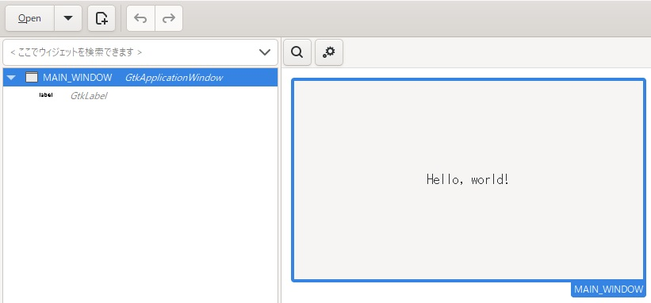

[go言語 & gotk3をちょっとやり直してみたい](../../README.md#go%E8%A8%80%E8%AA%9Egotk3%E3%82%92%E3%81%A1%E3%82%87%E3%81%A3%E3%81%A8%E3%82%84%E3%82%8A%E7%9B%B4%E3%81%97%E3%81%A6%E3%81%BF%E3%81%9F%E3%81%84)  

# 35. dllを使ったDrag and Drop  

「[22. Drag and Dropが使い難い](../22/README.md)」で説明したように、Windows環境のgotk3だけではDrag and Dropが限定した使い方しか出来なかったため、dllを使ってDrag and Dropを実装してみます。  

使うdllは、「[OleDragDrop.dll](https://www.vector.co.jp/soft/win95/prog/se240117.html)」ですが、32bitでコンパイルされてるため、リコンパイルが必要です。  
幸い、ソースも公開してくれてますので、以下のコマンドでリコンパイルしてみました。  

```bat
cl /LD OleDragDrop.c uuid.lib ole32.lib user32.lib shell32.lib
```

> [!NOTE]  
> `cl`はVisualStudioのコンパイラです。64bitでdllをコンパイルできれば、`cl`以外でコンパイルしても良いと思いますので自分の環境にあったコンパイラを調べてみて下さい。 

## 35.1 GladeでUIを作成  

  

「[1. gotk3を使って、Simple windowを作成する](../01/README.md)」と同じです。  

## 35.2 dllの設定  

dllの設定は、以下のようなコードになります。  

```go
var (
	OleDragDrop				= syscall.NewLazyDLL("OleDragDrop.dll")
	OLE_IDropSource_Start	= OleDragDrop.NewProc("OLE_IDropSource_Start")
)

const (
	WM_DROPGETDATA	= win32.WM_USER + 101
	WM_DROPDRAGEND	= win32.WM_USER + 102
)
```

定数の定義は、「[OleDragDrop.dll](https://www.vector.co.jp/soft/win95/prog/se240117.html)」のサンプルを参考にしています。  

## 35.3 Drag用にメッセージ用ウィンドウを作成  

「[OleDragDrop.dll](https://www.vector.co.jp/soft/win95/prog/se240117.html)」のサンプルより、Windowメッセージを利用しているため、メッセージ用ウィンドウを作成します。  

```go
// ウィンドウクラスの登録
className := windows.StringToUTF16Ptr("window class")
wndClass := win32.WNDCLASSEX{
	CbSize	: uint32(unsafe.Sizeof(win32.WNDCLASSEX{})),
	LpfnWndProc   : syscall.NewCallback(WndProc),
	LpszClassName : className,
}
_, w32err = win32.RegisterClassEx(&wndClass)
if w32err != win32.NO_ERROR {
	log.Fatal("RegisterClassExの失敗")
}

// モジュールハンドルを取得
hInstance, w32err := win32.GetModuleHandleW(nil)
if w32err != win32.NO_ERROR {
	log.Fatal("GetModuleHandleWの失敗")
}

// メッセージ受信用ウィンドウの作成
hwnd, w32err := win32.CreateWindowEx(0, className, nil, 0, 0, 0, 0, 0, win32.HWND_MESSAGE, 0, hInstance, nil)
if hwnd == 0 || w32err != win32.NO_ERROR {
	log.Fatal("CreateWindowExの失敗")
}
```

## 35.4 Dragの開始  

Dragの開始処理は、以下のようなコードになります。  

```go
var dragging bool
var offsetX, offsetY int32

//-----------------------------------------------------------
// マウスボタンを押したときのイベントハンドラ
//-----------------------------------------------------------
window1.Connect("button-press-event", func(win *gtk.ApplicationWindow, event *gdk.Event) {
	e := gdk.EventButtonNewFromEvent(event)
	if e.Button() == gdk.BUTTON_PRIMARY {
		dragging = true
		x, y := e.MotionVal()
		offsetX = int32(x)
		offsetY = int32(y)
	}
})

//-----------------------------------------------------------
// マウスを移動したときのイベントハンドラ
//-----------------------------------------------------------
window1.Connect("motion-notify-event", func(win *gtk.ApplicationWindow, event *gdk.Event) {
	if dragging {
		e := gdk.EventMotionNewFromEvent(event)
		
		// マウスの移動量を取得
		x, y := e.MotionVal()
		dx := int32(x) - offsetX
		dy := int32(y) - offsetY
		if dx < 0 { dx *= -1 }
		if dy < 0 { dy *= -1 }
		
		// Dragと判定される閾値を取得
		dragcx, w32err := win32.GetSystemMetrics(win32.SM_CXDRAG)
		if w32err != win32.NO_ERROR {
			ShowErrorDialog(window1, fmt.Errorf("GetSystemMetricsの失敗"))
		}
		dragcy, w32err := win32.GetSystemMetrics(win32.SM_CYDRAG)
		if w32err != win32.NO_ERROR {
			ShowErrorDialog(window1, fmt.Errorf("GetSystemMetricsの失敗"))
		}
		
		// 移動量が閾値を超えていたらDrag開始
		if dragcx < dx || dragcy < dy {
			cf := []uint{uint(win32.CF_HDROP)}
			_, _, err := OLE_IDropSource_Start.Call(uintptr(hwnd), uintptr(WM_DROPGETDATA), uintptr(WM_DROPDRAGEND), uintptr(unsafe.Pointer(&cf[0])), uintptr(1), uintptr(win32.DROPEFFECT_COPY | win32.DROPEFFECT_MOVE | win32.DROPEFFECT_LINK | win32.DROPEFFECT_SCROLL))
			if err.Error() != "The operation completed successfully." {
				ShowErrorDialog(window1, fmt.Errorf("OLE_IDropSource_Startの失敗"))
			}
			dragging = false
		}
	}
})

//-----------------------------------------------------------
// マウスボタンを離したときのイベントハンドラ
//-----------------------------------------------------------
window1.Connect("button-release-event", func(win *gtk.ApplicationWindow, event *gdk.Event) {
	e := gdk.EventButtonNewFromEvent(event)
	if e.Button() == gdk.BUTTON_PRIMARY {
		dragging = false
	}
})
```

マウスボタンを押したまま、閾値以上の移動を検知した場合、Drag開始となります。  
`OLE_IDropSource_Start()`関数に以下の引数を渡して、Dragを開始してます。  

- hwnd：ウィドウハンドル  
- WM_DROPGETDATA：Drag完了後（Drop時）のデータ要求を通知するWindowメッセージ  
- WM_DROPDRAGEND：Drop終了結果を通知するWindowメッセージ  
- &cf[0]：対象とするクリップボード形式リストが格納されてる配列のアドレス  
- 1：対象とするクリップボード形式リストが格納されてる配列の要素数  
- win32.DROPEFFECT_COPY | ･･･：対象とするDropEffect  

> [!NOTE]  
> 今回は、`window1`のシグナルハンドラでDragを開始してますが、表（TreeView）からDragを開始する場合は、TreeViewのシグナルハンドラでDragを開始して下さい。  
> また、Drag対象となるファイルパスを取得するコードは割愛してますが、TreeViewなどで選択されてるファイルのファイルパスを取得する必要があります。  

## 35.5 メッセージ受信用ウィンドウのウィンドウプロシージャ  

メッセージ受信用ウィンドウのウィンドウプロシージャは、以下のようなコードになります。  

```go
func WndProc(hwnd win32.HWND, msg uint32, wParam, lParam uintptr) uintptr {
	switch (msg) {
		case WM_DROPGETDATA:
			files := []string{`D:\test\bb.txt`}

			// UTF-16 文字列のスライスを作成
			u16str := []uint16{}
			for _, file := range files {
				u16, err := windows.UTF16FromString(file)
				if err != nil {
					return uintptr(1)
				}
				u16str = append(u16str, u16...)
			}
			u16str = append(u16str, 0) // 終端のヌル文字を追加

			// メモリの割り当て
			size := unsafe.Sizeof(win32.DROPFILES{}) + uintptr(len(u16str) * 2)
			hMem, ret := win32.GlobalAlloc(win32.GMEM_MOVEABLE, uintptr(size))
			if ret != win32.NO_ERROR {
				return uintptr(1)
			}

			// メモリのロック
			dataPtr, ret := win32.GlobalLock(hMem)
			if ret != win32.NO_ERROR {
				return uintptr(1)
			}
			defer win32.GlobalUnlock(hMem)

			// DROPFILES 構造体の作成とメモリへのコピー
			dropFiles := (*win32.DROPFILES)(dataPtr)
			dropFiles.PFiles = win32.DWORD(unsafe.Sizeof(win32.DROPFILES{})) // オフセットを設定
			dropFiles.Pt = win32.POINT{X: 0, Y: 0}
			dropFiles.FNC = win32.FALSE
			dropFiles.FWide = win32.TRUE

			// データをメモリにコピー
			utf16Ptr := (*uint16)(unsafe.Pointer(uintptr(dataPtr) + unsafe.Sizeof(win32.DROPFILES{})))
			copy(unsafe.Slice(utf16Ptr, len(u16str) * 2), u16str)

			// メモリをlParamが指すポインタへ代入
			handlePtr := (*windows.Handle)(unsafe.Pointer(lParam))
			*handlePtr = windows.Handle(hMem)
			
			return uintptr(0)

		case WM_DROPDRAGEND:
			switch win32.HRESULT(wParam) {
				case win32.DRAGDROP_S_DROP:
					log.Println("Drop完了")
				case win32.DRAGDROP_S_CANCEL:
					log.Println("Dropキャンセル")
			}
			return uintptr(0)

		case win32.WM_DESTROY:
			win32.PostQuitMessage(0)
	}
	return win32.DefWindowProc(hwnd, msg, wParam, lParam)
}
```

「35.4」で引数に渡したメッセージを受信した時の処理となります。  

- WM_DROPGETDATA：データ要求を通知するWindowメッセージ  
  Dragするファイルパスを`D:\test\bb.txt`固定で指定してるので、実際はTreeViewなどで選択されてるファイルパスを渡して下さい。  
  UTF16変換、メモリの割り当て、DROPFILES構造体の設定を行った後、`lParam`が指すアドレスへ割り当てたメモリのアドレスを渡せば、Drop側へデータが連携されます。  
- WM_DROPDRAGEND：Drop終了結果を通知するWindowメッセージ  
  `wParam`に結果が格納されてます。  

## 35.6 Dropされた時の処理  

Dropされた時の処理は、「[22. Drag and Dropが使い難い](../22/README.md)」で説明した方法で行ってます。  

```go
// TargetEntryの設定
targetEntryURI, err := gtk.TargetEntryNew("text/uri-list", gtk.TARGET_OTHER_APP, 0)
if err != nil {
	log.Fatal(err)
}
targetEntries := []gtk.TargetEntry{*targetEntryURI}

// Drop先の設定
window1.DragDestSet(gtk.DEST_DEFAULT_ALL, targetEntries, gdk.ACTION_COPY | gdk.ACTION_MOVE)

//-----------------------------------------------------------
// Drop時のデータ受信
//-----------------------------------------------------------
window1.Connect("drag-data-received", func(entry *gtk.ApplicationWindow, context *gdk.DragContext, x, y int, data *gtk.SelectionData, info, time uint) {
	// 受信したデータを表示
	switch info {
		case 0:
			fmt.Printf("text/uri-list:\n  %s\n", strings.ReplaceAll(string(data.GetData()), "\r\n",", "))
	}
})
```

`targetEntryURI`作成時の第3引数に`0`を指定してるため、`drag-data-received`シグナルハンドラのinfo引数が`0`の場合だけ処理をしています。  
Drag and Dropは、Drop側がファイルのコピー/移動処理を実装する必要があるため、本来は`drag-data-received`シグナルハンドラ内で、受信したファイルパスと受信時のキー押下状態から、ファイルのコピー/移動を行います。今回は、ファイルパスの表示のみ行っています。  

## 35.7 おわりに  

dllを使ったDrag and Dropを説明しました。「[OleDragDrop.dll](https://www.vector.co.jp/soft/win95/prog/se240117.html)」のサンプルに従って実装したため、クリップボード形式「CF_HDROP」のみの実装例となってますが、`OLE_IDropSource_Start()`関数の引数をみると「CF_HDROP」以外の形式にも対応出来るのかもしれないです。  

作成したファイルは、
[ここ](35_DnD_with_dll.go)
に置いてます。  

<br>

「[36. ファイルエクスプローラーのコンテキストメニューを表示](../36/README.md)」へ