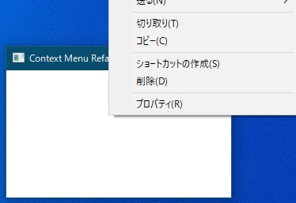
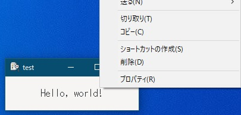
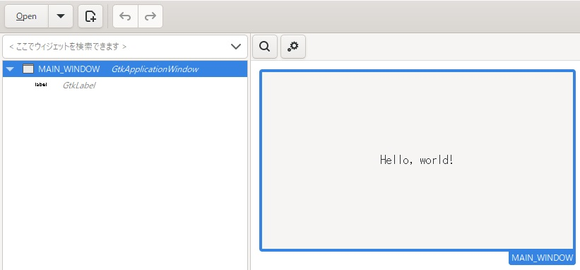

[go言語 & gotk3をちょっとやり直してみたい](../../README.md#go%E8%A8%80%E8%AA%9Egotk3%E3%82%92%E3%81%A1%E3%82%87%E3%81%A3%E3%81%A8%E3%82%84%E3%82%8A%E7%9B%B4%E3%81%97%E3%81%A6%E3%81%BF%E3%81%9F%E3%81%84)  

# 36. ファイルエクスプローラーのコンテキストメニューを表示

## 36.1 C言語にてコンテキストメニューを表示  

「[Open Windows Explorer Shell context menu](https://stackoverflow.com/questions/11346987/open-windows-explorer-shell-context-menu)」にC言語から、ファイルエクスプローラーのコンテキストメニューの内容を表示するコードが載っていたので、Geminiに確認しながらコンテキストメニューが表示されるように
[コードを改造してみました。](./c/your_code.c)  

  

ShowContextMenu関数の以下のコードでメニューを構築して表示しています。  

```c
// コンテキストメニューにアイテムを問い合わせて構築する
hr = pContextMenu->lpVtbl->QueryContextMenu(pContextMenu, hMenu, 0, 1, 0x7FFF, CMF_NORMAL | CMF_EXPLORE);
if (FAILED(hr)) {
	DestroyMenu(hMenu);
	SAFE_RELEASE(pContextMenu);
	return 1;
}

// オーナー描画のために IContextMenu2/3 インターフェイスを取得
pContextMenu->lpVtbl->QueryInterface(pContextMenu, &IID_IContextMenu2, (void**)&g_pContextMenu2);
pContextMenu->lpVtbl->QueryInterface(pContextMenu, &IID_IContextMenu3, (void**)&g_pContextMenu3);

// メニューを表示し、ユーザーの選択を待つ
UINT selectedCmd = TrackPopupMenuEx(hMenu, TPM_RETURNCMD | TPM_NONOTIFY, pt.x, pt.y, hwnd, NULL);
```  

「IContextMenu2/3」は、「送る」メニューアイテムの第二階層表示などに対応するための物だそうです。
（`WindowProc()`の中で使ってます）  
また、以下のコードで選択されたメニューアイテムの実行を行っています。  

```c
if (selectedCmd > 0) {
	CMINVOKECOMMANDINFOEX cmi = { sizeof(cmi) };
	//cmi.cbSize = sizeof(cmi);
	cmi.lpVerb = MAKEINTRESOURCEA(selectedCmd - 1);
	cmi.fMask = CMIC_MASK_UNICODE;
	cmi.hwnd = hwnd;
	cmi.lpVerbW = MAKEINTRESOURCEW(selectedCmd - 1);
	cmi.nShow = SW_SHOWNORMAL;

    pContextMenu->lpVtbl->InvokeCommand(pContextMenu, (LPCMINVOKECOMMANDINFO)&cmi);
}
```  

## 36.2 go言語にてコンテキストメニューを表示  

36.1で作成したコードをGeminiに聞きながら、go言語に移植してみたのですが、上手く動作しなかったため、CGOを使って対応することにしました。  

  

ウィンドウを右クリックしたら上図のようにファイルエクスプローラーのコンテキストメニューが表示されます。  

## 36.3 GladeでUIを作成  

  

「[1. gotk3を使って、Simple windowを作成する](../01/README.md)」と同じです。  

## 36.4 ファイルパス配列をメモリに格納  

CGOへの引数で複数のファイルパスを渡すためにメモリへ格納する処理は、以下のようなコードになります。  
戻り値は、配列のポインタとファイルパス数、エラーとなります。  

```go
func prepareFilePaths(filePaths []string) (unsafe.Pointer, C.int, error) {
	fileCount := len(filePaths)
	if fileCount == 0 {
		return nil, C.int(0), fmt.Errorf("no file")
	}

	// CのWCHAR** を確保
	// sizeof(WCHAR*) はC.int(unsafe.Sizeof((*C.WCHAR)(nil)))で取得できる
	cArray := C.malloc(C.size_t(C.int(unsafe.Sizeof((*C.WCHAR)(nil))) * C.int(fileCount)))
	if cArray == nil {
		return nil, C.int(0), fmt.Errorf("failed to allocate memory for C array")
	}
	
	for i, path := range filePaths {
		// UTF-16でNULL終端されたワイド文字列を生成
		wPath, err := windows.UTF16PtrFromString(path)
		if err != nil {
			return nil, C.int(0), err
		}

		// C.mallocでメモリを確保し、wPathをコピー
		// C.wcslen(wPath) * sizeof(wchar_t) + sizeof(wchar_t)
		wlen := C.wcslen((*C.WCHAR)(unsafe.Pointer(wPath)))
		cWcharPtr := C.malloc(C.size_t(wlen+1) * C.sizeof_wchar_t)
		if cWcharPtr == nil {
			return nil, C.int(0), fmt.Errorf("failed to allocate memory for WCHAR string")
		}

		// メモリをコピー
		C.wcscpy((*C.WCHAR)(cWcharPtr), (*C.WCHAR)(unsafe.Pointer(wPath)))

		// ポインタ配列にコピーしたワイド文字列のポインタを格納
		ptr := (**C.WCHAR)(unsafe.Pointer(uintptr(cArray) + uintptr(i)*unsafe.Sizeof((*C.WCHAR)(nil))))
		*ptr = (*C.WCHAR)(cWcharPtr)
	}
	
	return cArray, C.int(fileCount), nil
}
```  

## 36.5 メイン処理  

コンテキストメニューの「コピー」や「切り取り」のためにOLEを使ってるようなので、初期化を行います。  

```go
ret := win32.OleInitialize(nil) 
if ret != win32.S_OK {
	log.Fatal("OLEの初期化に失敗しました")
}
```  

ウィンドウを右クリックした時に、36.4で作成した関数をコールして、ファイルパス配列をメモリに格納します。その後、コンテキストメニューを表示する関数をコールします。  

```go
window1.Connect("button-press-event", func(win *gtk.ApplicationWindow, event *gdk.Event) bool {
	e := gdk.EventButtonNewFromEvent(event)
	switch e.Button() {
		case gdk.BUTTON_SECONDARY:							// 右クリック時
			// ファイルパスをCGO用メモリに格納
			filePaths, fileCount, err := prepareFilePaths([]string{"D:\\test\\ううう"})
			if err != nil {
				log.Println("ファイルパスのメモリ格納に失敗しました")
				return false
			}
				
			// 確保したメモリを解放する
			defer C.free_wchars_array((**C.WCHAR)(filePaths), fileCount)
					
			// コンテキストメニューを表示する
			x, y := e.MotionValRoot()
			ok := C.ShowContextMenu(C.HWND(unsafe.Pointer(Hwnd)), C.int(x), C.int(y), (**C.WCHAR)(filePaths), fileCount)
			if !ok {
				log.Println("コンテキストメニューの表示に失敗しました。")
			}
			// イベントの伝播を停止
			return true
	}
	// イベントを伝播
	return false
})
```  
最後に、 OLEの後始末 

```go
win32.OleUninitialize()
```  

を実行します。  

## 36.6 おわりに  

「送る」メニューは動作してるようなので、「IContextMenu2/3」対応は省いています。もし、動作しないようであれば、Windowメッセージをフックした後、C言語のコードと同様なメッセージ処理が必要となるかと思います。  
また、「アクセスを許可する」メニューなど、上手く動作しない物も残ってますが、「開く」「送る」「コピー」など、よく使いそうなメニューは動作しているようなので、ある程度は使えるかと思います。  

作成したファイルは、
[ここ](./36_SimpleWindow_context_menu.go)
に置いてます。  
コールされるC言語のコードは、
[ここ](./context_menu.c)
に置いてます。

<!--
</br>

「[35. dllを使ったDrag and Drop](../35/README.md)」へ
-->