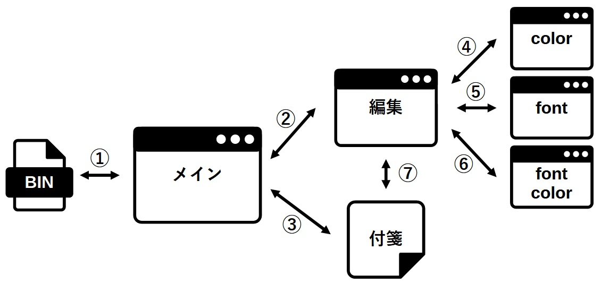

# 12. （まとめ）付箋アプリの作成～はじめに～

今まで記載してきた内容を組み合わせてアプリを作成してみたいと思います。  
良い題材がないか考えてみたのですが、5章で出てきた付箋アプリが今までの内容をそれなりに使用しそうに思えたので、付箋アプリを作成してみようと思います。  

## 12.1 全体のイメージ

全体のイメージは以下のような形で考えてみました。  

  

Windows10の付箋アプリのように付箋のヘッダーバーをON/OFFする方法も良いかと思ったのですが、シンプルに編集ウィンドウと付箋ウィンドウを分けることにしました。  

- メインウィドウ  
  - 表形式に付箋の一覧を表示  
  - 表の選択行をダブルクリックすることで付箋の編集ウィンドウを表示する  
  - 表の選択行を右クリックすることでメニューを表示し、付箋をはがせるようにする  
  - 表の更新が必要なため、追加・更新・削除はメインウィンドウを経由する  
  - メインウィンドウを閉じた時、タスクトレイへ格納する  
  - メインウィンドウが選択された時、作成済みの各付箋を前面に表示する  
  - アプリの終了はタスクトレイ格納中に右クリックメニューから選べるようにする  
  - アプリ終了時に、付箋情報はバイナリファイルへ保存する  
- 編集ウィンドウ  
  - 背景色・フォント・フォント色はダイアログを表示して設定する  
  - 背景色・フォント・フォント色の設定は編集ウィンドウへも反映する  
  - アライン（左寄せ/中央寄せ/右寄せ）をボタンで選択する  
  - アラインおよび背景色の透明度は見難くなるので編集ウィンドウへは適用しない  
  - 付箋ウィンドウ（ヘッダーバーなし）はサイズ変更が大変なので、編集ウィンドウで変更したサイズを付箋へ反映させる  
  - ウィンドウのサイズにあわせてラップ（右端折り返し）を実施する  
- 付箋ウィンドウ  
  - 編集ウィンドウで設定された、テキスト・書式情報・位置・サイズなどを反映する  
  - 右クリックメニューで、「新規付箋」と「はがす」が選べるようにする  

## 12.2 事前確認が必要な物

「12.1」で記載した内容を実現するために、1章～11章で説明してない機能を使用する必要があります。次章から以下の項目について確認していきます。  

- ファイルの存在確認とファイル入出力
  イメージ図の①の部分について、これまでファイルを扱う説明をしてなかったので、付箋情報を保存する方法とgo言語では標準関数化されてないファイルの存在確認の方法について確認します。  
- カスタムシグナル（関連：4章）  
  編集ウィンドウや付箋ウィンドウはモードレスダイアログとなるため、メインウィンドウはイメージ図の②や③を常に待ち受けておく必要があります。  
  チャネルでやりとりしても良いのですが、
  「[4.4 マルチスレッドで気をつけるところ](../../../04/README.md#44-%E3%83%9E%E3%83%AB%E3%83%81%E3%82%B9%E3%83%AC%E3%83%83%E3%83%89%E3%81%A7%E6%B0%97%E3%82%92%E3%81%A4%E3%81%91%E3%82%8B%E3%81%A8%E3%81%93%E3%82%8D)」
  で説明したようにgoルーチンを使って待ち受けを行うとエラーメッセージ出力などに支障が出てしまいます。  
  カスタムシグナルを作成することで、上記のような問題を回避していきます。  
- CSSを使った書式設定（関連：8章、10章）  
  イメージ図④～⑥で設定した書式を反映する部分についてですが、編集ウィンドウではTextViewを使う予定で考えているため、8章の「Pango Markup」で説明した内容では対応が難しくなります。TextViewで文字入力するたびにマークアップを設定するのは現実的ではないためCSSを使った書式設定の方法を確認していきます  
- タスクバーにアイコンを表示させない方法  
  付箋ウィンドウが常にタスクバー上に表示されると邪魔になるので、表示しないようにします。
  `SetSkipTaskbarHint()`がWindows上で動作すれば良かったのですが、残念ながら上手くいかなかったので、独自に対応します。  

イメージ図⑦の部分については、グローバルで宣言したマップ変数で管理している情報をキーを使って参照することとします。  
ここについては、特別な事は何もないので、事前確認対象からは除外します。  
