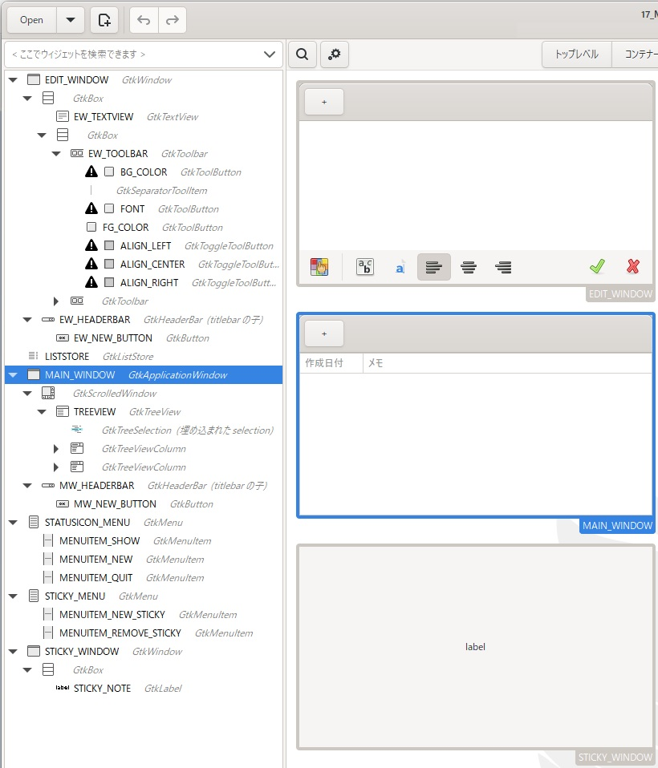

[go言語 & gotk3をちょっとやり直してみたい](../../README.md#go%E8%A8%80%E8%AA%9Egotk3%E3%82%92%E3%81%A1%E3%82%87%E3%81%A3%E3%81%A8%E3%82%84%E3%82%8A%E7%9B%B4%E3%81%97%E3%81%A6%E3%81%BF%E3%81%9F%E3%81%84)  

# 17. （まとめ）付箋アプリの作成  

大体必要と思われる機能の確認は出来たと思うので、付箋アプリを作成していきます。  

## 17.1 GladeでUIを作成  

Gladeでメインウィンドウ/編集ウィンドウ/付箋ウィンドウを作成後、ファイル名「17_MainWindow.glade」で保存します。  

    

上図の上から編集ウィンドウ、メインウィンドウ、付箋ウィンドウとなります。他にもListStore、タスクアイコン用のメニュー、付箋用のメニューなども作成しているので左側のペインに表示されてます。  

- 編集ウィンドウ  
  左上のボタン：新規付箋作成  
  真ん中：TextViewを使って付箋に表示する文字列を編集します  
  下側のボタンは左から、  
  - 背景色設定  
  - フォント設定  
  - フォント色設定  
  - 左寄せ  
  - 中央寄せ  
  - 右寄せ  
  - 決定  
  - キャンセル  
  
  となります。  
- メインウィンドウ  
  左上のボタン：新規付箋作成  
  下側：TreeViewを使って付箋の一覧を表示します  
- 付箋ウィンドウ  
  設定された色・書式・文字列・サイズで付箋を表示します。  
- タスクアイコン用のメニュー（STATUSICON_MENU）  
  以下のポップアップメニューを表示します。  
  - ウィンドウを表示
  - 新規付箋  
  - アプリケーションを終了  
- 付箋用のメニュー（STICKY_MENU）  
  以下のポップアップメニューを表示します。  
  - 新規付箋  
  - はがす

作成したファイルは、
[ここ](glade/17_MainWindow.glade)
に置いてます。  

## 17.2 