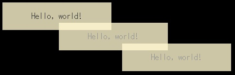
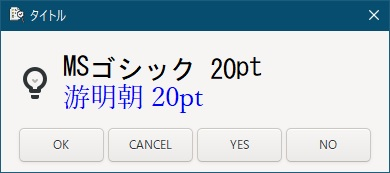

# go言語＆gotk3をちょっとやり直してみたい
## はじめに
Go言語とgotk3を用いてGoogle検索で調べながらファイラーを作成してみたりしたのですが、動作が不安定な時があったため、ちゃんと調べ直したいと考えてました。  
以前は参考となる情報が少なく苦労しましたが、現在ではAI技術が発展しているため、Geminiに質問しながらコードを作成してみようと思います。  

元々gtk4への移行を検討していましたが、うちの非力なパソコンではコンパイルに時間がかかり過ぎる上、完成したアプリケーションも「もっさり」だったため、断念しました。  
gtk3へ割り切ることで、非推奨となった機能（タスクトレイへの格納など）も活用していきたいと考えています。  

> [!NOTE]
> 対象OSはWindowsとなります。  
> go言語やgotk3のプログラミング方法や環境構築などの導入部分の解説は端折ってます。

## コンテンツ
[1. gotk3を使って、Simple windowを作成する](01/README.md)  
  

[2. 他のパソコンでも実行したい](02/README.md)  
  

[3. テーマを使いたい](03/README.md)  
  

[4. これに気をつけないとアプリがクラッシュする](04/README.md)  
  

[5. 半透明の付箋もどき](05/README.md)  
  

[6. タスクトレイに格納したい](06/README.md)  
  

[7. 7. メッセージダイアログとステータスバーを表示したい](07/README.md)  
  

[8. ヘッダーバー・ラベル書式・ウィンドウ書式のカスタマイズ](08/README.md)  
   

