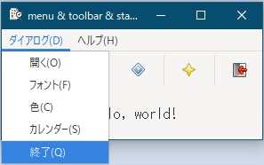
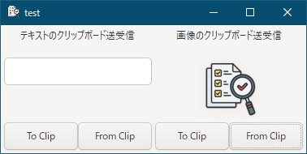
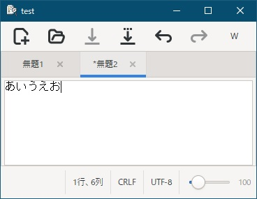
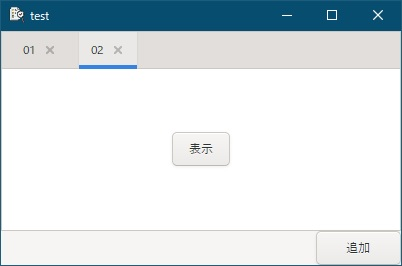

# go言語 & gotk3をちょっとやり直してみたい
## はじめに
Go言語とgotk3を用いてGoogle検索で調べながらファイラーを作成してみたりしたのですが、動作が不安定な時があったため、ちゃんと調べ直したいと考えてました。  
以前は参考となる情報が少なく苦労しましたが、現在ではAI技術が発展しているため、Geminiに質問しながらコードを作成してみようと思います。  

元々gtk4への移行を検討していましたが、うちの非力なパソコンではコンパイルに時間がかかり過ぎる上、完成したアプリケーションも「もっさり」だったため、断念しました。  
gtk3へ割り切ることで、非推奨となった機能（タスクトレイへの格納など）も活用していきたいと考えています。  

> [!NOTE]
> - 対象OSはWindowsとなります。  
> - go言語やgotk3のプログラミング方法や環境構築などの導入部分の解説は端折ってます。  
> - Geminiの回答とWEB検索をベースとしているため、間違え/不適切/非効率な部分があるかもしれません。  

## コンテンツ

<table>
<tr>
  <td align="center">   </td>
  <td> <a href="Contents/01/README.md">1. gotk3を使って、Simple windowを作成する</a> </td>
</tr>
<tr>
  <td align="center">   </td>
  <td> <a href="Contents/02/README.md">2. 他のパソコンでも実行したい</a> </td>
</tr>
<tr>
  <td align="center">   </td>
  <td> <a href="Contents/03/README.md">3. テーマを使いたい</a> </td>
</tr>
<tr>
  <td align="center">   </td>
  <td> <a href="Contents/04/README.md">4. これに気をつけないとアプリがクラッシュする</a> </td>
</tr>
<tr>
  <td align="center">   </td>
  <td> <a href="Contents/05/README.md">5. 半透明の付箋もどき</a> </td>
</tr>
<tr>
  <td align="center">   </td>
  <td> <a href="Contents/06/README.md">6. タスクトレイに格納したい</a> </td>
</tr>
<tr>
  <td align="center">   </td>
  <td> <a href="Contents/07/README.md">7. メッセージダイアログとステータスバーを表示したい</a> </td>
</tr>
<tr>
  <td align="center">     </td>
  <td> <a href="Contents/08/README.md">8. ヘッダーバー・ラベル書式・ウィンドウ書式のカスタマイズ</a> </td>
</tr>
<tr>
  <td align="center">   </td>
  <td> <a href="Contents/09/README.md">9. メニューバー/ツールバー/標準ダイアログを使いたい(前編)</a> </td>
</tr>
<tr>
  <td align="center">   </td>
  <td> <a href="Contents/10/README.md">10. メニューバー/ツールバー/標準ダイアログを使いたい(後編)</a> </td>
</tr>
<tr>
  <td align="center">   </td>
  <td> <a href="Contents/11/README.md">11. 表形式にデータを表示したい</a> </td>
</tr>
</table>  

ここまでの内容を踏まえて次からは簡単なアプリを作成していきます。  

<table>
<tr>
  <td align="center">   </td>
  <td> <a href="Contents/12/README.md">12. （まとめ）付箋アプリの作成～はじめに～</a> </td>
</tr>
<tr>
  <td align="center">   </td>
  <td> <a href="Contents/13/README.md">13. （まとめ）ファイルの存在確認とファイル入出力</a> </td>
</tr>
<tr>
  <td align="center">   </td>
  <td> <a href="Contents/14/README.md">14. （まとめ）カスタムシグナル</a> </td>
</tr>
<tr>
  <td align="center">      </td>
  <td> <a href="Contents/15/README.md">15. （まとめ）CSSを使った書式設定</a>   ※背景が青いのはデスクトップの色です </td>
</tr>
<tr>
  <td align="center">   </td>
  <td> <a href="Contents/16/README.md">16. （まとめ）タスクバーにアイコンを表示させない方法</a>   ※背景が青いのはデスクトップの色です </td>
</tr>
<tr>
  <td align="center">      </td>
  <td> <a href="Contents/17/README.md">17. （まとめ）付箋アプリの作成</a> </td>
</tr>  
</table>  

アプリ作成も一段落したので、ここからはgotk3に特化せずに、思いついたテーマを追加していきます。  

<table>
<tr>
  <td align="center">   </td>
  <td> <a href="Contents/18/README.md">18. クリップボード監視/USBドライブ抜き差し監視/USBドライブイジェクトがしたい</a> </td>
</tr>
<tr>
  <td align="center">   </td>
  <td> <a href="Contents/19/README.md">19. ディレクトリ配下の更新を監視したい</a> </td>
</tr>
<tr>
  <td align="center">   </td>
  <td> <a href="Contents/20/README.md">20. クリップボードを使いたい</a> </td>
</tr>
<tr>
  <td align="center">   </td>
  <td> <a href="Contents/21/README.md">21. キー入力の検知、IMEのON/OFF制御をしたい</a> </td>
</tr>
<tr>
  <td align="center">   </td>
  <td> <a href="Contents/22/README.md">22. Drag and Dropが使い難い</a> </td>
</tr>
<tr>
  <td align="center">   </td>
  <td> <a href="Contents/23/README.md">23. win32 apiのクリップボードを使いたい（受信）</a>   ※ファイルのcopy/move(cut)対応可 </td>
</tr>
<tr>
  <td align="center">   </td>
  <td> <a href="Contents/24/README.md">24. win32 apiのクリップボードを使いたい（送信）</a>   ※ファイルのcopy/move(cut)対応可 </td>
</tr>
<tr>
  <td align="center">   </td>
  <td> <a href="Contents/25/README.md">25. コンテキストの使い方メモ</a> </td>
</tr>
<tr>
  <td align="center">   </td>
  <td> <a href="Contents/26/README.md">26. 外部コマンドの実行方法メモ</a> </td>
</tr>
<tr>
  <td align="center">   </td>
  <td> <a href="Contents/27/README.md">27. プロセス間通信（名前付きパイプ）のメモ</a>   ※C#アプリとの通信 </td>
</tr>
</table>  

次からは、簡単なアプリとしてタブ切り替え型の簡易メモ帳を作成していきます。

<table>
<tr>
  <td align="center">   </td>
  <td> <a href="Contents/28/README.md">28. （まとめ2）タブ切り替え型の簡易メモ帳～はじめに～</a> </td>
</tr>
<tr>
  <td align="center">   </td>
  <td> <a href="Contents/29/README.md">29. （まとめ2）動的に追加するTabControl（Notebook）</a> </td>
</tr>
</table>  
